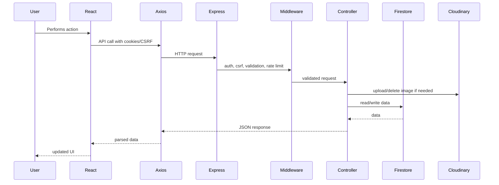

# Collexa Interview Master Guide (Conversational Edition)

This is a rewrite of the original interview guide. Every fact, endpoint, collection name, and architectural detail is unchanged — only the delivery is different. The goal here is to sound like an engineer actually talking through their own project, not reciting documentation, and to anticipate the follow-up questions a real interviewer would throw back at you.

A note on style: real answers trail off, self-correct, admit gaps, and get more specific as the interviewer pushes. Textbook definitions ("CSRF is a type of attack where...") are replaced with the kind of thing you'd actually say out loud, assuming the interviewer already knows what CSRF is and wants to hear how *you* dealt with it.

---

## SECTION 1 — Elevator Pitches

### 30 Seconds

"So Collexa is basically a marketplace, but scoped just to VIT students — think OLX, but you know everyone on it is actually from your campus. Students list stuff they want to sell or rent — books, cycles, whatever — and buyers can browse and chat with them directly. I built the whole thing myself: React and Express, Firestore as the database, Cloudinary for images, Firebase for the chat and push notifications, Resend for emails. The whole point was trust — a random OLX listing could be anyone, but on Collexa you know it's a VIT student."

**Interviewer follow-up:** "Why not just use a WhatsApp group for this?" → "That's honestly what most of campus was already doing, and it's the actual reason I built this — WhatsApp groups aren't searchable, listings get buried in minutes, and there's no structure. Collexa gives you filters, persistent listings, and a proper chat thread instead of scrolling through a group."

### 1 Minute

"Collexa is a verified marketplace for VIT students. You sign up with your VIT email — or Google, but it still has to be a VIT address — and once you're in you can post listings with photos, browse and filter what other people have posted, message sellers directly, manage your own listings, and report stuff if something's off. Backend's Express, with JWT stored in an HttpOnly cookie plus CSRF protection on top of that, and Firestore as the database. Images go to Cloudinary, OTP and admin emails go through Resend, and chat is realtime through Firebase. There's also a full admin dashboard — user moderation, listing moderation, reports, announcements, email campaigns. I built it because generic marketplaces like OLX are noisy and you have zero idea who you're actually dealing with; locking it to campus emails fixes that."

**Interviewer follow-up:** "What was the hardest part of that whole stack to get right?" → "Honestly, getting cookie auth and CSRF to play nicely with Firebase's own auth for chat. I ended up running two auth systems in parallel — my own JWT for the API, and a separate Firebase custom token just so Firestore's security rules could recognize who was in a chat room."

### 2 Minutes

"The idea came from a pretty practical problem — students at VIT constantly want to sell or rent stuff, books, cycles, lab equipment, but the places people actually do this are messy. WhatsApp groups, random Instagram stories, OLX. None of that is built for a campus. So I built Collexa specifically for that.

Frontend's a React SPA on Vite — public browsing, but the second you want to create a listing, chat, or touch your profile, you need to be logged in. It's got PWA support, push notifications, SEO pages, and an admin section. Backend is Express, and I kept it pretty disciplined — routes, controllers, services, so business logic and persistence aren't tangled together. Auth is HttpOnly JWT cookies with CSRF protection, bcrypt for passwords, OTP for signup, Google login as an option, and a session-versioning trick so I can invalidate old sessions without maintaining a token blacklist. Firestore holds everything — users, listings, reports, notifications, chat rooms, OTP records, admin email logs. Cloudinary handles all the images. Resend sends OTPs, support emails, missed-chat-message fallback emails, and admin campaign emails.

It's not just CRUD — there's moderation, rate limiting, an image upload lifecycle, account blocking, listing expiry jobs, push notifications through FCM, and a full admin dashboard. If you gave me another month, I'd move listing search off in-memory filtering and onto actual indexed Firestore queries, push chat messages into subcollections instead of arrays, put a real queue behind background jobs, and nail down explicit schemas instead of the implicit ones I've got now."

**Interviewer follow-up:** "You said 'implicit schemas' — walk me through what that actually means for your data." → "Firestore doesn't force a schema, so right now the 'shape' of a user document or a listing only exists in my head, spread across the validators, the controllers, and dataService.js. Nothing stops me from writing a document that's missing a field the frontend expects. I'd fix that with something like Zod, shared between client and server."

### 5 Minutes

"Collexa's a full-stack campus marketplace — let me walk through the motivation first, then the architecture.

The motivation: students constantly need to buy and sell stuff like books, electronics, bikes, instruments, sports gear, lab equipment — but nothing that exists is built for that. OLX doesn't know or care if you're from the same campus, so there's zero trust signal, and it's not optimized for a quick, in-person campus handoff. So I scoped the whole product down to just VIT students.

On the frontend, it's a React SPA built with Vite. Anyone can browse listings without logging in, but anything that touches your account — creating a listing, messaging a seller, reporting someone, editing your profile — requires auth. I used React Router for routing, and a handful of contexts for global state: auth, notifications, PWA install prompts, announcement updates, guest prompts. All API calls go through one centralized Axios instance that always hits `/api`, sends cookies, attaches a CSRF token on anything that mutates data, and — this one I'm actually kind of proud of — retries once automatically if the CSRF token turns out to be stale.

Backend's Express. app.js sets up the security stuff first — Helmet, CORS, cookie parsing, JSON body limits, the CSRF cookie, rate limiting — then mounts routes by domain: auth, users, listings, reports, admin, support, notifications, updates, chat, wishlist, sitemap. Controllers own the business logic, services own persistence and third-party integrations. Firestore's the database, and there's no Mongoose-style model layer — the schema for anything just lives implicitly across the validators, controllers, and the data service.

Auth is cookie-based. On login or OTP verification, I sign a JWT with the user's ID, an admin flag, and a session version, drop it into an HttpOnly cookie, and rotate a separate readable CSRF cookie alongside it. Passwords are bcrypt-hashed. OTPs live in Firestore with a 15-minute window and go out through Resend. Google login works too, but unless you're the configured admin account, you still need a `@vitstudent.ac.in` email — Google doesn't get you around that restriction.

Listings support the full lifecycle — create, browse, filter, edit, delete, mark sold, reactivate. Images go through Multer as multipart form data and land in Cloudinary; Firestore only ever stores the Cloudinary URL and public ID, never the actual file. Regular users get capped at three edits per listing, and listings auto-expire after 30 days via a cron job.

Chat is Firebase plus Firestore. The Express API handles creating or fetching a chat room, but the actual message stream is the React client subscribing straight to Firestore for realtime updates — I didn't build a WebSocket server for this, Firestore's listeners already do that job. On top of that, the server sends FCM push notifications, and if push isn't available or the recipient's inactive, it queues a missed-message email through Resend as a fallback.

The admin dashboard covers stats, user moderation, listing moderation, reports, public announcements, and batched email campaigns — that last one computes the recipient list, personalizes the template, sends in batches through Resend, and logs everything to Firestore for an audit trail.

It's solid for an early-stage product, but I'm upfront about the rough edges. Search and filtering are in-memory right now, which won't hold up at scale. `JWT_EXPIRE` is sitting in my env config but I never actually wired it into the token signing. Wishlist and phone verification are half-built — routes exist, but they're not implemented. Docker Compose still has a MongoDB service in it from an earlier iteration even though I moved everything to Firestore. And chat messages are stored as an array inside the room document, which will eventually hit Firestore's document size limits — that one should really be a subcollection. Those are exactly the things I'd tackle first before scaling this further."

**Interviewer follow-up:** "If I gave you one week, not one month, what's the single thing you'd fix?" → "CSRF and JWT expiry — those are the actual security gaps, versus search and chat storage which are scalability problems. I'd fix the things that could bite me today before the things that'll bite me at 10,000 users."

---

## SECTION 2 — Project Story

**Q: How did you land on this idea?**
"I kept seeing the same pattern — someone wants to sell a cycle or a textbook, and it's a WhatsApp group post that fifty other messages bury within the hour, or an Instagram story that disappears in a day. None of it's searchable, none of it's persistent, and there's no way to filter by category or price. I wanted something scoped to just VIT so the trust problem basically disappears, and structured enough that people can actually find what they're looking for."

**Q: Why actually build it, versus just using what exists?**
"Partly the real problem I just described, but honestly also because I didn't want to build another CRUD app for the sake of a portfolio project. I wanted auth done properly, image upload handling, moderation, realtime chat, push notifications, an admin panel — the stuff that makes something feel like a real product instead of a tutorial."

**Q: What's the actual problem it solves?**
"Two things — trust and discovery. Trust because everyone's a verified VIT student. Discovery because listings live in one searchable place instead of being scattered across five different group chats."

**Q: Who's actually using it?**
"Guests can look around without an account. Verified students can buy, sell, chat, and report issues. Admins moderate the whole thing."

**Q: Why would someone pick this over just posting on OLX?**
"OLX is anonymous and citywide — you genuinely don't know who you're meeting. Collexa restricts signup to VIT email addresses and organizes things around categories students actually care about, so both discovery and trust are better for this specific use case."

**Q: What was actually hard about building this?**
"Auth security probably ate the most time — getting cookie-based JWT auth to work cleanly with CSRF protection, on top of a second Firebase auth flow just for chat. Image upload lifecycle was its own headache too — making sure Cloudinary and Firestore stay in sync when someone deletes or replaces a listing's photos. And just generally — balancing 'ship this feature' against 'design this so it doesn't fall over later.'"

**Q: Realistically, how many users could this handle right now?**
"For campus scale, it's fine — Firestore and Cloudinary are both managed services, so they scale a good amount on their own. The actual constraint is my own code: listing search currently loads everything and filters in memory, so if listing volume got into the tens of thousands, that request would get noticeably slow well before Firestore itself became the bottleneck."

**Q: If you had to pick one thing to improve first, what is it?**
"Technical debt cleanup, honestly, before new features — actually apply `JWT_EXPIRE`, get CSRF onto the admin update routes that are missing it, rip out the stale Mongo config, and either finish or delete wishlist and phone verification. Then I'd go after search, chat storage, and background job handling."

---

## SECTION 3 — Architecture Walkthrough

"Let me just trace what happens when someone actually uses the app. Browser loads the React SPA — Vite build. React Router decides what to render; if you hit the homepage, `Home` fetches listings. If you go somewhere gated, like `create-listing`, `ProtectedRoute` checks `AuthContext` first and bounces you to login if you're not signed in.

Every API call goes through one Axios instance. It's always hitting `/api`, always sending credentials, and it attaches a CSRF token to anything that mutates data. If that CSRF token's gone stale, it calls `/auth/csrf` once to refresh it and retries the original request.

That request lands on Express. Global middleware runs first — Helmet, CORS, cookie parsing, JSON body limits, the CSRF cookie setup, rate limiting — then it's routed to whichever module matches, say `listingRoutes`.

Inside the route, middleware runs in a specific order. For creating a listing, that's: check auth, check CSRF, apply the create-listing rate limiter, run the images through Multer into Cloudinary, validate the fields with express-validator, then hand off to the controller.

The controller's where the actual decisions happen — parsing tags, mapping the uploaded Cloudinary files into image objects, then calling `dataService` to write the Firestore record. `dataService` is the one place that actually talks to Firestore — it goes through Firebase Admin, handles timestamp serialization, and hands back plain objects.

If there are images, Cloudinary stores them and gives back URLs and public IDs. If there's an email involved, that's Resend. Push notification, that's FCM. Controller sends the JSON response back, Axios unwraps it, React updates the UI."

**Interviewer follow-up:** "Where in that chain would you add a caching layer if reads started getting expensive?" → "Probably right between the controller and Firestore for the public listing browse endpoint specifically — that's the one getting hammered with reads. I wouldn't cache anything behind auth, since that data's more likely to be stale in a way that actually matters."

---

## SECTION 4 — Technology Decisions

*(Framed as if answering "walk me through why you picked X" in a real conversation, followed by what an interviewer would probe next.)*

**React:** "I needed a lot of dynamic UI state — protected routes, forms, listing cards, live chat, admin tabs — and React's component model made splitting all of that into manageable pieces pretty natural. Trade-off's the usual SPA one: more logic living in the client, and SEO takes a hit unless I add SSR or pre-rendering, which I didn't."
*Follow-up: "Would Next.js have solved that SEO problem for you?"* → "Yeah, that's basically the honest answer — if SEO mattered more for this specific product, Next.js would've been the better call from day one. I stuck with Vite because I didn't want SSR complexity for what's mostly an authenticated app."

**Vite:** "Fast dev loop, and proxying `/api` to Express in development was trivial to set up. I could've used Webpack, but that's just more config for no real benefit here, and Next.js only makes sense if I actually need SSR."

**Express:** "It's unopinionated, which I wanted — lightweight, good middleware ecosystem for auth, uploads, validation, rate limiting. Downside is it doesn't enforce any structure, so the route/controller/service separation is entirely on me to maintain."

**Firestore:** "Managed, scales fine for where this project's at, and the realtime listeners were huge for chat — I didn't have to stand up a WebSocket server. Trade-off is the query model — no joins, implicit schema, and you need indexes for anything beyond the simplest filter. If I needed heavier relational reporting I'd lean Postgres instead."
*Follow-up: "Why didn't Mongo make more sense, given you clearly considered it?"* → "Honestly, there's leftover Mongo config in my docker-compose from an earlier draft of the project that I never cleaned up — the actual code has been Firestore-only for a while. I chose Firestore specifically for the realtime chat piece."

**Firebase (Admin + client SDK):** "It's doing double duty — Admin SDK for server-side Firestore access, custom tokens, and FCM; client SDK for the realtime chat subscriptions. Let me get realtime features without running my own WebSocket infra. Trade-off's vendor lock-in, plus you really have to get the security rules right."

**JWT:** "Stateless auth — I verify the signature on each request instead of maintaining server-side sessions. The real weakness is revocation; I only partially solved that with `sessionVersion`, which invalidates old tokens after a password change but not on-demand."

**Cloudinary:** "Keeps me from ever storing image files on my own server, and I get optimized URLs for free. Trade-off is I'm now dependent on an external service, and I have to be careful managing public IDs so deletion actually cleans things up."

**Tailwind:** "Let me move fast on UI without maintaining a pile of custom CSS files. Downside's pretty well-known — the JSX gets class-heavy. At a bigger scale I'd probably introduce shared component primitives."

**Axios:** "Centralizes credentials, CSRF headers, response unwrapping, the CSRF retry logic, and dispatching unauthorized events. Fetch could technically do all this too, but the interceptor pattern made it a lot cleaner to keep in one place."

**Helmet:** "Sets the security headers and CSP for me instead of me hand-rolling them. The trade-off is CSP needs active maintenance — add a new third-party script and forget to update the policy, and you'll break it."

**Resend:** "Handles OTPs, support emails, chat fallback emails, admin campaigns. Simple API, but it needs a verified sender domain, and I have to handle provider failures myself."

**Google OAuth:** "Cuts down signup friction. I verify the ID token server-side and still enforce the VIT email restriction for everyone except the configured admin account."

**ReCAPTCHA:** "Sits in front of anything that generates an OTP — signup, resend, forgot password — so people can't just script-spam those endpoints. Adds friction, which is the trade-off, but it's worth it there."

**express-validator:** "Validates emails, listing fields, report reasons, price ranges, admin email payloads — request-level stuff. It does duplicate some of what I'm already checking on the frontend; a shared schema library would fix that overlap."

**bcrypt:** "Cost factor 12. It's deliberately slow so brute-forcing hashes is expensive. Argon2's a reasonable alternative if I wanted to switch."

**Multer:** "Parses the multipart uploads, wired directly into Cloudinary storage. Adds its own layer of upload-failure cases I have to account for."

**Rate limiting:** "Covers login, OTP, reports, profile updates, listing creation, admin actions. Right now it's an in-memory store, which is the wrong choice the moment I run more than one instance — that needs to move to Redis."

**Cookies:** "HttpOnly over localStorage specifically because JavaScript can't read an HttpOnly cookie, which cuts down what an XSS bug could actually steal. The cost is CSRF becomes a real concern, hence the CSRF token setup."

**CSRF:** "Since the browser auto-attaches cookies, I need proof the request actually came from my frontend — that's the double-submit pattern: readable cookie, matching header, server compares them."

---

## SECTION 5 — Deep Code Walkthrough

### Auth Module

"Auth covers signup OTP generation and verification, password login, Google login, fetching the current user, password reset, policy agreement, and logout.

`signup` checks the VIT email pattern, checks the blocklist and whether the account already exists, then fires off an OTP. `verifyOTP` is where the account actually gets created — validates the OTP, hashes the password, writes the user, issues cookies. `login` compares the bcrypt hash and starts a session. `googleAuth` verifies the Google ID token and either creates or updates the user record. `resetPassword` validates the reset OTP, rehashes the password, and bumps `sessionVersion` so old sessions die. `getCurrentUser` just returns a sanitized version of the user object.

Flow-wise: route validates the request shape, controller checks blocklist/user state, controller calls into `dataService`, passwords get hashed or compared with bcrypt, and JWT/CSRF cookies get issued or cleared depending on the outcome.

Errors: wrong credentials is a 401, blocked accounts are 403, and trying to register twice during OTP verification comes back as a 409."

**Interviewer follow-up:** "What stops someone from spamming your OTP endpoint to enumerate valid VIT emails?" → "CAPTCHA on the signup and resend endpoints, plus rate limiting by IP and email. I also made some of these responses intentionally generic — like forgot-password just says 'if this account exists, an OTP was sent' either way, so you can't tell from the response alone whether an email is registered."

### Listings Module

"This handles the full lifecycle — create, read, update, delete, filtering, hydrating seller info onto each listing, enforcing ownership and the edit cap, and cleaning up Cloudinary images when needed.

Validation covers title/description length plus a blocked-word check, category, condition, listing type, price range, and requiring at least one image on creation.

Errors: missing listing is a 404, editing something you don't own is a 403, and a non-admin trying to exceed three edits is also a 403."

### Users Module

"Profile retrieval, profile updates, password changes, account deletion. One thing worth flagging — the frontend has a `verifyProfilePhone` method sitting in `AuthContext`, but there's no matching backend route. If you called it, it'd just fail."

**Interviewer follow-up:** "So why does that method exist on the frontend at all?" → "Leftover from when I started building phone verification and didn't finish it. It's dead code at this point — I should either implement the backend route or delete the frontend method, and honestly it should probably just get deleted until I actually build it."

### Chat Module

"Covers minting a Firebase custom token, creating chat rooms, sending messages, looking up chat users for display, syncing notification state, and queuing or canceling the missed-message email fallback.

On validation — it rejects missing participant or message fields, blocks you from starting a chat with yourself, caps messages at 500 characters, and checks that both people are actually participants in the conversation before letting a message through."

### Admin Module

"Dashboard stats, managing users and blocked emails, viewing and deleting listings, reviewing reports, managing public updates, sending email campaigns.

One trade-off I'll call out myself: the email campaign send happens synchronously inside the request, with batching delays baked in. At any real scale that needs to move to a queue — right now a big campaign could just make that request hang."

### Notifications Module

"In-app notifications, mark-as-read (single or all), FCM token registration and removal, and actually sending the push."

### Support and Reports

"Listing reports go into Firestore, and duplicate reports from the same user on the same listing are blocked by using a deterministic ID — `listingId` plus reporter ID. Bug and account reports get emailed to the admin inbox via Resend, and the reporter gets an in-app notification once it's submitted."

### Updates

"Admins can create, edit, delete, and toggle publish state on updates. Public users just fetch the published ones. They're sorted pinned-first, then newest-first, and I prune older ones down to the latest four whenever a new one's created."

---

## SECTION 6 — CRUD Questions

**Q: Walk me through creating a listing.**
"Frontend builds a FormData payload — text fields plus images — and I upload the images through Cloudinary via Multer, validate everything server-side, and write the listing to Firestore with `status: active`, an expiry date, some counters, and the Cloudinary image metadata."

**Q: How does reading listings actually work?**
"The public `/listings` endpoint loads everything, syncs any expired listings first, applies filters in memory, hydrates seller info onto each result, and returns a paginated slice."

**Interviewer follow-up:** "That 'loads everything' part — that's going to hurt eventually, right?" → "Yeah, that's the known bottleneck. It's fine at current volume, but the fix is moving those filters into actual Firestore queries with composite indexes, or bolting on a proper search service if I want full-text search."

**Q: How's updating a listing secured?**
"Load the listing, confirm the requester owns it or is an admin, enforce the edit cap for regular users, validate the input, then merge the changes into Firestore."

**Q: What actually happens when a listing gets deleted?**
"Cloudinary images get destroyed by public ID first, then the Firestore document itself gets deleted."

**Q: Soft delete or hard delete?**
"Listings are a hard delete. User accounts are different — that's a soft delete on the user record, but a hard delete of that user's listings."

**Q: How do you stop duplicate reports?**
"The report document's ID is deterministic — it's built from the listing ID and the reporter's ID, so the same person reporting the same listing twice just overwrites the same document instead of creating a duplicate."

**Q: Can people update their profile picture?**
"Backend supports it — the profile update route accepts a Cloudinary upload — but I'll be honest, the current profile UI mostly focuses on editing text fields."

**Q: How does marking something sold work?**
"Verify ownership or admin rights, then flip status to `sold`."

**Q: And reactivating a listing?**
"Only works on expired listings — sets status back to active and gives it a fresh 30-day expiry."

**Q: What's the one CRUD feature that's just... not there?**
"Wishlist. The route exists, but it returns a 501 right now — I never actually built it out."

---

## SECTION 7 — Authentication Questions

**Q: Walk me through login.**
"User submits email and password, I look them up in Firestore, check they're not blocked and are actually verified, compare the password against the bcrypt hash, bump `lastLoginAt`, sign a JWT, drop it into an HttpOnly cookie, and rotate the CSRF cookie alongside it."

**Q: Why JWT specifically?**
"Mainly for statelessness — I verify the signature on each request instead of maintaining sessions server-side."

**Q: Why cookies instead of just localStorage?**
"Because it's HttpOnly — JavaScript literally can't read it, so an XSS bug can't just grab the token and exfiltrate it, which is the classic localStorage problem."

**Q: What do you give up by using cookies, though?**
"CSRF. The browser sends cookies automatically on any request to my domain, so I need a separate mechanism to prove the request actually came from my frontend and not some other site."

**Q: So how does CSRF actually work here?**
"Double-submit pattern — I set a readable `csrf_token` cookie, Axios reads it and sends it back as an `X-CSRF-Token` header on mutating requests, and the server just checks that the header matches the cookie."

**Interviewer follow-up:** "If someone's XSS payload can run JavaScript on your origin, can't it also just read that CSRF cookie?" → "Yeah, honestly — that's a real gap. The CSRF cookie is readable by design, so XSS defeats the CSRF protection too. It's not a substitute for actually preventing XSS in the first place; it's just there to stop cross-*site* requests, not compromised same-site JavaScript."

**Q: How do protected routes work on the frontend?**
"`AuthContext` calls `/auth/me` on load. `ProtectedRoute` waits for that to resolve, and redirects to login if there's no valid user."

**Q: And on the backend?**
"Middleware reads the JWT off the cookie, verifies it, loads the user, and checks they're not deleted, not blocked, are verified, and their `sessionVersion` still matches — then it attaches the user info onto the request."

**Q: Why bcrypt?**
"Passwords should never be plaintext, obviously — bcrypt salts and hashes them, and it's deliberately slow, cost factor 12, to make brute force expensive."

**Q: How do you actually kill old sessions?**
"`sessionVersion` on the user document. Password change or reset bumps it, so any JWT issued before that point fails the middleware check even though the signature itself is still technically valid."

**Q: What's the downside of doing it that way instead of a token blacklist?**
"It requires a Firestore lookup on every single authenticated request, which a blacklist would too honestly, but it also means I can't invalidate one specific session — it's all-or-nothing per user."

**Q: What happens if the JWT's just expired?**
"Middleware catches `TokenExpiredError`, clears the cookies, returns 401 — except, I'll be upfront, tokens don't actually expire right now. `JWT_EXPIRE` is sitting in my env file but I never passed it as `expiresIn` when signing. That's a real gap I'd fix before this went anywhere near production."

**Q: Why OTP for signup instead of just an email link?**
"Mainly to confirm the person actually controls that VIT email before I create an account tied to it."

**Q: How do you keep OTP endpoints from getting abused?**
"Rate limiting by IP and by email, plus CAPTCHA gating it."

**Q: What's this `captchaGrant` thing?**
"After you pass CAPTCHA once, I issue a short-lived signed grant so you're not stuck re-solving CAPTCHA every time you hit resend or verify in the same flow."

**Q: How does Google login fit into all this?**
"Frontend gets a Google credential, I verify that ID token server-side, check the email's on the VIT domain — unless it's the configured admin address — then create or update the user and issue the exact same cookie session as password login."

**Q: How do admins actually get admin access — separate login?**
"No, they're just normal users with `isAdmin: true` on their record. Admin routes are gated by auth middleware plus a separate admin-check middleware on top."

**Q: Is the access cookie actually locked down in production?**
"Yeah — `secure: true` and `sameSite: none` in prod, since frontend and backend are on different domains and cookies still need to travel."

**Q: `sameSite: none` — doesn't that make CSRF worse?**
"It does increase exposure, which is exactly why the explicit CSRF token check matters more here than it would with `sameSite: strict`."

**Q: Why Firebase custom auth on top of your own JWT — isn't that redundant?**
"It's not redundant, it's serving a different purpose — my JWT is for the API, but Firestore's security rules need to independently know who's making a request when the client talks to Firestore *directly* for chat. That's what the Firebase custom token is for. If I had more time I'd look at consolidating these, but right now it's genuinely two separate systems doing two separate jobs."

**Q: Biggest honest gap in your auth setup?**
"JWT expiry not actually being applied. That's the one I'd fix first."

---

## SECTION 8 — Database Questions

**Q: Why Firestore over something like Postgres?**
"Managed NoSQL, and the realtime subscriptions were a big deal for chat specifically — I get live updates without running my own WebSocket server."

**Q: What collections do you actually have?**
"`users`, `userEmails`, `listings`, `reports`, `otps`, `blockedEmails`, `notifications`, `updates`, `emailLogs`, `chatRooms`, and `chatNotificationJobs`."

**Q: How do you enforce unique emails without a real unique constraint?**
"A Firestore transaction writes a normalized-email document into `userEmails` before the user document gets created — so it's atomic, and it's my substitute for a database-level unique index."

**Q: What indexes do you actually have set up?**
"Just one composite index — `chatRooms` on `participants array-contains` plus `lastMessageAt` descending, for the conversation list. Nothing for listings yet, which is part of why search is in-memory."

**Q: Do you have schema files anywhere?**
"No — that's a real gap. Schemas are implicit, spread across validators, controllers, and `dataService`. I'd want to fix that with something like Zod before this got much bigger."

**Q: How do chat room IDs get generated?**
"Sort the two participant IDs and join them — so any given pair of users always maps to the exact same room document, no matter who initiates."

**Q: What's the actual problem with storing chat messages as an array?**
"Firestore documents have a hard size limit, and arrays just aren't efficient to update at scale — every new message means rewriting the whole array. The real fix is a subcollection, `chatRooms/{roomId}/messages/{messageId}`, which I just haven't gotten to yet."

**Q: How's listing expiry actually enforced?**
"A cron job runs daily, calls `syncExpiredListings`, and batch-updates any active listing past its `expiresAt` to `expired`."

**Q: Is search indexed at all?**
"No — that's the honest answer. It's in-memory filtering after loading everything from Firestore."

**Q: If I told you this needs to support 100,000 listings tomorrow, what's your first move?**
"Indexed Firestore queries at minimum, and if I want actual full-text search — typo tolerance, relevance ranking — I'd bring in something like Algolia or Meilisearch and keep it synced off Firestore writes."

**Q: What happens to a user's data when they delete their account?**
"Self-delete is a soft delete on the user record, but their listings get hard-deleted. One thing I haven't handled — their chat history can still stick around, since I never built chat deletion."

**Q: Biggest weak point in your database design overall?**
"The implicit schema, honestly, plus the in-memory search. Those are the two I'd tackle first."

---

## SECTION 9 — Backend Questions

**Q: Why'd you structure it as routes/controllers/services instead of just stuffing logic in the route handlers?**
"Mostly to keep concerns separate — request wiring in the routes, business decisions in the controllers, and all the actual Firestore access in the services. Makes it a lot easier to reason about where a bug is coming from."

**Q: How do you handle validation?**
"express-validator middleware chains, feeding into one shared `validate` handler that formats errors consistently."

**Q: And errors in general?**
"Controllers call `next(error)`, and one centralized error middleware turns that into a consistent JSON response — full detail in dev, generic message in prod."

**Q: What's the actual weakness of your rate limiting setup?**
"It's an in-memory store, so it only works correctly on a single instance. The moment I run more than one server process, each instance is tracking limits independently, which basically defeats the purpose. Redis fixes that."

**Q: How does image upload actually flow through the request?**
"Auth check, CSRF check, the create-listing rate limiter, then Multer streams the files straight into Cloudinary, then field validation, then the controller writes to Firestore."

**Q: What happens on the delete side with images?**
"Cloudinary images get destroyed by their public ID before the Firestore document itself is removed."

**Q: How do you keep listings from having obviously bad content?**
"There's a shared moderation utility that checks title and description against a blocked-word list."

**Q: Admin email campaigns — walk me through that.**
"Compute the recipient list, personalize the template per recipient, send in batches through Resend, log everything to `emailLogs`. I'll flag it myself — this all runs synchronously inside the HTTP request right now, with delays baked into the batching. That's fine for a small campus audience but wouldn't hold up at real scale — it needs to be a background job."

**Q: How's your cron setup work?**
"`node-cron` runs the listing expiry job daily, and a separate `setInterval` processes due chat-email jobs."

**Q: What's actually wrong with running cron in-process like that?**
"If I ever run multiple instances, both of them fire the same job — duplicated work. And on something serverless, the process might not even stay alive long enough for a `setInterval` to fire reliably."

**Q: Why no model layer — like no Mongoose-equivalent?**
"Firestore documents are handled directly through `dataService`, no separate model files. It's on my future-improvements list, but for now the schema really only exists implicitly."

**Q: Anything broken or half-finished you'd just tell me about upfront?**
"The sitemap generator has a scope bug — past 50,000 URLs, it references a `listings` variable that's out of scope in the index-building code. And `/api/wishlist/*` is a placeholder that returns 501."

**Q: If you had to pick the single highest-priority backend fix, what is it?**
"Fixing the auth gaps — JWT expiry and the missing CSRF on some admin routes — then schemas and tests, then moving search onto indexed queries."

---

## SECTION 10 — Frontend Questions

**Q: Why React and not something lighter?**
"There's a lot of interactive state here — forms, modals, route guards, live chat — and React's component model made all of that manageable. For something this stateful, I don't think a lighter framework would've saved me much."

**Q: Context instead of Redux — why?**
"The state needs weren't that complex or that global — a handful of domains: auth, notifications, PWA, guest prompts, updates. Context kept it simple without pulling in a whole state library I didn't really need."

**Q: How's your API layer structured?**
"One centralized Axios instance — sends credentials, attaches the CSRF header on mutations, unwraps responses, and dispatches an auth-unauthorized event on 401 so the app can react globally instead of every page handling that itself."

**Q: Is your form validation trustworthy on its own?**
"No, and it's not meant to be — frontend validation is just for immediate UX feedback. The backend is the actual source of truth via express-validator."

**Q: How does the chat UI stay live?**
"It subscribes directly to the Firestore `chatRooms` document with `onSnapshot` — no polling involved there."

**Q: What about the notification badge in the navbar — is that realtime too?**
"That one's not, actually — `NotificationContext` polls `/notifications` every 60 seconds. It's a real limitation; a proper realtime listener would be a clear improvement, I just didn't get to it."

**Q: How's PWA install handled?**
"`PwaContext` grabs the `beforeinstallprompt` event, and `InstallBanner` is what actually triggers the install flow."

**Q: SEO on an SPA — how'd you even approach that?**
"`react-helmet-async` through a shared `Seo` component for metadata, and I lazy-load the long-form SEO content pages specifically to keep the main app bundle lighter. The honest limitation is it's all still client-rendered, so it depends on the crawler actually executing JS."

**Q: Any dead code you know about?**
"A couple things — `verifyProfilePhone` in the frontend calls a backend route that was never built, and there's a `BottomNav` component that's just an empty file, not wired into anything."

**Q: TypeScript? React Query?**
"Neither, currently — plain JS/JSX, and API calls are just Axios plus local state. Both would be solid next steps — TypeScript for safety, React Query for caching and retry logic I'm currently handling by hand."

**Q: What's the single biggest frontend improvement you'd make?**
"Probably TypeScript plus React Query together — that combination would clean up a lot of the manual loading-state and error-handling code I've got scattered across pages right now."

---

## SECTION 11 — Security Questions

**Q: Walk me through how you're storing passwords.**
"bcrypt, cost factor 12. Never plaintext, obviously."

**Q: HttpOnly cookies — what's that actually buying you?**
"JavaScript can't read the cookie, so if I ever had an XSS bug, the attacker can't just grab the token straight out of `document.cookie` the way they could with localStorage."

**Q: But that's not the whole XSS story, right?**
"Right — HttpOnly stops token theft specifically, but it doesn't stop an XSS payload from just calling my API directly using the browser's own session, cookies and all. That's still a real risk, which is why input sanitization and CSP matter on top of it."

**Q: How exactly do you validate Firestore document IDs?**
"Regex pattern check before I ever use one in a query — small thing, but it closes off a class of injection-adjacent bugs, even though Firestore isn't SQL and doesn't have classic SQL injection."

**Q: Walk me through your OTP abuse protection.**
"CAPTCHA plus rate limiting on both IP and email for anything that generates an OTP."

**Q: What's the actual known gap in your CSRF coverage?**
"The admin 'updates' create/edit/delete routes. They're behind auth and admin middleware, but I never applied `requireCsrf` on them specifically — that's an inconsistency I know about and haven't closed yet."

**Q: What's your honest answer on the biggest security weakness in this project?**
"JWT expiry not being applied, plus that CSRF inconsistency on the admin update routes. Those are the two concrete things — not vague 'could be more secure' stuff, actual gaps I can name."

**Q: If someone stole a valid JWT right now, what stops them?**
"Almost nothing until the user changes their password — logout only clears the cookie client-side, it doesn't blacklist the token server-side. `sessionVersion` only kicks in on a password change or reset. I'd want short-lived access tokens plus refresh token rotation to actually close that gap."

**Q: What would you do differently before shipping this to real production traffic?**
"Full secrets audit, close the CSRF gap on admin updates, actually apply `JWT_EXPIRE`, test the Firestore security rules properly, and add real logging so I'd know if any of this got abused."

---

## SECTION 12 — Performance Questions

**Q: What's your actual current bottleneck?**
"Listing search and filtering — it loads and filters everything in memory on every browse request instead of querying Firestore with actual filters."

**Q: How's pagination implemented right now?**
"Array slicing after the in-memory filter runs — which means the server's still loading every matching record before it ever slices out a page. Cursor-based pagination would only fetch what's actually needed."

**Q: What caching do you have in place today?**
"Sitemap XML caching, PWA asset caching through the service worker, `localStorage` for dismissed-update state, and a TTL'd chat-user cache on the client. No API response caching yet, and no React Query."

**Q: If listings hit a million records, what actually breaks first?**
"The in-memory filtering, immediately. At that point I'd need a real search engine, indexed queries, actual pagination, caching, and probably a CDN in front of the public read paths."

**Q: Give me one cheap fix and one expensive fix.**
"Cheap: debounce the search input on the homepage — right now every keystroke can trigger a new request. Expensive: standing up a dedicated search service and a real queue system for background jobs."

---

## SECTION 13 — Scaling Questions

**Q: At 10,000 users, what actually needs to change?**
"Listing filters need to move onto real Firestore queries, notifications need better handling, and email jobs need to be queued instead of synchronous."

**Q: At 100,000?**
"Dedicated search engine, Redis-backed rate limiting, real queues, observability, and chat storage needs to move off arrays and into subcollections."

**Q: Would you reach for microservices at any point here?**
"Not early, no — that'd be over-engineering for what this actually needs right now. If it got big enough, I'd peel off email, notifications, search, and chat into their own workers before I'd call it 'microservices' in any formal sense."

**Q: Would Firestore itself survive that kind of scale?**
"Yeah, for most of this — the data shapes are honestly fine for Firestore. It's specifically my in-memory listing filtering that wouldn't survive, not Firestore as a choice."

**Q: What's your actual first, second, and third scaling priority, in order?**
"First, fix listing search. Second, move background jobs — email, notifications — onto real queues. Third, refactor chat message storage into subcollections."

---

## SECTION 14 — Debugging Stories

### CSRF Token Story

"This one actually happened during dev, and it's a good example of security features needing UX handling. Since auth's cookie-based, mutating requests need that `X-CSRF-Token` header. If someone leaves a tab open long enough for the token to rotate or expire, their next POST just fails with 'Invalid CSRF token' — which from a user's perspective looks like a completely random failure. I fixed it in the Axios interceptor: catch that exact error, hit `/auth/csrf` for a fresh token, retry the original request once. Lesson for me was that a security mechanism that just fails silently on the user is basically a bug, even if it's 'working as designed.'"

### Deployment Config Story

"Small one, but a real one — my docker-compose still has a MongoDB service defined even though the app's been Firestore-only for a while. It's not doing anything harmful, but it's exactly the kind of stale config that confuses whoever deploys this next, including future me. Lesson: infra config is part of correctness too, not just app code."

### Cloudinary Story

"Image upload has a bunch of independent failure points — file size, file type, network blips, bad Cloudinary credentials, and cleanup on delete. Multer handles size/type limits, and deletion goes through the stored public ID. What I haven't built yet is proper rollback — if Cloudinary succeeds but the Firestore write after it fails, or vice versa, I don't currently reconcile that automatically."

### Notification Fallback Story

"Browser push depends on a secure context, service worker support, actual notification permission, Firebase messaging support, and a valid VAPID key — that's a lot of things that can independently not be true. Collexa checks readiness up front and falls back to email through the missed-message queue if push genuinely isn't available. Lesson: notification systems need layered fallbacks, because you can't assume push just works everywhere."

### Rate Limiting Story

"OTP endpoints are an obvious abuse target, so I stacked IP and email-based rate limits plus CAPTCHA on top. Trade-off is legitimate users can hit a cooldown too, so I made sure the UI actually surfaces that cooldown state instead of just failing silently."

---

## SECTION 15 — Behavioral Questions

**Q: Tell me about this project.**
"Collexa's a campus-only marketplace I built end to end for VIT students — React frontend, Express backend, Firestore, Cloudinary, Firebase for chat and push, Resend for email, plus a full admin dashboard."

**Q: What was the hardest part?**
"Getting cookie-based auth, CSRF, and a completely separate Firebase auth flow for chat to all work together cleanly while the UX still felt smooth."

**Q: Hardest bug you actually hit?**
"The CSRF token staleness one I mentioned — fixed it with an Axios retry path that silently refreshes the token once and retries."

**Q: What are you actually proud of here?**
"That it's not just CRUD wearing a nice UI. OTP, Google login, real image upload handling, realtime chat, push with an email fallback, admin moderation, listing expiry — it's a real product surface, not a demo."

**Q: What would you change if you started over?**
"Explicit schemas from day one, TypeScript, indexed search instead of in-memory filtering, and I'd wire up JWT expiry correctly the first time instead of leaving it half-configured."

**Q: Biggest mistake, honestly?**
"Letting stale stuff linger instead of cleaning it up as I went — the Mongo config in docker-compose, the phone verification route that's referenced but never built. None of it's harmful, but it's the kind of thing that erodes trust in a codebase over time."

**Q: How'd you prioritize what to build?**
"Core workflows first — auth, listings, uploads, chat, admin moderation — since those are what make it usable at all. Security, notifications, and SEO came after that foundation was solid."

---

## SECTION 16 — Resume Cross-Questions

**Q: What did you actually build here, end to end?**
"The whole thing — frontend, backend APIs, auth, listing management, uploads, chat, notifications, the admin dashboard, support and reporting, and the deployment config."

**Q: How many major API groups are we talking about?**
"Auth, users, listings, reports, support, notifications, chat, updates, admin, a wishlist placeholder, health, and sitemap."

**Q: What's the single most technically involved feature?**
"Chat plus notifications together — that one touches Express, Firebase custom tokens, Firestore security rules, realtime snapshots, FCM, and the email fallback queue, all at once."

**Q: What's the weakest part of the project, in your own words?**
"Search scalability and the implicit schema. Those are the two I'd own without hesitation if you pushed me."

**Q: How would you actually prove to me this is secure, not just claim it?**
"I can walk you through the specifics — cookie auth plus CSRF, bcrypt with a real cost factor, rate limits on the abuse-prone endpoints, Helmet, input validation, admin-gated routes, and Firestore security rules — and I can also tell you exactly where the gaps are, which I think matters more than pretending there aren't any."

---

## SECTION 17 — Rapid Fire Round

*(In a real interview, rapid-fire questions almost always get a "why" tacked onto the next one — so treat each of these as one beat in a back-and-forth, not an isolated fact. A few representative examples below; the rest follow the same one-line, plainly-stated pattern.)*

- Database? — "Firestore." *(Follow-up: "Any regrets?" → "Only around search — no native full-text, so that part's on me to build.")*
- Frontend? — "React with Vite."
- Backend? — "Express."
- Auth token? — "JWT, HttpOnly cookie."
- Password hashing? — "bcrypt."
- Image storage? — "Cloudinary."
- Email provider? — "Resend."
- Push provider? — "Firebase Cloud Messaging."
- Realtime chat? — "Firestore snapshots — no Socket.IO."
- API client? — "Axios, one shared instance."
- CSS? — "Tailwind."
- CAPTCHA? — "Google ReCAPTCHA."
- OAuth? — "Google."
- Rate limiting? — "express-rate-limit, in-memory store."
- Validation? — "express-validator."
- Security headers? — "Helmet."
- Upload parsing? — "Multer."
- Scheduler? — "node-cron plus a setInterval worker."
- Admin guard? — "auth middleware plus a separate admin check."
- CSRF strategy? — "Double-submit cookie and header."
- Listing expiry? — "30 days."
- Edit cap? — "Three edits for non-admins."
- Wishlist? — "Not implemented — 501."
- Phone verification? — "Referenced on the frontend, no backend route."
- Search? — "In-memory filtering, honestly the weakest part."
- Chat storage? — "Array in the room document — should be a subcollection."
- OTP expiry? — "15 minutes."
- Unique emails? — "`userEmails` transaction mapping."
- Docker issue? — "Stale, unused Mongo service."
- JWT issue? — "Expiry configured in env, never applied."
- Biggest bottleneck overall? — "Listing search."
- Best immediate fix? — "JWT expiry and CSRF consistency."
- Best scale fix? — "Indexed search."
- Why Collexa over OLX? — "Campus trust and relevance."
- Monetization? — "Not built — wasn't the point of this project."

---

## SECTION 18 — System Design, Grounded in Collexa

**Design a marketplace like OLX:**
"I'd start with the same core pieces I already built — users, listings, images, search, chat, moderation, notifications, admin tooling. Collexa's basically a smaller, campus-scoped version of exactly that. At OLX's actual scale, I'd swap my in-memory filtering for a real search engine, put a CDN in front of reads, queue notifications instead of sending synchronously, add fraud detection and geolocation, and split listings, search, chat, and moderation into separate services instead of one monolith."

**Design something like Facebook Marketplace:**
"Same foundation as Collexa, but layer on a social graph, location-awareness, recommendations, and trust signals beyond just 'verified email' — plus search that can handle a much bigger, more relational query pattern. Collexa doesn't have any of the social-graph or recommendation piece; that'd be new territory."

**Design WhatsApp-style chat:**
"My chat is Firestore documents with an array of messages and realtime listeners — that's fine at Collexa's scale, but it would not survive WhatsApp's volume. I'd move to actual message streams, partition by conversation, add delivery receipts, offline message queuing, encryption, and push fanout at a much bigger scale than my current FCM setup."

**Design a push notification service:**
"I've basically got the minimum viable version already — FCM tokens on the user record, sent through Firebase Admin. A real standalone service would need a proper token registry, user preference management, queuing with retries, invalid-token pruning — which I do have a basic version of — provider abstraction so I'm not locked to FCM, and actual delivery analytics."

**Design image upload at scale:**
"Mine goes through Express and Cloudinary directly. At real scale I'd move to signed direct-to-Cloudinary uploads so my server isn't in the file's path at all, add content scanning if needed, and build proper async processing and lifecycle cleanup instead of my current synchronous delete-by-public-ID."

**Design search:**
"Right now I'm filtering in memory, which is the part of this system I'd redesign first regardless of the question. A real system indexes listings into something like Algolia or Meilisearch — title, description, category, price, status, timestamps — kept in sync off Firestore writes instead of queried live."

---

## SECTION 19 — Follow-Up Trap Chains

*(These are already structured as chains in the source material — the conversational version just makes the tone match how it'd actually sound out loud.)*

**On JWT:**
"Why JWT?" → "Stateless sessions fit this architecture without needing a session store."
"What if it gets stolen?" → "HttpOnly cuts down the theft surface, but if it's actually stolen, it works until it's invalidated — which right now only really happens on password change."
"So fix it?" → "Apply the expiry I already have configured, add refresh token rotation, and track sessions per device."
"Disadvantage of JWT generally?" → "Revocation is just harder than with server-side sessions — that's the whole trade-off."

**On search:**
"Why in-memory to begin with?" → "It was simple, and it was genuinely enough for early campus-scale testing."
"What happens as listings grow?" → "Every single browse request gets more expensive, because it's scanning everything before filtering."
"Fix?" → "Indexed Firestore queries, or a dedicated search engine if I want real full-text."
"Downside of a search engine?" → "Extra operational surface, and keeping it in sync with Firestore adds its own consistency risk."

**On chat:**
"Why Firestore for chat instead of your own WebSocket server?" → "The realtime listeners did that job for free — I didn't need to build or run that infrastructure myself."
"What happens as message volume grows?" → "The array inside the room document runs into Firestore's document size limit eventually."
"Fix?" → "Subcollections per room, with cursor pagination on message history."
"Downside?" → "More queries, and the security rules get more complex to write correctly."

---

## SECTION 20 — Final Mock Interview

**HR Round — "Tell me about yourself and this project."**
"I'm a full-stack developer, and I like building things that actually function like products, not demos. Collexa's my campus marketplace project — I designed and built the frontend, backend, database layer, auth, uploads, chat, notifications, and the admin tooling myself."

**Project Round — "Walk me through Collexa."**
"Someone opens the React app, browses listings, logs in with a VIT email or Google, posts listings with Cloudinary-hosted images, chats through Firestore-backed rooms, gets notified through FCM or email, and admins moderate the whole thing through a dashboard."

**Technical Round — "Explain your auth in depth."**
"JWT in an HttpOnly cookie, bcrypt-hashed passwords, OTP verification on signup, Google login as an alternative, CSRF protection on top of the cookie auth, `sessionVersion` for invalidating old sessions, blocked-email checks, and route guards on both the frontend and backend."

**System Design Round — "How would you scale this to 100K users?"**
"Move listing search onto indexed queries or a real search engine, put Redis behind rate limiting, push email and notification jobs onto real queues, move chat messages into subcollections, add actual observability, and paginate every admin and listing endpoint properly instead of loading broad datasets."

**Coding Discussion — "How would you build wishlist?"**
"I'd add a `wishlists` collection — or a subcollection under the user — keyed by user ID and listing ID, protected add/remove/list endpoints, a check that the listing actually exists before adding it, and optimistic UI state on the frontend so it feels instant."

**Behavioral Round — "Biggest technical debt right now?"**
"Implicit schemas, in-memory search, JWT expiry not being applied, the missing phone verification route, stale Mongo config, and in-process background workers. I can list those without flinching — I think knowing exactly what's wrong with your own system is more convincing than pretending it's all clean."

**Closing — "What did you actually learn building this?"**
"That a feature isn't done just because the happy path works. Security, failure handling, abuse protection, admin tooling, and scalability thinking are what separate 'it works on my machine' from something you could actually hand to real users."
