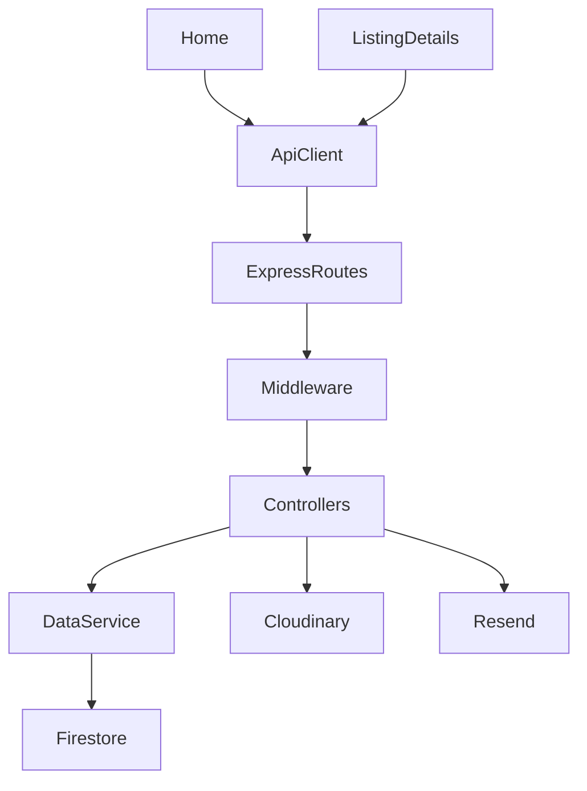
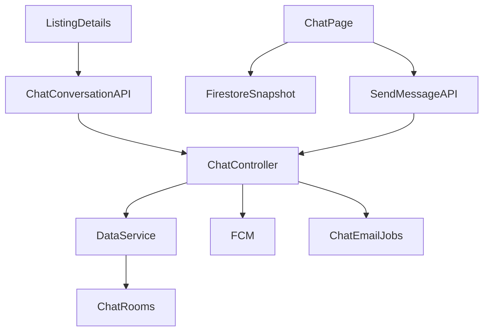
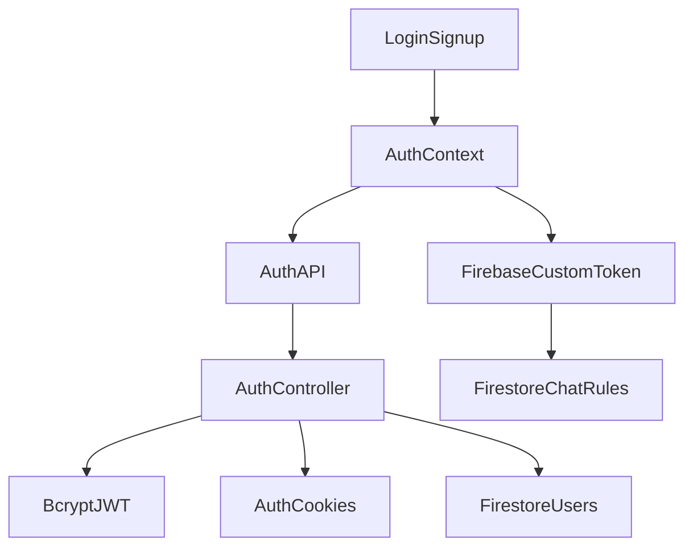

# Collexa Repository Reverse Engineering Report

Analyzed first-party source, config, public assets, built artifacts, and repo metadata. node_modules, client/dist, and server/public/assets are present and inventoried as generated/vendor artifacts, not application source.

## STEP 1 — Repository Inventory

```
Collexa/
├─ client/                  React/Vite frontend
│  ├─ src/
│  │  ├─ components/        Shared UI/layout/guards/PWA/SEO components
│  │  ├─ context/           Auth, notifications, PWA, guest prompts, updates
│  │  ├─ hooks/              Push notification hook
│  │  ├─ lib/                Firebase client + FCM helpers
│  │  ├─ pages/              Route-level React pages
│  │  ├─ services/           Axios API client
│  │  └─ utils/              Shared frontend moderation/privacy helpers
│  ├─ public/                PWA manifest, service worker, logos, robots, screenshots
│  ├─ dist/                  Built frontend artifact
│  └─ config files           Vite, Tailwind, PostCSS, Vercel, env templates
├─ server/                  Express/Firebase backend
│  ├─ api/                   Vercel serverless entry
│  ├─ config/                Firebase Admin, Cloudinary, Resend email
│  ├─ controllers/           Request handlers
│  ├─ cron/                  Expiry and chat-email worker scheduler
│  ├─ middleware/            Auth, CSRF, validation, rate limit, upload, errors
│  ├─ public/                Built SPA served by container/deploy
│  ├─ routes/                Express route registration
│  ├─ services/              Firestore data access, notifications, chat email jobs
│  ├─ utils/                 Cookies, email templates, OTP, moderation/privacy
│  └─ __tests__/             Email/admin email campaign tests
├─ firestore.rules          Firestore client access rules
├─ firestore.indexes.json   Firestore index for chat room query
├─ Dockerfile               Multi-stage client build + server image
├─ docker-compose.yml       Server + Mongo container, but Mongo is not used by code
├─ firebase.json            Firestore deployment config
├─ package.json             Root misc deps only
└─ docs/md files            Existing docs/change notes
```

| Area | Purpose | Important Files | Connections |
|---|---|---|---|
| client/src/pages | Route screens and workflow orchestration | Home, Login, Signup, ListingDetails, Chat, AdminDashboard | Calls services/api, contexts, Firebase |
| client/src/components | Reusable UI, route guards, SEO, PWA/push UI | Navbar, ProtectedRoute, AdminRoute, ListingCard, Seo, NotificationInitializer | Used by App.jsx and pages |
| client/src/context | Global app state | AuthContext, NotificationContext, UpdatesContext | Wraps app in App.jsx; consumes API/Firebase |
| server/routes | HTTP surface | authRoutes, listingRoutes, adminRoutes, chatRoutes | Mounted in server/app.js |
| server/controllers | Business handlers | authController, listingController, adminController, chatController | Call services/config/utils |
| server/services | Firestore and notification infrastructure | dataService, notificationService, chatNotificationService | Defines implicit schemas |
| server/middleware | Security and validation | auth, csrf, validation, rateLimiter | Applied in routes/app |
| server/config | External services | firebase.js, firebaseAdmin.js, cloudinary.js, email.js | Used across controllers/services |
| public/dist/server/public | PWA/static frontend | manifest.json, firebase-messaging-sw.js, logos | Served by frontend/deployment |

### Environment Variables Used

| Scope | Variables |
|---|---|
| Server core | PORT, NODE_ENV, FRONTEND_URL, PUBLIC_SITE_URL, JWT_SECRET, JWT_EXPIRE, ENABLE_CRON, VERCEL, SITEMAP_STATIC_LASTMOD |
| Firebase Admin | FIREBASE_PROJECT_ID, FIREBASE_CLIENT_EMAIL, FIREBASE_PRIVATE_KEY, FIREBASE_ADMIN_KEY, FIREBASE_SERVICE_ACCOUNT_KEY, GOOGLE_APPLICATION_CREDENTIALS |
| Email | RESEND_API_KEY, EMAIL_FROM, COMPANY_EMAIL, ADMIN_EMAIL, ADMIN_PASSWORD |
| Cloudinary | CLOUDINARY_CLOUD_NAME, CLOUDINARY_API_KEY, CLOUDINARY_API_SECRET |
| Auth integrations | GOOGLE_CLIENT_ID, RECAPTCHA_SECRET_KEY |
| Chat email worker | CHAT_EMAIL_DELAY_MIN_SECONDS, CHAT_EMAIL_DELAY_MAX_SECONDS, CHAT_EMAIL_COOLDOWN_MINUTES, CHAT_ACTIVITY_WINDOW_MS, CHAT_EMAIL_WORKER_BATCH_SIZE |
| Client | VITE_API_URL unused by axios, VITE_FIREBASE_*, VITE_FIREBASE_VAPID_KEY, VITE_GOOGLE_CLIENT_ID, VITE_RECAPTCHA_SITE_KEY, VITE_LISTING_BLACKLIST_WORDS |

### Package Dependencies

| Package File | Runtime Dependencies |
|---|---|
| root package.json | resend, vite-plugin-sitemap |
| client/package.json | React 18, React Router, Axios, Firebase, Google OAuth, ReCAPTCHA, Helmet |
| client dev | Vite, React plugin, Tailwind, PostCSS, Autoprefixer |
| server/package.json | Express, Firebase Admin, bcryptjs, jsonwebtoken, Cloudinary, multer, Resend, Helmet, CORS, cookie-parser, express-validator, express-rate-limit, node-cron, google-auth-library, axios |
| server dev | nodemon |

Build/package manager: npm. Bundler: Vite/Rollup. Styling: Tailwind CSS. Deployment configs: Docker, Vercel, Firebase Firestore.

## STEP 2 — Technology Detection

| Technology | Why / Where | Responsible Files | Alternatives |
|---|---|---|---|
| React SPA | JSX pages/components | client/src/* | Vue, Svelte, Next.js |
| React Router | Route definitions/protected routes | App.jsx, route guards | TanStack Router, Next routing |
| Vite | Dev/build/proxy | client/vite.config.js | Webpack, Parcel |
| Tailwind CSS | Utility classes/theme | index.css, tailwind.config.js | CSS Modules, Chakra, MUI |
| Express | Backend API | server/app.js, routes/* | Fastify, NestJS, Koa |
| Firestore | Data persistence | dataService.js, firebase.js, rules/indexes | MongoDB, Postgres |
| Firebase Auth custom token | Chat client auth | AuthContext, chatController, Firestore rules | Full Firebase Auth, Socket.IO auth |
| Firebase Cloud Messaging | Push notifications | firebaseMessaging.js, SW, notificationService.js | Web Push directly, OneSignal |
| JWT auth | Backend session token | authController, auth.js, authCookies.js | Server sessions, Firebase Auth |
| CSRF double-submit | Mutating requests | csrf.js, api.js, cookies | SameSite strict, synchronizer token |
| bcryptjs | Password hashing | authController, userController | argon2, bcrypt native |
| Resend | Email/OTP/campaigns | email.js, sendEmail.js, admin email controller | SendGrid, SES, Mailgun |
| Cloudinary | Image hosting/uploads | cloudinary.js, listing/user routes | S3, Firebase Storage |
| ReCAPTCHA v2 | Signup/password reset bot defense | Captcha.jsx, captchaVerify.js | hCaptcha, Turnstile |
| express-validator | Request validation | validation.js | Zod, Joi |
| express-rate-limit | Abuse limits | rateLimiter.js | Redis-backed limiter |
| node-cron | Scheduled expiry/email jobs | expireListings.js | Cloud Scheduler, queue worker |
| Helmet/CORS | HTTP security | app.js | custom middleware |

## STEP 3 — Component Discovery

| Component | Purpose | Props | State/Hooks | API Calls | Parent/Children |
|---|---|---|---|---|---|
| App | Providers/routes/layout | none | splash state | none | root; wraps all pages |
| Navbar | Navigation, notifications, unread chat | none | dropdowns, Firestore snapshot | notifications context | App; links/buttons |
| ProtectedRoute | Auth route guard | children | useAuth, location | none | protected routes |
| AdminRoute | Admin guard | children | useAuth | none | admin routes |
| ListingCard | Listing preview card | listing | useAuth | none | Home |
| Captcha | Google reCAPTCHA | onChange, onExpired, ref | none | external widget | login/signup |
| Seo | Helmet metadata/schema | title, description, canonical, robots, structuredData | none | none | pages |
| PolicyGate | Forces policy agreement | none | useAuth | agreeToPolicies via popup | App, WelcomePopup |
| WelcomePopup | Terms/welcome modal | onClose | visible/loading | /auth/agree-policies through context | PolicyGate, Signup |
| NotificationInitializer | Push setup prompt | none | permission/message | /notifications/register-token | App |
| ChatNotificationBridge | Browser chat notifications and activity sync | none | refs/effects | /chat/notifications/state, cancel | App |
| InstallBanner | PWA install CTA | none | usePwa | none | App |
| LatestUpdatePopup | Latest update modal | update, open, onClose | escape key effect | none | Home |
| UpdateCard | Update display | update, compact, onOpen | none | none | updates views |
| UpdatesSection | Update preview section | updates, loading, limit | none | none | apparently available, not central |
| UserStats | Animated joined count | none | count/visibility | /auth/stats | Login/Signup |
| RestrictedActionButton | Disabled-looking guest action | children/onClick/className/title/disabled | none | none | Navbar/ListingDetails |
| LongFormSeoPage | SEO article template | content/SEO props | none | none | SEO pages |
| BottomNav | Empty file | none | none | none | not used |
| Context components | Global state providers | children | useState/useEffect | auth/notification/update APIs | App |

## STEP 4 — Page Discovery

| Route | Page | Protected | Purpose | Components | Data/API |
|---|---|---|---|---|---|
| / | Home | No | Listing browse/search/filter | Seo, ListingCard, LatestUpdatePopup | GET /listings, GET /auth/stats |
| /login | Login | No | Login/Google/forgot/reset | Captcha, UserStats, Seo | auth context endpoints |
| /signup | Signup | No | Email OTP signup/Google signup | Captcha, WelcomePopup, UserStats | auth context endpoints |
| /listing/:id | ListingDetails | No, actions gated | Listing detail, seller contact, chat, report account | Seo, restricted button | GET /listings/:id, POST /chat/conversation, POST /support/account-report |
| /create-listing | CreateListing | Yes | Create listing/image upload | notification helpers | GET /listings/my-listings, POST /listings |
| /edit-listing/:id | EditListing | Yes | Edit listing text/tags/price | none | GET /listings/:id, PUT /listings/:id |
| /my-listings | MyListings | Yes | Seller listing management | links/cards | GET my-listings, delete/reactivate/sold |
| /profile | Profile | Yes | Profile update/delete | auth context | GET/PUT/DELETE /users/profile |
| /bug-report | BugReport | Yes | Submit bug report | none | POST /support/bug-report |
| /chat, /chat/:conversationId | Chat | Yes | Conversations/messages | Firestore direct | POST /chat/messages, Firestore snapshots |
| /updates | Updates | No | Published announcements | UpdateCard | GET /updates via context |
| /policies | Policies | No | Static policies | Seo | none |
| /admin* | AdminDashboard | Admin | Stats/users/listings/updates/email campaigns | internal tabs | many /admin/*, also DELETE /listings/:id |
| SEO routes | VitOlx, VitMarketplace, BuySellVit, blog pages | No | Long-form SEO content | LongFormSeoPage | none |

## STEP 5 — Backend Discovery

| Layer | Files | Responsibilities |
|---|---|---|
| Entry | server.js, app.js, api/index.js | Start Express, security middleware, route mounting, Vercel export |
| Routes | routes/* | Declare HTTP endpoints and middleware order |
| Controllers | auth, listing, user, admin, chat, notification, report, support, update, sitemap | Request orchestration/business logic |
| Services | dataService, notificationService, chatNotificationService | Firestore CRUD, FCM, email fallback queue |
| Middleware | auth, optionalAuth, csrf, captchaVerify, validation, rateLimiter, upload, errorHandler, admin | Auth/security/input/limits/errors |
| Config | firebase, firebaseAdmin, cloudinary, email | External service clients |
| Cron | expireListings | 2 AM listing expiry sync; 30s chat-email job processor |
| Utils | authCookies, sendEmail, generateOTP, privacy, listingModeration | Cookies, templates, masking, blacklist |

No standalone model files exist; Firestore shapes are implicit.

## STEP 6 — API Discovery

| Method | Endpoint | Auth | Controller/Purpose | Request | Response/Errors |
|---|---|---|---|---|---|
| GET | /api/health | No | health | none | {status:"ok"} |
| GET | /api/auth/csrf | No | rotate CSRF | none | csrfToken |
| POST | /api/auth/signup | No + CAPTCHA | send signup OTP | name,email,password,phone,captcha | success/captchaGrant; generic for existing/blocked |
| POST | /api/auth/verify-otp | No | create account/session | email,otp,name,password,phone | user, csrf; 400/403/409 |
| POST | /api/auth/login | No | password login | email,password | user, csrf; 401/403 |
| POST | /api/auth/google | No | Google login/signup | token | user,isNewUser; 403 for non-VIT |
| GET | /api/auth/me | Yes | current user | cookie | user |
| POST | /api/auth/resend-otp | No + CAPTCHA | resend signup OTP | email | success |
| POST | /api/auth/forgot-password | No + CAPTCHA | password reset OTP | email | generic success |
| POST | /api/auth/reset-password | No | reset password | email,otp,newPassword | success; clears cookies |
| POST | /api/auth/agree-policies | Yes+CSRF | agree policies | none | user |
| POST | /api/auth/logout | Yes+CSRF | clear cookies | none | success |
| GET | /api/auth/stats | No | user count | none | userCount |
| GET | /api/listings | Optional | browse listings | filters/page/limit | listings/page |
| GET | /api/listings/my-listings | Yes | seller listings | status/page/limit | listings |
| GET | /api/listings/:id | Optional | listing detail/view count | id | listing; 404 |
| POST | /api/listings | Yes+CSRF | create listing | multipart fields/images | listing; validation/upload errors |
| PUT | /api/listings/:id | Yes+CSRF | update listing | JSON or multipart | listing; 403 edit cap/ownership |
| PUT | /api/listings/:id/sold | Yes+CSRF | mark sold | id | listing |
| DELETE | /api/listings/:id | Yes+CSRF | delete listing/images | id | success |
| POST | /api/listings/:id/reactivate | Yes+CSRF | reactivate expired | id | listing |
| GET | /api/users/profile | Yes | profile | none | user |
| PUT | /api/users/profile | Yes+CSRF | update profile/photo | form/body | user |
| PUT | /api/users/change-password | Yes+CSRF | change password | current/new | success; clears cookies |
| DELETE | /api/users/profile | Yes+CSRF | soft delete account | none | success |
| POST | /api/reports | Yes+CSRF | report listing | listingId,reason,description | report; 409 duplicate |
| GET | /api/reports/my-reports | Yes | own reports | none | reports |
| POST | /api/support/bug-report | Yes+CSRF | email bug report | title,description,pageUrl,deviceInfo | success |
| POST | /api/support/account-report | Yes+CSRF | email account report | reportedUserId,reason,details | success |
| GET | /api/notifications | Yes | list notifications | none | notifications |
| PUT | /api/notifications/read-all | Yes+CSRF | mark all read | none | success |
| PUT | /api/notifications/:id/read | Yes+CSRF | mark one read | id | notification |
| POST | /api/notifications/register-token | Yes | save FCM token | fcmToken | success |
| POST | /api/notifications/remove-token | Yes | remove FCM token | fcmToken? | success |
| GET | /api/chat/token | Yes | Firebase custom token | none | token |
| POST | /api/chat/conversation | Yes | create/get conversation | participantId,listingId | conversation |
| POST | /api/chat/messages | Yes+CSRF | append message/send push/email fallback | conversationId,recipientId,messageText | message,push |
| GET | /api/chat/user/:id | Yes | compact chat user | id | user |
| POST | /api/chat/notifications/state | Yes+CSRF | sync activity | permission,visibility,activeConversationId | state |
| POST | /api/chat/notifications/missed-message | Yes+CSRF | queue email fallback | conversationId,recipientId,messageId,messageText | queued |
| POST | /api/chat/notifications/cancel/:conversationId | Yes+CSRF | cancel queued job | conversationId | cancelled |
| GET | /api/updates | No | published updates | limit | updates |
| Admin | /api/admin/* | Admin mostly CSRF for mutations | stats/users/listings/reports/updates/email campaigns | validated | data/logs/errors |
| Sitemap | /sitemap.xml, /sitemaps/* and /api/... | No | XML sitemap | path | XML |
| Wishlist | /api/wishlist/* | Yes | not implemented | any | 501 |

## STEP 7 — Database Discovery

| Collection | Fields / Shape | Relationships / Notes |
|---|---|---|
| users | email, name, passwordHash, phone, phoneVerified, year, department, accountType, profilePicture, showPhoneNumber, isVerified, isAdmin, isDeleted, agreedToPolicies, sessionVersion, lastLoginAt, fcmToken(s), notificationState, notificationMeta, timestamps | referenced by listings, reports, chat participants |
| userEmails | doc id normalized email, userId, createdAt | unique email mapping in transaction |
| listings | sellerId, title, description, category, condition, price, listingType, rentDuration, showPhone, contactPhone, tags, images[{url,publicId}], status, editCount, expiresAt, viewCount, reportCount, timestamps | seller relationship; images in Cloudinary |
| reports | doc id ${listingId}_${reportedBy}, listingId, reportedBy, reason, description, status, reviewedBy, reviewNote, reviewedAt, timestamps | duplicate report prevention by deterministic id |
| otps | doc id email, otpRecords[{id,otp,purpose,createdAt,expiresAt}] | 15 min TTL handled manually |
| blockedEmails | doc id email, email, blockedAt, blockedBy, reason, userId | checked during auth/signup/login |
| notifications | userId, type, message, link, read, timestamps | user notifications |
| updates | title, content, type, tags, isPinned, isPublished, expiresAt, timestamps | public announcements; pruned to 4 on create |
| emailLogs | campaign metadata, templates, counts, failures, accepted provider IDs, status | admin audit |
| chatRooms | doc id sorted user ids, participants[2], unreadCounts, messages[], lastMessage, lastMessageAt, productId, timestamps | client reads directly; Firestore index configured |
| chatNotificationJobs | conversationId, recipientId, sender/message metadata, status, sendAfter, delivery fields | processed by server interval |
| _ | temporary collection only to generate ids | not persistent app data |

Indexes: only chatRooms(participants array-contains, lastMessageAt desc) defined. Firestore rules allow users to read/write own users/{uid} and participant-only chat room reads/limited updates.

## STEP 8 — Authentication Discovery

| Flow | Implementation |
|---|---|
| Registration | POST /auth/signup validates VIT email + CAPTCHA, sends OTP via Resend, stores OTP in Firestore; verify-otp hashes password with bcrypt cost 12, creates user, deletes OTP, sends admin new-account email |
| Login | password login checks blocklist, bcrypt compare, verified flag, updates lastLoginAt, issues JWT cookie |
| Google | verifies ID token using GOOGLE_CLIENT_ID, requires vitstudent.ac.in unless ADMIN_EMAIL, creates user if missing |
| JWT | signed with JWT_SECRET, payload {userId,isAdmin,sessionVersion}; no explicit expiresIn despite JWT_EXPIRE env |
| Cookie storage | access_token HttpOnly; max age 10 years; SameSite none+secure in production, lax dev |
| CSRF | readable csrf_token cookie; mutating requests require matching X-CSRF-Token; client retries once after /auth/csrf |
| Verification | auth middleware validates JWT, sessionVersion, user exists/not deleted/not blocked/isVerified |
| Authorization | admin checks req.isAdmin; listings check seller/admin ownership |
| Logout | clears auth + CSRF cookies; client also signs out Firebase |
| Token storage | JWT cookie; Firebase custom token used to sign into client Firebase Auth for chat |
| Missing/mismatch | JWT_EXPIRE not applied; /users/profile/verify-phone is called by context but no backend route exists |

## STEP 9 — Workflow Discovery

| Workflow | Files Involved |
|---|---|
| Login | Login.jsx, AuthContext.jsx, api.js, authRoutes.js, authController.js, authCookies.js, auth.js, dataService.js |
| Registration | Signup.jsx, Captcha.jsx, AuthContext, captchaVerify, validation, sendEmail, dataService |
| Password reset | Login.jsx, AuthContext, authController, sendPasswordResetOTPEmail, dataService |
| Listing creation | CreateListing.jsx, listingModeration, listingRoutes, cloudinary, upload, validation, listingController, dataService |
| Listing browsing/search | Home.jsx, ListingCard, optionalAuth, listingController.filterListings, dataService |
| Listing details/contact | ListingDetails.jsx, listingController, privacy, chat routes, support routes |
| Listing editing | EditListing.jsx, listingController.updateListing, validation, Cloudinary delete on image replacement |
| Listing lifecycle | MyListings.jsx, expireListings.js, syncExpiredListings, sold/delete/reactivate endpoints |
| Profile update/delete | Profile.jsx, AuthContext, userRoutes, userController, dataService |
| Chat | ListingDetails, Chat.jsx, ChatNotificationBridge, Firebase client, chatController, dataService, Firestore rules/indexes |
| Push notifications | NotificationInitializer, usePushNotifications, firebaseMessaging, service worker, notificationService |
| Email fallback | chatNotificationService, expireListings.js, email.js, Resend |
| Admin moderation | AdminDashboard, adminRoutes, adminController, listing/user/report services |
| Admin updates | AdminDashboard, updateController, UpdatesContext, Updates.jsx, UpdateCard |
| Admin email campaign | AdminDashboard, adminController.sendAdminEmailCampaign, emailLogs, email.js |
| Bug/account reports | BugReport, ListingDetails, supportController, sendEmail, notifications |
| SEO/sitemap | SEO pages, Seo, sitemapRoutes, sitemapController |

## STEP 10 — Dependency Graph







## STEP 11 — Configuration Discovery

| Config | Details |
|---|---|
| Express | Helmet CSP, CORS allowlist from FRONTEND_URL + localhost, JSON/urlencoded 25kb, cookies, CSRF cookie, global /api limiter, route mounts |
| Firebase | Server uses env service account in config/firebase.js; alternate admin loader in firebaseAdmin.js; client uses Vite Firebase envs |
| Cloudinary | folders collexa/profiles, collexa/listings; image transform max 1200, quality/fetch auto |
| Resend | requires RESEND_API_KEY + verified EMAIL_FROM; rejects personal sender domains |
| Vite | port 5173, proxy /api, /sitemap.xml, /sitemaps to localhost:5000 |
| Tailwind | Inter font, brand blue palette, xs-sm-md-lg-xl breakpoints |
| Docker | builds client then copies dist into server public; exposes 5000 |
| Docker Compose | includes MongoDB despite code using Firestore; MONGO_URI appears unused |
| Firebase deploy | Firestore rules/indexes only; location asia-south2 |
| PWA | manifest, FCM service worker, cache collexa-v5, offline HTML fallback |

## STEP 12 — Architecture Summary

Collexa is a VIT-focused marketplace implemented as a React/Vite SPA backed by an Express API. Authentication is server-owned via JWT cookies and CSRF protection, while chat uses Firebase custom auth and direct Firestore subscriptions for realtime reads. Firestore is the primary database; Cloudinary stores listing/profile images; Resend handles OTP, support, chat fallback, and admin campaign email. The backend is organized route → middleware → controller → service, with dataService.js acting as the implicit repository/model layer. The frontend keeps global auth, notifications, PWA install state, guest prompts, and updates in React contexts.

Important implementation notes:

- No MongoDB code exists despite Docker Compose defining Mongo.
- No model/schema files exist; schema is implicit.
- BottomNav.jsx is empty.
- /users/profile/verify-phone is referenced by frontend but not implemented.
- JWT_EXPIRE is documented but not used in token signing.
- Sitemap index path has a latent bug above 50,000 URLs due to an out-of-scope listings reference.
- Several files show mojibake/encoding artifacts for rupee/emoji characters.

### Repository Understanding Score

**91 / 100**

### Information Still Missing

- Actual production secrets/env values and current deployed infrastructure.
- Live Firestore data contents and whether older legacy image formats still exist.
- Test runner configuration; tests exist but server/package.json has no test script.
- Complete behavioral confirmation from running the app against real Firebase/Cloudinary/Resend services.
- Product intent for unimplemented wishlist and phone verification features.
