# Collexa — Technical Documentation

## 1. Project Overview

### What It Is

Collexa is a full-stack marketplace application for VIT students. It allows verified campus users to browse, create, edit, manage, and discuss listings for items such as books, cycles, electronics, instruments, sports equipment, lab equipment, and other student-relevant goods.

The system is implemented as a React single-page application (SPA) backed by an Express API. Firestore is the primary database, Cloudinary stores uploaded images, Firebase Cloud Messaging (FCM) supports push notifications, and Resend sends OTP, support, chat-fallback, and admin campaign emails.

### Why It Exists

The business objective is to provide a trusted, campus-focused alternative to generic classified platforms. A marketplace restricted to a single student body can reduce noise, improve trust, and simplify handoffs, because every buyer and seller belongs to the same campus community.

### Target Users

| User Type | Description | Primary Goals |
|---|---|---|
| Guest visitor | Unauthenticated user browsing the public marketplace and SEO pages | Browse listings, understand the platform, sign up |
| VIT student | Authenticated non-admin user with a VIT email | Create listings, chat with sellers, manage profile, report issues |
| Seller | Any authenticated user who posts listings | Upload images, manage listing lifecycle, receive chat/push/email notifications |
| Admin | User whose account is marked `isAdmin` | Moderate users, listings, and reports; publish updates; send email campaigns |

### Core Functionality

| Capability | Implemented | Notes |
|---|:---:|---|
| Email/password signup with OTP | Yes | Restricted to `@vitstudent.ac.in` by validation |
| Google login/signup | Yes | Requires a VIT email unless the account is the configured admin email |
| Listing creation | Yes | Multipart image upload to Cloudinary |
| Listing browsing/search/filtering | Yes | In-memory filtering over Firestore results |
| Listing editing | Yes | Non-admin users are limited to 3 edits |
| Listing deletion | Yes | Deletes Cloudinary images and the Firestore document |
| Listing reactivation | Yes | Expired listings can be reactivated for another 30 days |
| Mark as sold | Yes | Sets listing status to `sold` |
| Direct chat | Yes | Firestore-backed realtime chat rooms |
| Push notifications | Yes | FCM token registration and send path |
| Missed-chat email fallback | Yes | Queued Firestore jobs processed by an interval worker |
| Admin dashboard | Yes | Stats, users, listings, updates, email campaigns |
| Wishlist | No | Route exists but returns `501 Not Implemented` |
| Phone verification | No | Frontend references the route, but the backend does not implement it |

### Key Highlights

- Clear route → controller → service structure on the backend.
- Firestore is used consistently for all application data.
- Authentication uses HttpOnly JWT cookies plus CSRF protection.
- The client uses Firebase Auth custom tokens for Firestore chat access.
- Image storage is delegated entirely to Cloudinary.
- Email delivery is centralized through Resend.
- PWA assets and a Firebase Messaging service worker are present.
- SEO pages, dynamic metadata, and sitemap generation are included.

### Current Limitations

| Limitation | Impact |
|---|---|
| No explicit Firestore schema/model layer | Data contracts are spread across controllers, validators, services, and client-side assumptions |
| Search/filtering is in-memory | Poor scalability as listing volume grows |
| `JWT_EXPIRE` env variable is unused | Sessions rely on a 10-year cookie; the token itself has no configured `expiresIn` |
| Docker Compose includes MongoDB | Misleading deployment config, since the app uses Firestore, not MongoDB |
| Phone verification route is missing | The frontend API function is dead — or will error — if called |
| Wishlist route is not implemented | The feature surface exists but returns `501` |
| Sitemap index bug above 50,000 URLs | Large listing volumes can break sitemap index generation |
| Encoding artifacts in some files | Rupee and emoji characters show mojibake in several files |

---

## 2. System Architecture

### High-Level Architecture

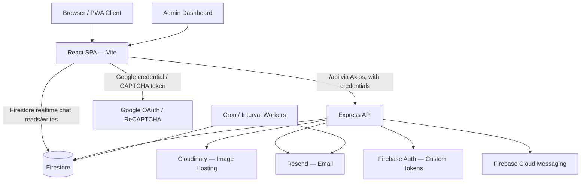

### Component Responsibilities

| Component | What | Why | How |
|---|---|---|---|
| Browser / PWA | Runs the React app, service worker, and push notification UI | Provides an installable, mobile-like experience | Loads static assets and registers `firebase-messaging-sw.js` |
| React SPA | User interface and workflow state | Keeps marketplace interactions fast and client-side | React Router, contexts, Axios, Firebase client SDK |
| Express API | Backend business logic and security boundary | Centralizes auth, validation, moderation, uploads, and admin actions | Route → middleware → controller → service |
| Firestore | Primary database | Managed, realtime NoSQL database — well suited to chat snapshots | `dataService.js`, Firebase Admin, and the client Firestore SDK |
| Cloudinary | Image storage and transformations | Avoids server-side file storage and provides optimized CDN image URLs | Multer with Cloudinary storage |
| Firebase Auth | Custom auth for chat access to Firestore | Lets Firestore rules identify chat participants | Server creates a custom token; client signs in with it |
| FCM | Push notifications | Alerts users about chat and listing activity | Client registers an FCM token; server sends multicast messages |
| Resend | Email delivery | OTP, support, fallback, and campaign email | Centralized `sendMail` wrapper |
| Cron workers | Background maintenance | Expires listings and processes queued missed-message emails | `node-cron` and `setInterval` |

### Communication Patterns

| Path | Protocol | Data | Notes |
|---|---|---|---|
| React → Express | HTTPS, JSON/multipart | Auth, listings, admin, support | Uses `withCredentials` and a CSRF header |
| React → Firestore | Firebase SDK | Chat room snapshots and unread-count updates | Requires a Firebase custom-token sign-in |
| Express → Firestore | Firebase Admin SDK | All server-side data | Requires a service account in the environment |
| Express → Cloudinary | Cloudinary SDK via Multer | Listing/profile images | Stores the returned URLs and public IDs |
| Express → Resend | Resend SDK | OTP, support, admin, and chat email | Requires a verified sender domain |
| Express → FCM | Firebase Admin Messaging | Push payloads | Invalid tokens are pruned |

### Trade-Offs

| Decision | Benefit | Trade-Off |
|---|---|---|
| Firestore for all persistence | Fast development, native realtime chat support | No explicit relational constraints; query limitations |
| Direct client reads from Firestore for chat | Realtime UX without a Socket.IO server | More complex security rules and a dual auth model |
| JWT cookie auth for the API | Server-controlled sessions with an HttpOnly token | Requires CSRF handling and careful same-site cookie behavior |
| Cloudinary for images | CDN and transformations out of the box | External vendor dependency and upload failure modes |
| In-memory listing filters | Simple to implement | Does not scale to large listing counts |

### Future Improvements

- Introduce explicit schema definitions using Zod, or a shared TypeScript model package.
- Move search to Firestore queries with composite indexes, or to a dedicated search engine.
- Replace interval workers with managed queue/scheduler infrastructure.
- Consolidate auth around either Firebase Auth or server sessions, to reduce dual-token complexity.
- Remove the stale MongoDB deployment configuration.

---

## 3. Technology Stack

| Technology | Purpose | Why Chosen | Advantages | Trade-Offs | Alternatives | Why Not the Alternatives |
|---|---|---|---|---|---|---|
| React | Frontend UI | Mature SPA framework | Component model, large ecosystem | Client-side complexity | Vue, Svelte | The repo already uses React patterns |
| Vite | Frontend build/dev tool | Fast dev server and modern bundling | Simple config, proxy support | SPA-only, no SSR | Webpack, Next.js | Simpler than Webpack; SSR is not implemented |
| React Router | Client-side routing | SPA route management | Guards, params, nested components | SEO depends on client-side rendering | Next.js routing | The app is not built on Next.js |
| Tailwind CSS | Styling | Utility-first implementation | Fast UI iteration | Class-heavy JSX | CSS Modules, MUI | The existing UI is built around Tailwind |
| Express | Backend API | Lightweight Node framework | Rich middleware ecosystem | Requires manual structure | Fastify, NestJS | The existing codebase is Express-based |
| Firestore | Database | Realtime, managed NoSQL | Chat subscriptions, serverless scaling | Query and index constraints | MongoDB, Postgres | The code uses Firestore; the Mongo config is stale |
| Firebase Admin | Server access to Firestore, FCM, and custom tokens | Required for privileged operations | Unified Firebase backend | Service account management | REST APIs | The SDK is simpler to use |
| Firebase client SDK | Chat and messaging | Realtime subscriptions and FCM | Direct client updates | Requires strict security rules | Socket.IO | Firestore is already in use |
| JWT | API session token | Stateless authentication | Simple verification | Revocation depends on `sessionVersion` | Server-side sessions | A stateless design was chosen |
| HttpOnly cookies | Token storage | Reduces XSS-based token theft | Browser sends them automatically | Requires CSRF protection | `localStorage` | More secure for storing a JWT |
| CSRF double-submit | Protects mutating requests | Cookie auth requires CSRF mitigation | Simple to implement | Token-sync complexity | SameSite=Strict, server-side token store | Cross-site production cookies require `SameSite=None` |
| bcryptjs | Password hashing | Established password-hashing library | Salted hashing, easy integration | Slower than native implementations | argon2, native bcrypt | Existing dependency |
| Cloudinary | Image hosting | Managed CDN with transformations | Optimized image delivery | Vendor dependency | S3, Firebase Storage | Faster feature delivery |
| Multer | Multipart parsing | Standard Express upload middleware | Handles file limits | Needs storage integration | Busboy | Integrates cleanly with Cloudinary storage |
| Resend | Email provider | Transactional email | Simple API | Sender-domain requirements | SES, SendGrid | Existing implementation |
| Helmet | Security headers | Hardens HTTP responses | CSP and sane header defaults | CSP requires ongoing maintenance | Manual headers | Less error-prone |
| CORS | Cross-origin API access | Needed for dev/prod origin separation | Controlled origins | Risk of config drift | Same-origin only | The Vite proxy and prod domains require config |
| express-rate-limit | Abuse prevention | Protects auth, OTP, and report endpoints | Simple middleware | Memory store doesn't scale across instances | Redis-backed limiter | Sufficient for current scale |
| express-validator | Validation | Middleware-based validation | Request-level constraints | Imperative, and duplicated with frontend checks | Zod, Joi | Existing dependency |
| Google OAuth | Social login | Easier signup/login | Verified Google identity | External client configuration | Email-only auth | Improves user convenience |
| ReCAPTCHA | Bot defense | Protects OTP flows | Reduces abuse | Adds UX friction | Turnstile, hCaptcha | Existing implementation |
| node-cron | Scheduled jobs | Listing expiry | Simple in-process scheduling | Not reliable across multiple instances | Cloud Scheduler, managed queues | Sufficient for a single-process deployment |

---

## 4. Folder Structure

### Root

```text
Collexa/
├─ client/
├─ server/
├─ Dockerfile
├─ docker-compose.yml
├─ firebase.json
├─ firestore.rules
├─ firestore.indexes.json
├─ package.json
├─ package-lock.json
├─ README.md
├─ CONCEPTS.md
├─ PRODUCTION_EMAIL_FIX.md
└─ DOCUMENTATION.md
```

| File | Purpose | Notes |
|---|---|---|
| `Dockerfile` | Builds the frontend and backend into a production image | Copies `client/dist` into `server/public` |
| `docker-compose.yml` | Local container orchestration | Includes an unused MongoDB service |
| `firebase.json` | Firebase/Firestore deploy config | Firestore only |
| `firestore.rules` | Client-side Firestore security rules | Covers `users` and `chatRooms` |
| `firestore.indexes.json` | Firestore composite index config | Chat room participant/ordering query |
| `package.json` | Root-level dependencies | Not the main application package |

### Client

```text
client/
├─ public/
├─ src/
│  ├─ components/
│  ├─ context/
│  ├─ hooks/
│  ├─ lib/
│  ├─ pages/
│  ├─ services/
│  └─ utils/
├─ index.html
├─ package.json
├─ vite.config.js
├─ tailwind.config.js
├─ postcss.config.js
├─ vercel.json
└─ .env.example
```

| Folder / File | Responsibility | Key Dependencies |
|---|---|---|
| `src/App.jsx` | Provider composition, layout, and route table | React Router, contexts, guards |
| `src/main.jsx` | React root, Google OAuth provider, service worker registration | React DOM, Helmet, Google OAuth |
| `components/` | UI building blocks and cross-cutting UI services | Contexts, Firebase, API |
| `context/` | Global state providers | API service, Firebase Auth |
| `pages/` | Route-level workflow implementation | API, components, contexts |
| `services/api.js` | Axios instance, CSRF retry logic, chat-user cache | Axios |
| `lib/firebase*.js` | Firebase app/auth/Firestore/messaging setup | Firebase SDK |
| `public/` | PWA assets, service worker, static files | Browser runtime |

### Server

```text
server/
├─ api/
├─ config/
├─ controllers/
├─ cron/
├─ middleware/
├─ public/
├─ routes/
├─ services/
├─ utils/
├─ __tests__/
├─ app.js
├─ server.js
├─ package.json
└─ .env.example
```

| Folder / File | Responsibility | Key Dependencies |
|---|---|---|
| `app.js` | Express app setup: security, routes, cron start | Express, Helmet, CORS, routes |
| `server.js` | Local/production entry point | `app`, email config |
| `api/index.js` | Vercel serverless export | `app` |
| `routes/` | Endpoint definitions | Controllers, middleware |
| `controllers/` | Business request handling | Services, config, utils |
| `services/dataService.js` | Firestore persistence gateway | Firebase Admin |
| `config/firebase.js` | Env-based Firestore Admin setup | Firebase Admin |
| `config/firebaseAdmin.js` | Alternate Admin init, used for messaging | Firebase Admin |
| `config/cloudinary.js` | Upload storage and deletion | Cloudinary, Multer |
| `config/email.js` | Resend send wrapper | Resend |
| `middleware/validation.js` | Request validators | express-validator |
| `cron/expireListings.js` | Background jobs | node-cron |

---

## 5. Frontend Architecture

### Routing

`App.jsx` defines all routes using `BrowserRouter`, `Routes`, and `Route`. Public routes render directly. Authenticated routes are wrapped in `ProtectedRoute`. Admin routes are wrapped in `AdminRoute`.

| Route Type | Examples | Guard |
|---|---|---|
| Public marketplace | `/`, `/listing/:id`, `/updates`, SEO pages | None |
| Auth flow | `/login`, `/signup` | Redirects away if already authenticated |
| Authenticated app | `/create-listing`, `/my-listings`, `/profile`, `/chat` | `ProtectedRoute` |
| Admin | `/admin`, `/admin/users`, `/admin/listings`, `/admin/updates`, `/admin/emails` | `AdminRoute` |

### Page Responsibilities

| Page | Responsibility | Key State | API / External Calls |
|---|---|---|---|
| `Home` | Browse listings, filters, stats, update popup | filters, listings, loading | `/listings`, `/auth/stats` |
| `Login` | Password login, Google login, password reset | mode, forms, captcha, cooldown | Auth context |
| `Signup` | OTP signup and Google signup | step, captcha, OTP, terms | Auth context |
| `CreateListing` | New listing form and upload | form, files, notification prompt | `/listings`, `/notifications/register-token` |
| `EditListing` | Edit listing text data | form, edit count | `/listings/:id` |
| `ListingDetails` | Display item, contact seller, start chat, report account | listing, image carousel, report form | `/listings/:id`, `/chat/conversation`, support |
| `MyListings` | Manage seller listings | filter, listings | My listings, delete, reactivate, sold |
| `Profile` | Profile edits and account deletion | profile form, modal | User context |
| `Chat` | Realtime conversations and messages | conversations, messages, active partner | Firestore snapshots, `/chat/messages` |
| `AdminDashboard` | Admin operations | active tab, lists, update/email forms | `/admin/*` |

### Contexts

| Context | What | Why | Trade-Offs |
|---|---|---|---|
| `AuthContext` | User state and login/signup/logout/profile actions | Central auth state and API wrappers | Large context surface; includes a phone-verification method whose backend route is missing |
| `NotificationContext` | In-app notifications and unread count | Avoids repeated notification fetching | Polls every 60s instead of using realtime updates |
| `PwaContext` | Install-prompt state | Encapsulates PWA browser APIs | Browser support varies |
| `GuestPromptContext` | Modal prompt for guest-only restrictions | Consistent guest-conversion UX | UI state is tied to the router |
| `UpdatesContext` | Published updates, seen state, popup state | Central announcement handling | Uses `localStorage`, client-side only |

### API Layer

`client/src/services/api.js` creates an Axios instance:

```js
const api = axios.create({
  baseURL: '/api',
  withCredentials: true,
  timeout: 30000,
});
```

Why this configuration:

- A same-origin `/api` base URL avoids cross-origin cookie drops.
- `withCredentials` sends the HttpOnly JWT cookie.
- A request interceptor adds `X-CSRF-Token` to mutating requests.
- A response interceptor caches rotated CSRF tokens and retries once on an invalid-CSRF error.
- `401` responses dispatch an `auth:unauthorized` event.

### State Management

The app uses React local state and context rather than Redux or Zustand.

| State Category | Storage |
|---|---|
| Auth user | `AuthContext` |
| Forms | Local component state |
| Notifications | `NotificationContext`, plus polling |
| Updates seen/dismissed | `UpdatesContext`, plus `localStorage` |
| Chat data | Firestore snapshots in `Chat` and `Navbar` |
| CSRF token | In-memory cache, plus cookie |

### Forms and Validation

Validation exists on both the frontend and the backend:

- The frontend provides immediate UX validation.
- The backend is authoritative and uses `express-validator`.
- Listing moderation words are checked on both client and server.
- CAPTCHA is enforced for OTP-generating flows.

**Trade-off:** validation logic is duplicated between the two layers. A shared schema package could reduce drift in the future.

### SEO

SEO is implemented with `react-helmet-async` through the `Seo` component. Long-form SEO pages use `LongFormSeoPage`. Backend sitemap endpoints generate both static and listing URLs.

Limitations:

- The SPA is not server-side rendered.
- Metadata is rendered client-side.
- The sitemap index has a latent bug above 50,000 URLs.

### PWA and Notifications

The frontend registers `/firebase-messaging-sw.js`. The service worker:

- Initializes Firebase Messaging.
- Caches selected static assets.
- Handles background notifications.
- Opens the chat route when a notification is clicked.

Notification setup is split across:

- `NotificationInitializer`
- `usePushNotifications`
- `firebaseMessaging.js`
- `ChatNotificationBridge`
- `notificationService.js` (server-side)

---

## 6. Backend Architecture

### Express Initialization

`server/app.js` performs, in order:

1. Loads environment variables via `dotenv`.
2. Creates the Express app.
3. Configures allowed CORS origins.
4. Sets proxy trust and disables `x-powered-by`.
5. Applies Helmet's CSP.
6. Applies CORS with credentials.
7. Parses cookies, JSON, and URL-encoded bodies.
8. Ensures the CSRF cookie is set.
9. Applies the global `/api` rate limiter.
10. Mounts route modules.
11. Registers health, root, and 404 handlers.
12. Registers the error handler.
13. Starts cron jobs, unless disabled.

### Middleware

| Middleware | Responsibility | Why |
|---|---|---|
| `auth` | Validates the JWT cookie, user state, blocklist, and session version | Protects private endpoints |
| `optionalAuth` | Attaches the user if the token is valid, otherwise continues | Enables enhanced data on public listing pages |
| `admin` | Requires `req.isAdmin` | Protects admin endpoints |
| `requireCsrf` | Double-submit CSRF token check | Protects cookie-authenticated mutating requests |
| `verifyCaptcha` | Verifies ReCAPTCHA or a captcha grant | Protects OTP endpoints |
| `validation` | Request validation and sanitization | Prevents invalid input |
| `rateLimiter` | Per-route abuse protection | Protects auth, OTP, report, and admin flows |
| `upload` | Legacy local Multer upload helper | Present, though the Cloudinary route config is primary |
| `errorHandler` | Converts errors to JSON responses | Ensures consistent API errors |

### Routes and Controllers

The backend follows a consistent request path:

```text
HTTP request
  → Express route
  → Middleware
  → Controller
  → Service / config / utils
  → Firestore / Cloudinary / Resend / FCM
```

Controllers remain responsible for business decisions — ownership checks, edit limits, and response shaping. `dataService.js` is responsible for Firestore document reads, writes, and serialization.

### Error Handling

`errorHandler.js` handles:

- Validation errors
- Duplicate-key-style errors
- JWT errors
- Multer upload errors
- Generic errors

In development, it returns the message, the error object, and the stack trace. In production, unhandled errors return a generic `Request failed` message.

---

## 7. Database Design

### Entity Relationship Overview

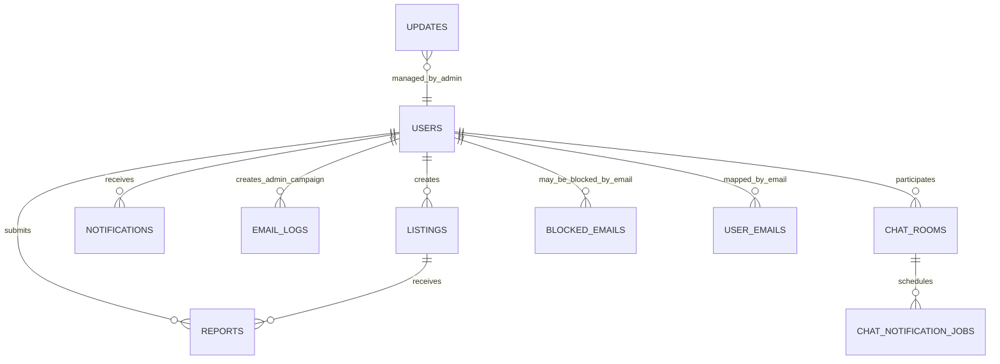

### Collections

| Collection | Fields | Validation Source | Relationships |
|---|---|---|---|
| `users` | Profile, auth, admin, and notification fields | Auth/user validators | Referenced by listings, reports, and chat |
| `userEmails` | Normalized email → `userId` | Transaction in `createUser` | Uniqueness helper |
| `listings` | Seller, item details, price, images, status, counters | Listing validators | Belongs to a user |
| `reports` | `listingId`, reporter, reason, review fields | Report/admin validators | User reports a listing |
| `otps` | Email plus active OTP records | Auth controller | Signup and password reset |
| `blockedEmails` | Blocked-email metadata | Admin actions | Checked during auth/signup/login |
| `notifications` | `userId`, type, message, read status | Notification controller | Belongs to a user |
| `updates` | Announcement content and visibility | Update controller | Public/admin |
| `emailLogs` | Campaign metadata and delivery results | Admin email controller | Admin audit trail |
| `chatRooms` | Participants, messages, unread counts | Firestore rules/controller | Two users |
| `chatNotificationJobs` | Queued missed-message email jobs | Chat notification service | Chat room + recipient |

### Indexes

`firestore.indexes.json` defines a single composite index:

| Collection | Fields | Purpose |
|---|---|---|
| `chatRooms` | `participants` (array-contains), `lastMessageAt` (desc) | Orders the chat conversation list by newest activity |

### Firestore Rules

The rules allow:

- Users to read/write only their own `users/{userId}` document.
- Authenticated chat participants to create, read, and update chat rooms.
- Chat room updates only to `lastMessage`, `lastMessageAt`, `unreadCounts`, and `messages`.
- No deletion of chat rooms.

Limitations:

- Rules only cover client-accessed collections.
- Most collections are server-only and are not explicitly protected by rules, since clients do not need direct access to them.
- Chat message array growth can become a document-size bottleneck.

---

## 8. API Documentation

### Conventions

All API routes are mounted under `/api`, except the sitemap routes, which are mounted both at the root and under `/api`.

Mutating, authenticated requests require:

```http
Cookie: access_token=...
Cookie: csrf_token=...
X-CSRF-Token: same-value-as-csrf-cookie
```

Typical success envelope:

```json
{
  "success": true,
  "message": "Operation completed"
}
```

Typical validation error:

```json
{
  "success": false,
  "message": "Validation failed",
  "errors": [
    { "field": "email", "message": "Invalid email format" }
  ]
}
```

### Authentication APIs

| Method | Endpoint | Auth | Purpose |
|---|---|---|---|
| GET | `/api/auth/csrf` | No | Rotate/set the CSRF token |
| POST | `/api/auth/signup` | No | Send a signup OTP |
| POST | `/api/auth/verify-otp` | No | Verify the OTP and create the account |
| POST | `/api/auth/login` | No | Password login |
| POST | `/api/auth/google` | No | Google login/signup |
| GET | `/api/auth/me` | Yes | Get the current user |
| POST | `/api/auth/resend-otp` | No | Resend the signup OTP |
| POST | `/api/auth/forgot-password` | No | Send a reset OTP |
| POST | `/api/auth/reset-password` | No | Reset the password |
| POST | `/api/auth/agree-policies` | Yes + CSRF | Mark policies as accepted |
| POST | `/api/auth/logout` | Yes + CSRF | Clear cookies |
| GET | `/api/auth/stats` | No | Public user count |

**Example — login request:**

```http
POST /api/auth/login
Content-Type: application/json

{
  "email": "student@vitstudent.ac.in",
  "password": "correct-password"
}
```

**Example — login response:**

```json
{
  "success": true,
  "message": "Login successful",
  "csrfToken": "generated-token",
  "user": {
    "_id": "userId",
    "email": "student@vitstudent.ac.in",
    "isAdmin": false,
    "agreedToPolicies": true
  }
}
```

### Listings APIs

| Method | Endpoint | Auth | Purpose |
|---|---|---|---|
| GET | `/api/listings` | Optional | Browse public listings |
| GET | `/api/listings/my-listings` | Yes | User's listing dashboard |
| GET | `/api/listings/:id` | Optional | Listing details |
| POST | `/api/listings` | Yes + CSRF | Create a listing |
| PUT | `/api/listings/:id` | Yes + CSRF | Edit a listing |
| PUT | `/api/listings/:id/sold` | Yes + CSRF | Mark a listing sold |
| DELETE | `/api/listings/:id` | Yes + CSRF | Delete a listing |
| POST | `/api/listings/:id/reactivate` | Yes + CSRF | Reactivate an expired listing |

**Example — create-listing request (multipart):**

```http
POST /api/listings
Content-Type: multipart/form-data

title=Engineering Mathematics Textbook
description=...
category=Books
condition=Good
price=500
listingType=sell
tags=["Negotiable"]
images=<file1>,<file2>
```

### Users APIs

| Method | Endpoint | Auth | Purpose |
|---|---|---|---|
| GET | `/api/users/profile` | Yes | Load profile |
| PUT | `/api/users/profile` | Yes + CSRF | Update profile |
| PUT | `/api/users/change-password` | Yes + CSRF | Change password |
| DELETE | `/api/users/profile` | Yes + CSRF | Delete account |

**Missing:** the frontend references `POST /api/users/profile/verify-phone`, but the corresponding backend route does not exist.

### Chat APIs

| Method | Endpoint | Auth | Purpose |
|---|---|---|---|
| GET | `/api/chat/token` | Yes | Get a Firebase custom token |
| POST | `/api/chat/conversation` | Yes | Get or create a chat room |
| POST | `/api/chat/messages` | Yes + CSRF | Send a message |
| GET | `/api/chat/user/:id` | Yes | Compact user lookup |
| POST | `/api/chat/notifications/state` | Yes + CSRF | Sync activity state |
| POST | `/api/chat/notifications/missed-message` | Yes + CSRF | Queue a missed-message email |
| POST | `/api/chat/notifications/cancel/:conversationId` | Yes + CSRF | Cancel a queued missed-message email |

### Notifications APIs

| Method | Endpoint | Auth | Purpose |
|---|---|---|---|
| GET | `/api/notifications` | Yes | List notifications |
| PUT | `/api/notifications/read-all` | Yes + CSRF | Mark all as read |
| PUT | `/api/notifications/:id/read` | Yes + CSRF | Mark one as read |
| POST | `/api/notifications/register-token` | Yes | Save an FCM token |
| POST | `/api/notifications/remove-token` | Yes | Remove an FCM token |

### Admin APIs

| Method | Endpoint | Purpose |
|---|---|---|
| GET | `/api/admin/stats` | Dashboard stats |
| GET | `/api/admin/users` | List users |
| GET | `/api/admin/listings` | List all listings |
| GET | `/api/admin/reports` | List reports |
| PUT | `/api/admin/reports/:id/review` | Review a report |
| GET | `/api/admin/blocked-emails` | List blocked emails |
| POST | `/api/admin/users/:id/block` | Block a user's email |
| POST | `/api/admin/users/:id/unblock` | Unblock a user's email |
| DELETE | `/api/admin/users/:id` | Delete and block a user |
| GET | `/api/admin/email-recipients` | Compute the campaign audience |
| GET | `/api/admin/email-logs` | Read campaign logs |
| POST | `/api/admin/emails/send` | Send a batched campaign |
| GET | `/api/admin/updates` | List admin updates |
| POST | `/api/admin/updates` | Create an update |
| PUT | `/api/admin/updates/:id` | Edit an update |
| DELETE | `/api/admin/updates/:id` | Delete an update |
| PATCH | `/api/admin/updates/:id/toggle` | Publish/unpublish an update |

**Note:** the update-admin routes are mounted after `router.use(auth, admin)`, but the individual create/edit/delete routes for updates do not currently apply CSRF middleware.

### Support, Reports, Updates, and Sitemap

| Method | Endpoint | Auth | Purpose |
|---|---|---|---|
| POST | `/api/support/bug-report` | Yes + CSRF | Email a bug report |
| POST | `/api/support/account-report` | Yes + CSRF | Email an account report |
| POST | `/api/reports` | Yes + CSRF | Report a listing |
| GET | `/api/reports/my-reports` | Yes | List a user's own reports |
| GET | `/api/updates` | No | Public, published updates |
| GET | `/sitemap.xml` | No | Sitemap XML |
| GET | `/sitemaps/static.xml` | No | Static sitemap |
| GET | `/sitemaps/listings-:page.xml` | No | Listing sitemap page |

---

## 9. Authentication System

### Registration Flow

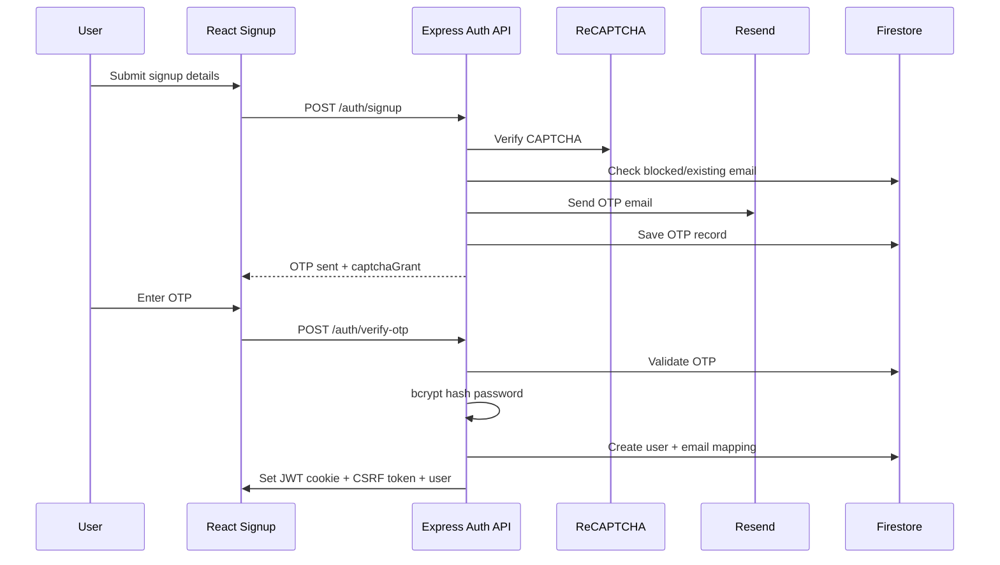

### Login Flow

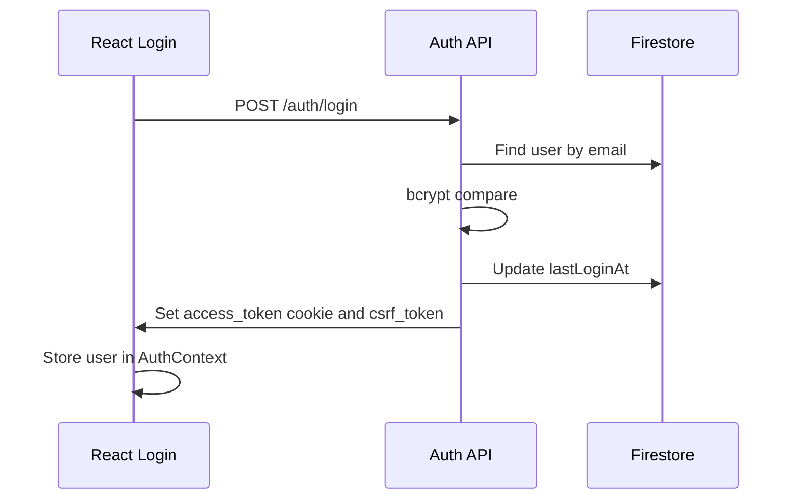

### JWT and Cookies

The API signs a JWT with the payload:

```js
{
  userId: user._id,
  isAdmin: user.isAdmin,
  sessionVersion: user.sessionVersion || 0
}
```

The token is stored as:

- **Cookie name:** `access_token`
- **HttpOnly:** true
- **Max age:** 10 years
- **SameSite:** `none` in production, `lax` in development
- **Secure:** true in production

**Missing:** `JWT_EXPIRE` is present in the env examples but is not used when signing the token.

### Protected Route Flow

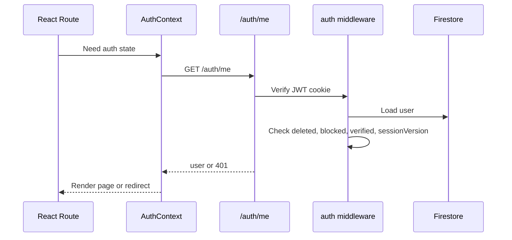

### Google Login

Google login verifies the credential server-side using `google-auth-library`. It allows:

- Any `@vitstudent.ac.in` email.
- The configured `ADMIN_EMAIL`, even if it is not a VIT address.

For new users, it creates a verified account with an empty password hash and `agreedToPolicies: false`.

### Logout

Logout:

1. Calls `POST /auth/logout`.
2. Clears the `access_token` and `csrf_token` cookies.
3. Clears the user state in `AuthContext`.
4. Signs the client out of Firebase.

---

## 10. Complete Workflow Documentation

### Forgot Password

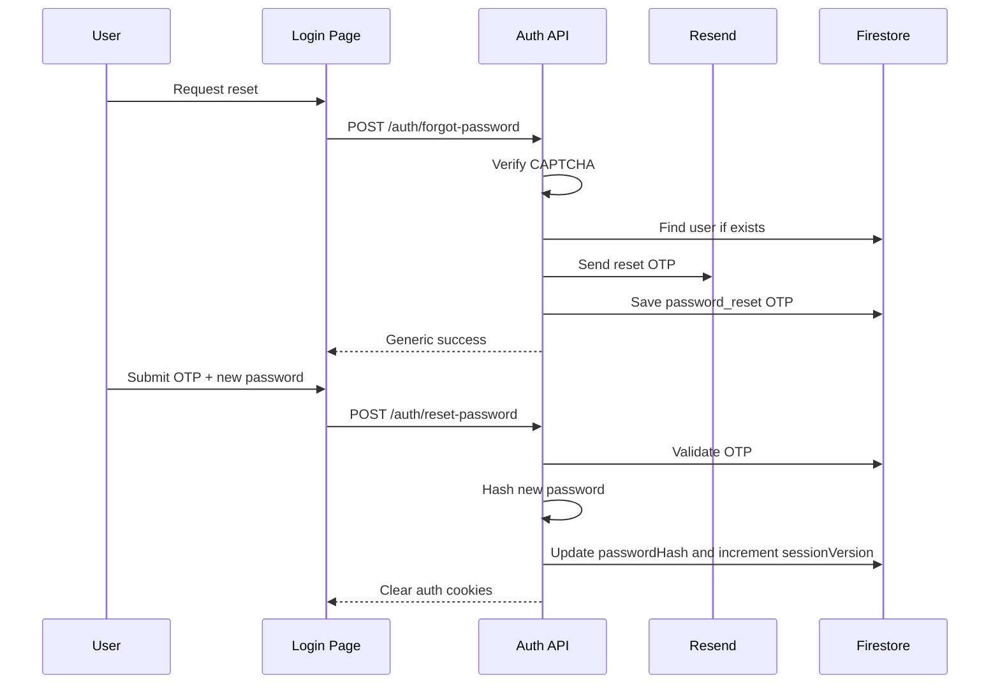

### Create Listing and Upload Image

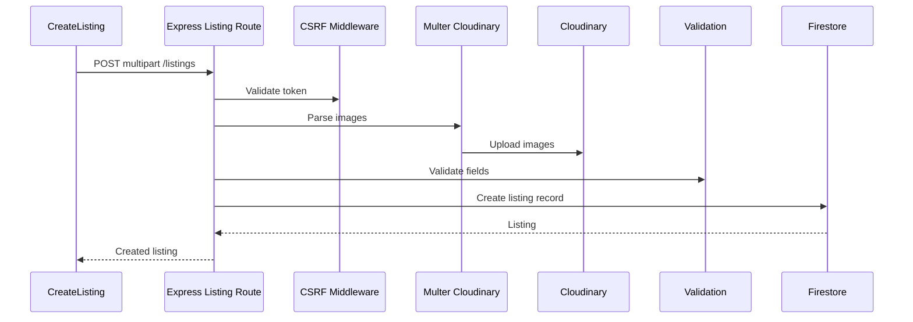

### Edit Listing

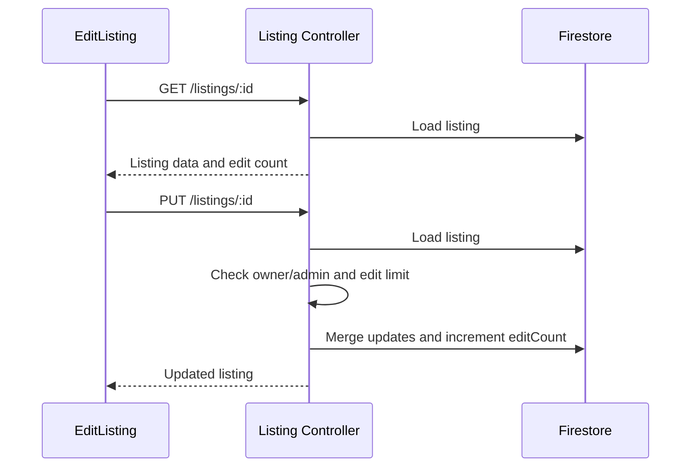

### Delete Listing

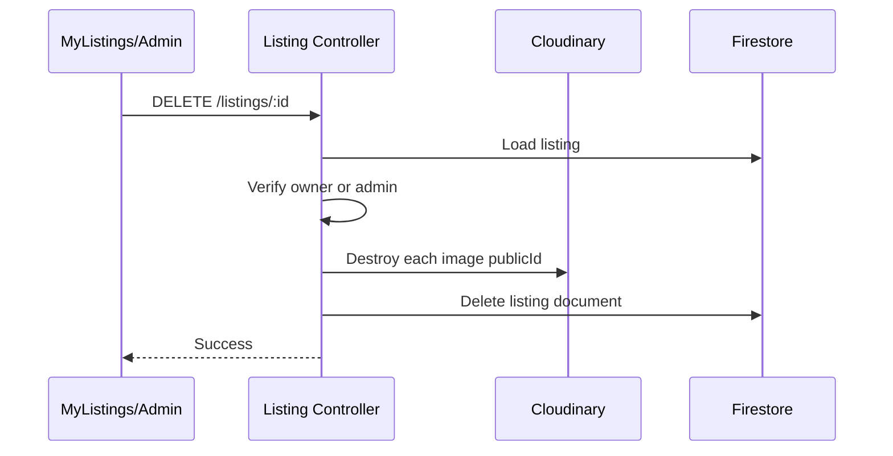

### Browse and Search Listings

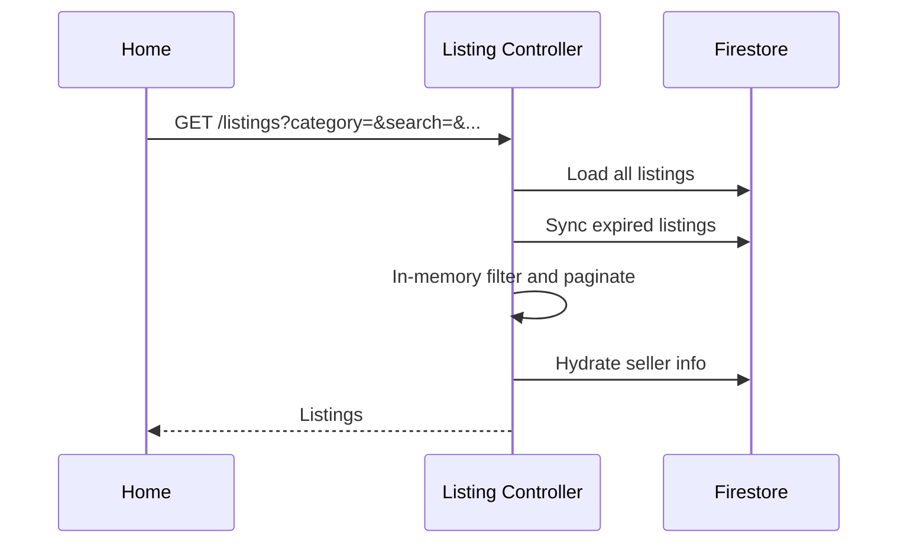

### Chat

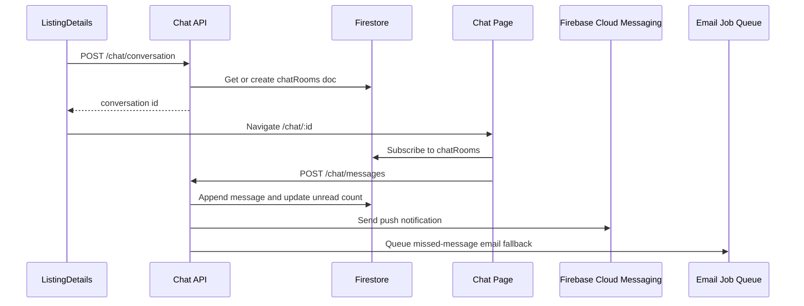

### Push Notifications

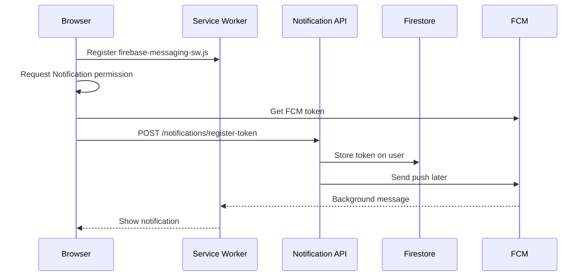

### Admin Email Campaign

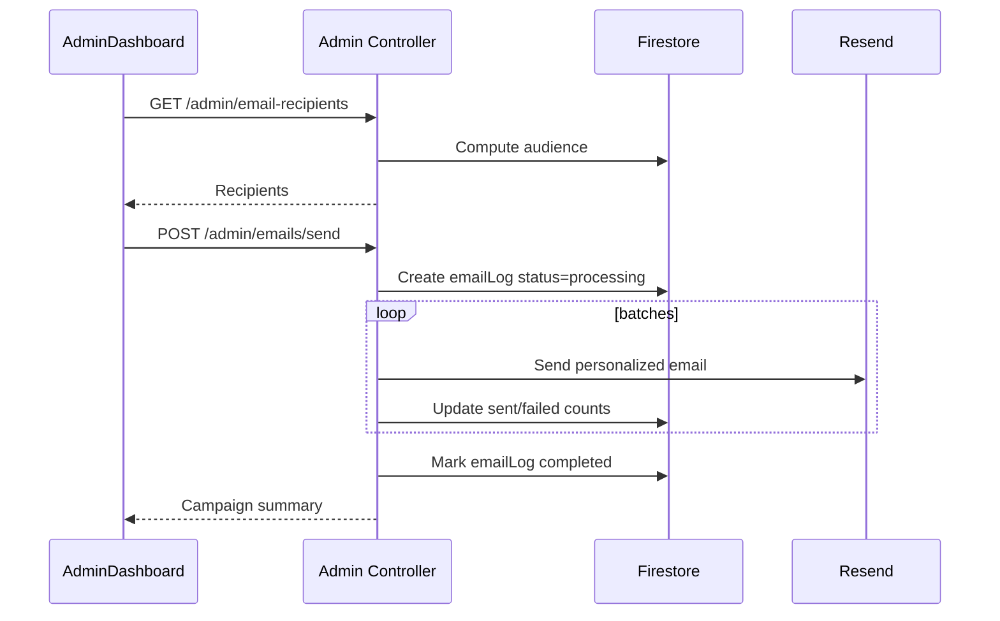

### Listing Expiry

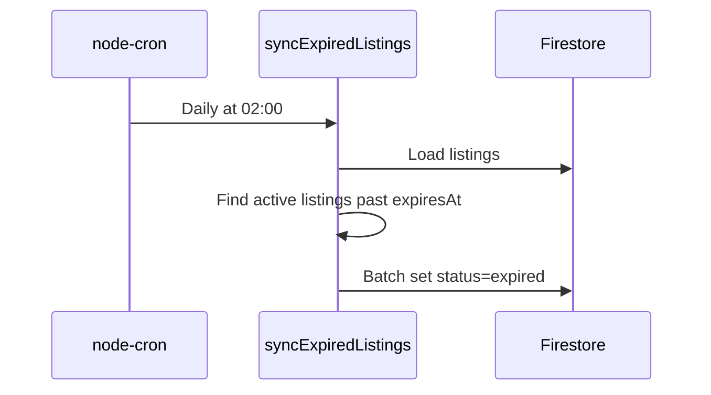

---

## 11. Image Upload System

### What

Images are uploaded from the frontend as multipart form data. Backend routes use Multer with Cloudinary storage to stream files directly to Cloudinary. Firestore stores only image metadata — never binary data.

### How

1. The frontend selects files and builds previews with `URL.createObjectURL`.
2. The frontend submits a `FormData` payload.
3. The Express listing route applies `uploadListing.array('images', 5)`.
4. Cloudinary transforms and stores the images.
5. The controller maps `req.files` to `{ url: file.path, publicId: file.filename }`.
6. Firestore stores the resulting image array on the listing.

### Trade-Offs

| Benefit | Cost |
|---|---|
| The server never stores image files | Cloudinary becomes a hard dependency |
| CDN delivery and transforms are automatic | Upload failures depend on an external service |
| Deletion can remove remote assets by `publicId` | Legacy images without a `publicId` may not delete cleanly |

### Failure Handling

- Multer file-size/type errors are converted to `400` responses.
- Cloudinary delete errors are logged and re-thrown.
- Creating a listing requires at least one image.
- The edit route can replace images if multipart files are supplied, but the current `EditListing` page only edits text fields.

---

## 12. Search Implementation

### Current Implementation

Search and filtering are implemented in `listingController` after listings are loaded from Firestore, across these fields:

- `category`
- `listingType`
- `minPrice`
- `maxPrice`
- `search` (matched against title and description)
- `sellerId`
- `status`

Sorting is handled in `listAllListings`, which sorts by `createdAt` descending. Pagination is array slicing performed after filtering.

### What Is Not Used

- No regex-based database queries.
- No Firestore full-text search.
- No Algolia, Meilisearch, or Elasticsearch integration.
- No dedicated listing indexes beyond the chat index.

### Performance Implications

This approach is acceptable for small datasets, but it scales poorly: every browse request loads the full listing set before filtering.

### Future Improvements

| Improvement | Complexity | Benefit |
|---|---|---|
| Firestore query filters | Medium | Less data transferred |
| Composite indexes for status/category/type/price | Medium | Faster filtering |
| Dedicated search service | Hard | True full-text search |
| Cursor pagination | Medium | Scales better than page slicing |
| Cached public listing feed | Medium | Fewer Firestore reads |

---

## 13. Security

### Implemented Security Features

| Feature | Implementation | Purpose |
|---|---|---|
| Password hashing | bcrypt, cost factor 12 | Protects stored passwords |
| HttpOnly JWT cookie | `access_token` | Reduces token theft via XSS |
| CSRF protection | Readable `csrf_token` cookie + header | Protects cookie-authenticated mutations |
| Session versioning | JWT payload and a user field | Invalidates sessions after password changes |
| Blocked-email checks | `blockedEmails` collection | Bans abusive accounts |
| Rate limiting | Auth, OTP, report, profile, admin | Abuse protection |
| Helmet | CSP and security headers | Browser hardening |
| CORS allowlist | Frontend URL and localhost | Restricts cross-origin credentialed requests |
| ReCAPTCHA | OTP flows | Bot mitigation |
| Input validation | express-validator | Prevents invalid or malicious payloads |
| Cloudinary constraints | Image-only, with size limits | Upload safety |
| Firestore rules | `users`, `chatRooms` | Client-side data access control |
| Admin middleware | `auth` + `admin` | Protects privileged routes |

### Missing or Weak Areas

| Gap | Risk | Improvement |
|---|---|---|
| JWT has no configured expiry | Long-lived sessions | Apply `JWT_EXPIRE` and add a refresh strategy |
| Admin update mutations lack CSRF middleware | CSRF risk on those routes | Apply `requireCsrf` consistently |
| In-memory rate limit store | Not distributed across instances | Redis-backed limiter |
| Chat messages stored as Firestore arrays | Document growth and rule complexity | Move to subcollections |
| CSP requires ongoing tuning | External scripts/assets can break unexpectedly | Automated CSP testing |
| No centralized audit log for admin actions | Limited traceability | Add an admin audit collection |

---

## 14. Performance

### Current Optimizations

| Area | Optimization |
|---|---|
| Frontend build | Vite bundling |
| SEO pages | Lazy-loaded for non-critical routes |
| Images | Cloudinary transforms with automatic quality/format |
| Chat users | Client-side cache with TTL |
| Updates | `localStorage` seen/dismissed tracking |
| Sitemap | XML cache with TTL |
| PWA | Static asset caching |
| FCM tokens | Invalid tokens are pruned |

### Bottlenecks

| Bottleneck | Why It Matters |
|---|---|
| Listing filtering loads all listings | High read cost and latency at scale |
| Chat messages stored as an array in the room document | Firestore document size limit |
| Notification polling | Unnecessary network calls |
| In-process cron/worker | Risk of duplicated work across multiple instances |
| Admin list endpoints load broad datasets | Admin pages can slow down as volume grows |

### Future Optimizations

- Firestore query-based listing filtering.
- Cursor pagination.
- A dedicated search service.
- Moving chat messages to subcollections.
- Replacing notification polling with realtime subscriptions or push-only badge updates.
- Server-side caching for public listing pages and the sitemap.

---

## 15. Error Handling

### Backend

Backend errors are normalized by `errorHandler.js`. Known error types return explicit status codes. Unknown errors return detailed output in development and a generic message in production.

| Error Type | Status | Handling |
|---|:---:|---|
| Validation failed | 400 | `{ errors: [{ field, message }] }` |
| Auth missing/invalid | 401 | Auth middleware clears cookies on an invalid token |
| Blocked/unverified | 403 | Explicit account-status message |
| Duplicate report | 409 | Controller handles the duplicate report ID |
| Upload too large | 400 | Multer-specific message |
| Missing report inbox | 503 | Support controller throws a service-unavailable error |

### Frontend

The Axios interceptor converts API failures into `Error` objects containing:

- `message`
- `response`
- `data`

On a `401`, it dispatches `auth:unauthorized`, so `AuthContext` clears the user state.

Limitations:

- Some pages still use `alert()` for errors.
- Error UI is inconsistent across workflows.
- Network retry logic exists only for CSRF failures.

---

## 16. Deployment

### Docker Production Flow

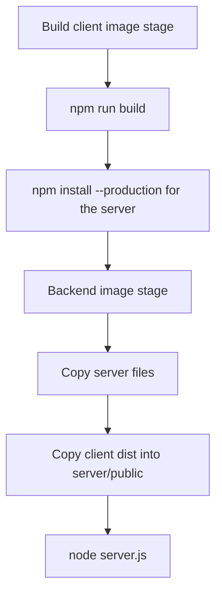

### Vercel

The server includes `api/index.js`, which exports the Express app for serverless use. Both the client and server include their own Vercel config files. The exact production deployment topology cannot be fully determined from the code alone.

### Firebase

`firebase.json` configures Firestore:

- **Database:** default
- **Location:** `asia-south2`
- **Rules:** `firestore.rules`
- **Indexes:** `firestore.indexes.json`

### Environment Requirements

Production requires:

- Firebase Admin credentials
- Cloudinary credentials
- A Resend API key and a verified sender
- A Google OAuth client ID
- A ReCAPTCHA secret/site key
- A JWT secret
- Correct `FRONTEND_URL` and `PUBLIC_SITE_URL` values

### Deployment Limitations

- The Docker Compose config references MongoDB, but the code does not use it.
- In-process cron is not ideal for serverless deployments.
- `ENABLE_CRON=false` may be needed on platforms where background intervals are not reliable.

---

## 17. Current Limitations

| Limitation | Why It Exists | Possible Solution |
|---|---|---|
| No model layer | Firestore access is centralized, but schemas remain implicit | Add a schema module or TypeScript types |
| In-memory listing search | Simpler to implement | Firestore queries or a search engine |
| Missing phone-verification route | A partial feature remains in the frontend context | Implement the route, or remove the client method |
| Wishlist not available | Placeholder route only | Implement the collection and UI |
| JWT expiration not used | Token signing omits `expiresIn` | Use `JWT_EXPIRE` |
| Admin update routes lack CSRF | Middleware not applied there | Add `requireCsrf` |
| MongoDB in Docker Compose | Legacy/stale config | Remove the Mongo service and `MONGO_URI` |
| Sitemap bug at high volume | Undefined variable in the index builder | Fix the variable scope and add a test |
| Chat room message arrays | Simple chat data model | Move messages to a subcollection |
| In-process workers | Easy to implement locally | Use a queue/scheduler |
| Encoding artifacts | File encoding issues | Normalize source files to UTF-8 |
| Tests lack a run script | Test files exist, but there is no package script | Add a test runner and scripts |

---

## 18. Future Improvements

### Easy

- Remove the unused MongoDB Docker Compose service.
- Add `npm test` scripts.
- Add CSRF middleware to admin update mutations.
- Fix the sitemap index's undefined-variable bug.
- Remove or implement `verifyProfilePhone`.
- Normalize mojibake text.
- Document required production environment variables in one place.

### Medium

- Add schema validation with Zod, shared between frontend and backend.
- Replace in-memory listing filtering with indexed Firestore queries.
- Add cursor pagination.
- Add admin audit logs.
- Improve error UI consistency.
- Add structured logging.
- Add automated integration tests for auth, listing, and admin flows.

### Hard

- Move chat messages to subcollections.
- Introduce queue-based email and notification workers.
- Add full-text search with Algolia, Meilisearch, or Elasticsearch.
- Add SSR or pre-rendering for SEO-critical pages.
- Build a proper role/permission model beyond `isAdmin`.
- Add observability: metrics, traces, and alerting.

### Enterprise Scale

- Multi-environment infrastructure-as-code.
- Centralized secrets management.
- Redis-backed rate limiting and caching.
- Data retention and compliance policies.
- Formal audit logging for all privileged actions.
- Load testing and performance budgets.
- Blue/green or canary deployments.
- Incident response runbooks.

---

## 19. Engineering Summary

Collexa is a pragmatic, feature-rich marketplace built from familiar web technologies. The core system is coherent: React drives the product experience, Express owns the security and business boundary, Firestore stores operational data, Cloudinary hosts images, FCM handles push notifications, and Resend handles email.

The strongest architectural choices are the clear backend layering, cookie-based API authentication, the centralized Firestore service, Cloudinary image offloading, and direct Firestore chat subscriptions. Together, these choices let a small team ship a marketplace with realtime chat, uploads, notifications, OTP flows, and admin tooling — without running a large infrastructure footprint.

The main technical debt lies in implicit schemas, in-memory filtering, mixed auth responsibilities, missing placeholder features, stale deployment config, and in-process background jobs. These are manageable at the current, early scale, but should be addressed before the platform grows significantly.

The roadmap should prioritize correctness and maintainability first: fix missing routes and config drift, enforce CSRF consistently, add tests, formalize schemas, and improve query scalability. After that, Collexa can evolve toward enterprise-grade reliability through queues, observability, audit logging, search infrastructure, and stronger deployment automation.
