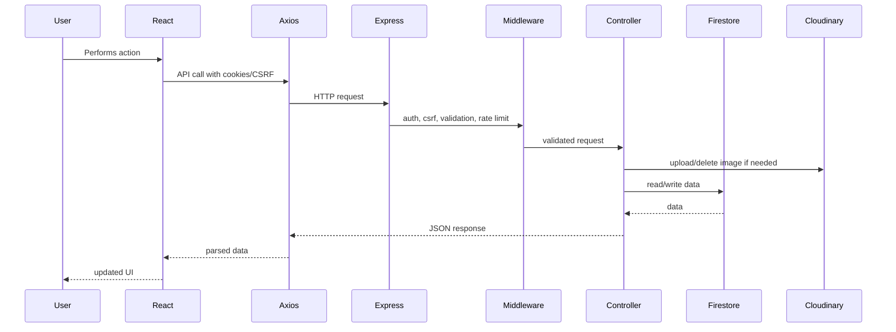

# Collexa Interview Master Guide

This guide prepares you to defend Collexa in technical, project, behavioral, and system-design interviews. Every answer is based on the implemented project. When a feature is missing or incomplete, say that clearly and explain how you would improve it.

## SECTION 1 - 30 Second Elevator Pitch

### 30 Second Version

"Collexa is a campus-only marketplace for VIT students where verified users can buy, sell, rent, and chat about second-hand items. I built it as a React and Express full-stack application using Firestore for data, Cloudinary for image uploads, Firebase for chat and push notifications, and Resend for OTP and email workflows. The main idea was to make student-to-student transactions safer and more relevant than a generic marketplace like OLX."

### 1 Minute Version

"Collexa is a verified marketplace built specifically for VIT students. Users sign up with a VIT email or Google login, create listings with images, browse and filter listings, chat with sellers, manage their own listings, and report issues. On the backend, I used Express with JWT cookie authentication, CSRF protection, rate limiting, validation, and Firestore as the database. Images are handled by Cloudinary, OTP and admin emails go through Resend, and chat uses Firebase/Firestore realtime updates. I also built an admin dashboard for users, listings, reports, announcements, and email campaigns. The project solves the trust and locality problem of generic marketplaces by limiting the experience to a student community."

### 2 Minute Version

"Collexa started as a solution for a very practical campus problem: students often want to sell books, cycles, electronics, or lab equipment, but generic platforms are noisy, less trustworthy, and not optimized for campus handoffs. So I built a full-stack marketplace specifically for VIT students.

The frontend is a React SPA built with Vite and Tailwind. It has public browsing, authenticated listing creation, profile management, realtime chat, PWA support, push notifications, SEO pages, and admin screens. The backend is an Express API with a route-controller-service structure. Authentication uses HttpOnly JWT cookies, CSRF protection, bcrypt password hashing, OTP verification, Google login, and session versioning. Firestore stores users, listings, reports, notifications, updates, chat rooms, OTPs, and admin email logs. Cloudinary handles listing and profile images. Resend handles OTPs, support reports, missed chat email fallbacks, and admin campaign emails.

The project is not just CRUD. It includes moderation, rate limiting, image upload lifecycle, account blocking, listing expiry jobs, FCM push notifications, and an admin dashboard. If I had more time, I would improve scalability by moving listing search from in-memory filtering to indexed Firestore queries or a search engine, move chat messages into subcollections, add a real queue for background jobs, and formalize schemas."

### 5 Minute Detailed Explanation

"Collexa is a full-stack campus marketplace I built for VIT students. The motivation was that students regularly need to buy or sell second-hand items like books, electronics, bicycles, instruments, sports equipment, and lab equipment, but generic platforms like OLX are not campus-specific. They do not guarantee that the buyer or seller belongs to the same community, and they are not optimized for local handoffs. Collexa narrows the marketplace to verified VIT students and gives them a cleaner, safer workflow.

The application has a React frontend built with Vite. Users can browse listings publicly, but actions like creating listings, contacting sellers, chatting, reporting accounts, and managing profile require authentication. The frontend uses React Router for routing, contexts for global state such as authentication, notifications, PWA install state, updates, and guest prompts, and Axios for API communication. The Axios layer always uses `/api`, sends cookies, attaches CSRF tokens for mutating requests, and retries once if the CSRF token is stale.

On the backend, I used Express. The app initializes security middleware like Helmet, CORS, cookie parsing, JSON body limits, CSRF cookie setup, and rate limiting. Routes are separated by domain: auth, users, listings, reports, admin, support, notifications, updates, chat, wishlist, and sitemap. Controllers handle business logic, and services handle persistence and integrations. Firestore is the primary database; there are no Mongoose-style model files, so schemas are implicit in the data service, validators, and controllers.

Authentication is cookie-based. During login or signup verification, the server signs a JWT containing the user id, admin flag, and session version, stores it in an HttpOnly cookie, and also rotates a CSRF token in a readable cookie. Passwords are hashed with bcrypt. OTPs are stored in Firestore with a 15-minute validity window and emailed through Resend. Google login is also supported, but non-admin users must use a `@vitstudent.ac.in` email.

Listings support creation, browsing, filtering, editing, deletion, marking sold, and reactivation. Images are uploaded as multipart form data through Multer and stored in Cloudinary. The backend stores only the Cloudinary URL and public id in Firestore. Listing edits are capped at three for normal users, and listings expire after 30 days through a cron job.

Chat is implemented with Firebase and Firestore. The Express API creates or retrieves a chat room, and the React client subscribes to chat rooms directly with Firestore for realtime updates. The server also sends FCM push notifications and queues missed-message email fallback jobs using Resend if browser notifications are not available.

The admin dashboard supports stats, user moderation, listing moderation, reports, public updates, and batched email campaigns. The campaign system computes recipients, personalizes templates, sends emails in batches through Resend, and stores audit logs in Firestore.

The system is functional and fairly secure for an early-stage product, but it has known limitations. Search and filters currently load listings and filter in memory, which will not scale well. JWT expiry is configured in env but not actually used in signing. Wishlist and phone verification are not implemented. Docker Compose still includes MongoDB even though Firestore is used. Chat messages are stored in arrays inside chat room documents, which should eventually move to a subcollection. These are the exact improvements I would prioritize before scaling further."

## SECTION 2 - Project Story

### How did you get this idea?

"I noticed that college students frequently need to exchange used items, but the existing options are scattered across WhatsApp groups, Instagram stories, and generic marketplaces. Those channels are noisy and hard to trust. I wanted a dedicated marketplace where the audience is already scoped to VIT students."

### Why did you build it?

"I built it to solve a real campus problem while also learning how to design a complete full-stack product. I did not want to build only CRUD; I wanted authentication, upload handling, moderation, chat, notifications, admin workflows, and deployment considerations."

### What problem does it solve?

"It reduces trust friction and discovery friction. Students can list items in one place, buyers can browse relevant items, and communication can happen through the app instead of scattered external channels."

### Who are the users?

"The primary users are VIT students. Guests can browse, verified students can buy/sell/chat/report, and admins can moderate the platform."

### Why would someone use Collexa instead of OLX?

"OLX is broad and anonymous. Collexa is campus-specific, VIT email restricted, and optimized for student categories and campus handoffs. That makes discovery more relevant and reduces the trust gap."

### What challenges did you notice?

"The main challenges were authentication security, image upload lifecycle, CSRF with cookie auth, realtime chat, notification fallbacks, and keeping admin workflows safe. Another challenge was balancing speed of development with scalable design."

### How many users can it currently support?

"For a campus-scale early product, it can support a reasonable number of users because Firestore and Cloudinary are managed services. But the current listing browse/search implementation loads listings and filters in memory, so before going to tens or hundreds of thousands of listings, I would move filtering to indexed Firestore queries or a dedicated search service."

### What would you improve?

"I would first fix known technical debt: use JWT expiry, add CSRF to admin update mutations, remove stale Mongo config, implement or remove phone verification and wishlist, and fix the sitemap edge case. Then I would improve search, chat storage, queue-based workers, tests, and observability."

## SECTION 3 - Architecture Walkthrough

"When a user opens Collexa, the browser loads a React single-page application built with Vite. React Router decides which page to render. For example, if the user visits the home page, the `Home` page loads listings. If the user goes to a protected page like `create-listing`, `ProtectedRoute` checks authentication state from `AuthContext`.

The frontend talks to the backend through a centralized Axios client. Axios uses `/api` as the base URL, sends credentials, and attaches a CSRF token for mutating requests. If the CSRF token is stale, it calls `/auth/csrf` once and retries.

The request then reaches the Express API. Express first applies global middleware: Helmet for security headers, CORS for allowed origins, cookie parsing, JSON body limits, CSRF cookie setup, and rate limiting. Then the request is routed to a module, like `listingRoutes` or `authRoutes`.

Inside the route, middleware runs in order. For a protected listing creation request, the route checks authentication, validates CSRF, applies a create-listing rate limit, processes multipart images through Cloudinary-backed Multer, validates fields with express-validator, and then calls the controller.

The controller contains business logic. For listing creation, it reads fields, parses tags, maps uploaded Cloudinary files into image objects, and calls `dataService` to create the Firestore record. `dataService` is the persistence layer; it talks to Firestore through Firebase Admin, serializes timestamps, and returns plain objects.

If the request involves images, Cloudinary stores the actual files and returns URLs and public IDs. If the request involves email, Resend sends the email. If it involves push notifications, Firebase Cloud Messaging sends the push payload. Finally, the controller returns a JSON response to Axios, and React updates the UI."

## SECTION 4 - Technology Decisions

| Technology | Interview-Ready Answer |
|---|---|
| React | "I chose React because Collexa needed a dynamic interface with protected routes, forms, listing cards, chat, admin tabs, and contextual UI state. React's component model made it easy to split pages, reusable components, and providers. The trade-off is more client-side complexity and weaker SEO compared to SSR unless you add pre-rendering or server rendering." |
| Vite | "Vite gave me a fast development loop and simple production build for the React SPA. It also made proxying `/api` to the Express backend easy in development. I could have used Webpack or Next.js, but Webpack would add config overhead and Next.js would be more useful if I wanted SSR." |
| Express | "Express is the backend API framework. I used it because it is lightweight, flexible, and has good middleware support for auth, validation, rate limiting, uploads, and errors. The trade-off is that Express does not enforce architecture, so I had to organize routes, controllers, middleware, and services myself." |
| Firestore | "Firestore is the primary database. I chose it because it is managed, scalable for early use, and supports realtime chat subscriptions. The trade-off is query limitations, implicit schemas, and the need for indexes. For relational reporting, Postgres might be stronger; for self-hosted document storage, MongoDB could work." |
| Firebase | "Firebase is used on both sides: Admin SDK for Firestore, custom tokens, and FCM; client SDK for Firestore realtime chat and messaging. It lets the app support realtime features without building a WebSocket server. The trade-off is vendor lock-in and careful security rule design." |
| JWT | "JWT is used for API authentication. I store it in an HttpOnly cookie and verify it in middleware. The benefit is stateless auth; the trade-off is revocation, which I handle partly through a sessionVersion field. One known improvement is actually applying the configured JWT expiry." |
| Cloudinary | "Cloudinary handles image uploads and transformations. This avoids storing files on my server and gives optimized URLs. The trade-off is dependency on an external service and needing to manage public IDs for deletion." |
| Tailwind | "Tailwind allowed me to build responsive UI quickly without maintaining many custom CSS files. The downside is class-heavy JSX. For a larger design system, I might introduce component primitives or use a UI library." |
| Axios | "Axios centralizes API calls. In Collexa it handles credentials, CSRF headers, response unwrapping, CSRF retry, and unauthorized events. Fetch could also work, but Axios interceptors made this cleaner." |
| Helmet | "Helmet sets security-related HTTP headers and CSP. It helps reduce common browser-level risks. The trade-off is that CSP can break legitimate third-party scripts if not maintained carefully." |
| Resend | "Resend sends OTPs, support emails, chat fallback emails, and admin campaigns. It has a simple API and works well for transactional email. The trade-off is needing a verified sender domain and handling provider failures." |
| Google OAuth | "Google OAuth reduces signup/login friction. I verify the ID token server-side and restrict non-admin accounts to VIT emails. The trade-off is dependency on Google configuration and handling OAuth errors." |
| ReCAPTCHA | "ReCAPTCHA protects OTP-generating flows from abuse. I use it for signup, resend OTP, and forgot password. The downside is user friction and external dependency." |
| Firebase Messaging | "FCM supports push notifications for chat and listing-related events. The browser stores a token with the backend, and the server sends multicast messages. The trade-off is browser support complexity and service worker handling." |
| express-validator | "I use express-validator for request-level validation. It validates emails, IDs, listing fields, report reasons, price ranges, and admin email payloads. The downside is duplication with frontend validation; a shared schema system would be better." |
| bcrypt | "bcrypt hashes passwords before storing them. I use cost factor 12. It is intentionally slow to make brute-force attacks harder. Argon2 would also be a strong alternative." |
| Multer | "Multer parses multipart form data for image uploads. In this project it is integrated with Cloudinary storage. The trade-off is extra upload failure cases and file validation complexity." |
| Rate Limiting | "Rate limiting protects login, OTP, reports, profile updates, listing creation, and admin actions. It reduces abuse but the current memory-store approach is not ideal for multi-instance scale." |
| Cookies | "Cookies store the API JWT. I chose HttpOnly cookies over localStorage because they reduce token theft through XSS. The trade-off is CSRF, which is why I added CSRF tokens." |
| CSRF | "Because authentication uses cookies, browsers attach them automatically. CSRF protection requires mutating requests to include a token from a readable cookie in the `X-CSRF-Token` header. This blocks cross-site form submissions that cannot read the cookie value." |

## SECTION 5 - Deep Code Walkthrough

### Authentication Module

Responsibilities:
- Signup OTP generation and verification.
- Password login.
- Google login.
- Current user lookup.
- Password reset.
- Policy agreement.
- Logout.

Important functions:
- `signup`: validates VIT email flow, checks blocklist/existing user, sends OTP.
- `verifyOTP`: validates OTP, hashes password, creates user, issues cookies.
- `login`: verifies password, creates session.
- `googleAuth`: verifies Google ID token and creates/updates user.
- `resetPassword`: verifies reset OTP, hashes new password, increments session version.
- `getCurrentUser`: returns sanitized user.

Execution flow:
1. Route validates request.
2. Controller checks blocklist and user state.
3. Controller calls `dataService`.
4. Passwords are hashed/compared with bcrypt.
5. JWT and CSRF cookies are issued or cleared.

Validation:
- Email format, VIT domain for signup, password length, OTP format, Google token length.

Database interaction:
- `users`, `userEmails`, `otps`, `blockedEmails`.

Error handling:
- Invalid credentials return 401.
- Blocked users return 403.
- Duplicate registration returns 409 during OTP verification.

### Listings Module

Responsibilities:
- Create, read, update, delete listings.
- Filter listings.
- Hydrate seller data.
- Enforce ownership and edit limits.
- Delete Cloudinary images when needed.

Important functions:
- `createListing`
- `getAllListings`
- `getListingById`
- `getMyListings`
- `updateListing`
- `deleteListing`
- `reactivateListing`
- `markListingAsSold`

Validation:
- Title/description length and blocked words.
- Category, condition, listing type.
- Price range.
- Image presence on create.

Database interaction:
- `listings`, `users`.

Error handling:
- 404 for missing listings.
- 403 for unauthorized edit/delete.
- 403 if non-admin exceeds 3 edits.

### Users Module

Responsibilities:
- Profile retrieval.
- Profile update.
- Password change.
- Account deletion.

Important functions:
- `getUserProfile`
- `updateProfile`
- `changePassword`
- `deleteAccount`

Missing:
- The frontend has a `verifyProfilePhone` method, but the backend route is not implemented.

### Chat Module

Responsibilities:
- Firebase custom token generation.
- Chat room creation.
- Message sending.
- User lookup for chat display.
- Notification state sync.
- Missed-message email queueing/canceling.

Important functions:
- `getFirebaseToken`
- `initializeConversation`
- `sendChatMessage`
- `getChatUser`
- `syncChatNotificationState`
- `queueMissedMessageEmail`
- `cancelMissedMessageEmail`

Database interaction:
- `chatRooms`, `users`, `chatNotificationJobs`.

Error handling:
- Rejects missing participant/message fields.
- Rejects self-chat.
- Rejects messages over 500 characters.
- Checks conversation participants before appending message.

### Admin Module

Responsibilities:
- View dashboard stats.
- Manage users and blocked emails.
- View/delete listings.
- Review reports.
- Manage public updates.
- Send email campaigns.

Important functions:
- `getDashboardStats`
- `getAllUsers`
- `getAllListingsAdmin`
- `reviewReport`
- `blockUser`
- `unblockUser`
- `deleteUser`
- `sendAdminEmailCampaign`

Trade-off:
- Admin email campaign is synchronous inside the request, with batching delays. A production-scale version should use a queue.

### Notifications Module

Responsibilities:
- In-app notifications.
- Mark read/all read.
- FCM token registration/removal.
- Push notification sending.

Database interaction:
- `notifications`, user FCM token fields.

### Support and Reports

Reports:
- Listing reports are stored in Firestore.
- Duplicate report is prevented by deterministic report ID.

Support:
- Bug and account reports are emailed to company/admin inbox through Resend.
- A notification is created for the reporter after successful support submission.

### Updates

Responsibilities:
- Admin creates/edits/deletes/toggles updates.
- Public users fetch published updates.
- Updates are sorted pinned-first and newest-first.
- Old updates are pruned to a limit of four after create.

## SECTION 6 - CRUD Questions

### CRUD Explanation

| Operation | Interview Answer |
|---|---|
| Create Listing | "The frontend builds a FormData payload with text fields and images. The backend authenticates the user, checks CSRF, uploads images to Cloudinary through Multer, validates the listing, and stores the listing in Firestore with status `active`, expiry date, counters, and Cloudinary image metadata." |
| Read Listing | "Public listing reads use optional auth. If a user is logged in, seller details can be less restricted; if not, seller identity is masked. The controller also increments view count unless the viewer is the seller." |
| Update Listing | "The backend checks that the user owns the listing or is admin. Non-admin users can edit only three times. It validates allowed fields and updates Firestore. If new images are uploaded, old Cloudinary images are deleted." |
| Delete Listing | "The backend verifies ownership or admin access, deletes Cloudinary images by public id, and deletes the Firestore listing document." |
| Profile CRUD | "Users can read and update profile fields like name, year, phone, and showPhoneNumber. Account deletion soft-deletes the user and removes their listings. Full phone verification is not implemented." |
| Reports | "Users can create listing reports. Admins can list and review reports, and optionally mark the listing deleted when action is taken." |
| Notifications | "Users can read notifications and mark one or all as read. FCM tokens can also be registered and removed." |
| Admin CRUD | "Admins can manage users, listings, reports, updates, email campaigns, and blocked emails. Update CRUD exists, but admin update mutations should ideally also include CSRF middleware." |

### CRUD Interview Questions and Model Answers

1. Q: How do you create a listing?  
   A: "I submit multipart form data from React, upload images through Cloudinary-backed Multer, validate fields server-side, and save the listing metadata in Firestore."

2. Q: How do you read listings?  
   A: "The public `/listings` endpoint loads listings, syncs expired ones, applies filters in memory, hydrates seller info, and returns paginated results."

3. Q: How do you update listings securely?  
   A: "The update controller loads the listing, checks owner or admin access, enforces the edit limit for normal users, validates input, and merges changes into Firestore."

4. Q: What happens when a listing is deleted?  
   A: "The backend deletes associated Cloudinary images and then deletes the Firestore document."

5. Q: Is delete soft or hard?  
   A: "Listing deletion is hard delete in the current implementation, while user account deletion is soft for user data but deletes that user's listings."

6. Q: How do reports work?  
   A: "Reports are stored in Firestore with a deterministic ID made from listing id and reporter id, which prevents duplicate reports by the same user."

7. Q: Can users update profile pictures?  
   A: "Backend supports profile picture upload through Cloudinary in the profile update route, although the current profile UI mainly edits text fields."

8. Q: How does mark as sold work?  
   A: "It verifies ownership or admin rights, then changes the listing status to `sold`."

9. Q: How is reactivation handled?  
   A: "Only expired listings can be reactivated, and the backend sets status back to active with a new 30-day expiry."

10. Q: What CRUD feature is incomplete?  
    A: "Wishlist is not implemented; the route exists but returns 501."

## SECTION 7 - Authentication Questions

1. Q: Explain your login flow.  
   A: "The user submits email and password, the backend finds the user in Firestore, checks block/verification status, compares bcrypt hash, updates last login, signs a JWT, sets it in an HttpOnly cookie, and rotates a CSRF token."

2. Q: Why did you use JWT?  
   A: "JWT makes API auth stateless. The server verifies the signed token on each request and loads the user by id."

3. Q: Why cookies instead of localStorage?  
   A: "The JWT is in an HttpOnly cookie, so JavaScript cannot read it. That reduces damage from XSS compared to localStorage."

4. Q: What is the trade-off of cookies?  
   A: "Cookies are automatically sent by the browser, so CSRF becomes a concern. I handle that with a CSRF cookie/header check."

5. Q: How does CSRF work in Collexa?  
   A: "The server sets a readable `csrf_token` cookie. For mutating requests, Axios reads it and sends it as `X-CSRF-Token`. The server checks that header and cookie match."

6. Q: How do protected routes work on the frontend?  
   A: "`AuthContext` boots by calling `/auth/me`. `ProtectedRoute` waits for loading and redirects unauthenticated users to login."

7. Q: How does backend auth middleware work?  
   A: "It reads the JWT from the cookie, verifies it, loads the user, checks deleted/blocked/verified/sessionVersion, then attaches user fields to the request."

8. Q: Why bcrypt?  
   A: "Passwords should never be stored in plain text. bcrypt hashes passwords with a slow, salted algorithm; I use cost factor 12."

9. Q: How do you invalidate sessions?  
   A: "When password changes or resets, the user `sessionVersion` increments. Existing JWTs with the old version fail middleware validation."

10. Q: What happens if JWT expires?  
    A: "The middleware handles `TokenExpiredError`, clears cookies, and returns 401. However, one limitation is that the current token signing does not actually apply the configured `JWT_EXPIRE`."

11. Q: How does signup work?  
    A: "Signup first sends an OTP after CAPTCHA and email validation. Account creation happens only after OTP verification."

12. Q: Why OTP?  
    A: "It verifies that the user controls the VIT student email before creating an account."

13. Q: How long are OTPs valid?  
    A: "OTP records are valid for 15 minutes."

14. Q: How do you prevent OTP abuse?  
    A: "I use IP and email-based rate limiters and require CAPTCHA or a captcha grant."

15. Q: What is captchaGrant?  
    A: "After successful CAPTCHA, the server can issue a short-lived signed grant so repeated OTP actions do not require solving CAPTCHA every time."

16. Q: How does Google login work?  
    A: "The frontend receives a Google credential, the backend verifies the ID token, checks the email domain, creates or updates the user, then issues the same cookie session."

17. Q: Can non-VIT users use Google login?  
    A: "No, unless the email matches configured admin email. Normal users must use `@vitstudent.ac.in`."

18. Q: How do admins authenticate?  
    A: "Admins are normal authenticated users with `isAdmin: true`. Admin routes require both auth and admin middleware."

19. Q: Where is the JWT stored?  
    A: "In the `access_token` HttpOnly cookie."

20. Q: Where is the CSRF token stored?  
    A: "In a readable `csrf_token` cookie and in the client-side Axios cache."

21. Q: What is optional auth?  
    A: "Public listing routes can optionally attach user data if a valid token exists, but continue normally if not."

22. Q: What happens to blocked users?  
    A: "The auth middleware checks `blockedEmails`; blocked users receive 403 and cannot use protected routes."

23. Q: How are deleted users handled?  
    A: "If a user is marked deleted, auth middleware treats them as invalid."

24. Q: Why use sessionVersion instead of a token blacklist?  
    A: "It is simpler and stored on the user document. It invalidates all old sessions after sensitive changes without maintaining a separate blacklist."

25. Q: What is the disadvantage of sessionVersion?  
    A: "It requires a database lookup on every authenticated request."

26. Q: Does logout invalidate JWT server-side?  
    A: "Logout clears the cookie. It does not blacklist the token server-side."

27. Q: Is the access cookie secure in production?  
    A: "Yes, production cookie options use `secure: true` and `sameSite: none`."

28. Q: Why sameSite none?  
    A: "It supports cross-site frontend/backend deployments where cookies must still be sent."

29. Q: What is the risk of sameSite none?  
    A: "It increases CSRF exposure, which is why explicit CSRF protection is needed."

30. Q: How is Firebase auth used?  
    A: "The backend creates a Firebase custom token for the logged-in user, and the frontend signs in to Firebase so Firestore chat rules can identify the user."

31. Q: Why not use Firebase Auth for everything?  
    A: "I used server-owned JWT auth for API sessions and Firebase custom auth specifically for chat access. A future simplification could consolidate auth."

32. Q: Are passwords stored for Google users?  
    A: "Google-created users have an empty password hash because they authenticate through Google."

33. Q: What happens if login credentials are wrong?  
    A: "The backend returns 401 with `Invalid credentials`."

34. Q: What happens if user is unverified?  
    A: "The backend returns 403 asking the user to verify email."

35. Q: How do you protect password reset?  
    A: "Password reset requires CAPTCHA, sends an OTP, validates OTP, hashes the new password, increments sessionVersion, and clears cookies."

36. Q: What is one auth improvement?  
    A: "Apply `JWT_EXPIRE`, add refresh strategy if needed, and audit session lifecycle."

37. Q: How do you avoid leaking whether an email exists?  
    A: "For signup and forgot password, some responses are intentionally generic like `If valid, OTP sent`."

38. Q: How do you handle unauthorized API responses on the client?  
    A: "Axios dispatches `auth:unauthorized`, and `AuthContext` clears the user."

39. Q: Can CSRF tokens become stale?  
    A: "Yes. The Axios interceptor detects `Invalid CSRF token`, fetches a fresh token, and retries once."

40. Q: What is the biggest auth limitation?  
    A: "JWT expiry is configured but not applied, so I would fix token expiry and session refresh before production scale."

## SECTION 8 - Database Questions

1. Q: Why Firestore? A: "Firestore gives managed NoSQL storage and realtime subscriptions, which fit chat and early marketplace data well."
2. Q: Why not MongoDB? A: "Mongo would work, but the implementation uses Firebase Admin and Firestore. Docker has Mongo config, but it is stale and unused."
3. Q: What collections exist? A: "`users`, `userEmails`, `listings`, `reports`, `otps`, `blockedEmails`, `notifications`, `updates`, `emailLogs`, `chatRooms`, and `chatNotificationJobs`."
4. Q: How do you enforce unique emails? A: "A transaction writes a normalized email document in `userEmails` before creating the user."
5. Q: What is stored in listings? A: "Seller id, item fields, price, type, rent duration, images, status, edit count, expiry, view count, report count, and timestamps."
6. Q: How are relationships represented? A: "By IDs, like `sellerId`, `reportedBy`, `listingId`, and chat participant IDs."
7. Q: Do you have schema files? A: "No. Schemas are implicit in validators, controllers, and `dataService`. A future improvement is explicit schemas."
8. Q: What indexes exist? A: "A Firestore composite index for `chatRooms` using participants array-contains and `lastMessageAt` descending."
9. Q: How do Firestore rules work? A: "Users can access their own user doc, and chat rooms are readable/updatable only by participants with restricted fields."
10. Q: Are all collections protected by rules? A: "Rules cover client-accessed users/chatRooms. Other collections are intended to be server-only."
11. Q: How are OTPs stored? A: "In `otps` documents keyed by normalized email, with active OTP records and expiry timestamps."
12. Q: How do you remove expired OTPs? A: "When reading OTP status, expired records are filtered and the document is cleaned up."
13. Q: How are blocked users represented? A: "By normalized email documents in `blockedEmails`."
14. Q: How do reports prevent duplicates? A: "The report document id is `${listingId}_${reportedBy}`."
15. Q: How do chat rooms get IDs? A: "The two participant IDs are sorted and joined, so the same pair maps to one conversation."
16. Q: What is a Firestore transaction used for? A: "User creation uses a transaction to enforce unique email mapping."
17. Q: What is the limitation of chat messages as arrays? A: "Firestore documents have size limits and arrays become inefficient as chats grow."
18. Q: How would you redesign chat storage? A: "Use `chatRooms/{roomId}/messages/{messageId}` subcollections."
19. Q: How does listing expiry update data? A: "A cron job calls `syncExpiredListings` and batch updates active listings past `expiresAt` to expired."
20. Q: Is search indexed? A: "No, listing search is currently in-memory after loading listings."
21. Q: How would you scale search? A: "Use Firestore indexed filters or integrate Algolia/Meilisearch for full-text search."
22. Q: How do you paginate? A: "Currently by slicing arrays after filtering. Cursor pagination would be better."
23. Q: What is stored for images? A: "Cloudinary URL and public ID, not binary image data."
24. Q: What is stored for email campaigns? A: "`emailLogs` contains templates, counts, failures, accepted provider IDs, status, and metadata."
25. Q: What is stored for FCM? A: "Users can have `fcmToken` and `fcmTokens` arrays."
26. Q: What is `userEmails` for? A: "It is a normalized email-to-user mapping for uniqueness."
27. Q: How do you handle timestamps? A: "`dataService` serializes Firestore timestamps into ISO strings."
28. Q: What is `stripUndefined` for? A: "It avoids writing undefined fields to Firestore."
29. Q: How do you maintain consistency when deleting users? A: "Admin hard delete removes user, email mapping, OTPs, listings, notifications, and reports by that user."
30. Q: What does user self-delete do? A: "It soft-deletes the user and hard deletes that user's listings."
31. Q: What consistency issue remains? A: "Some related chat history may remain because chat deletion is not implemented."
32. Q: Would Firestore support 100k users? A: "Yes for user documents, but queries and search patterns need indexing and pagination."
33. Q: What data should be archived? A: "Old email logs, expired OTPs, old chat notification jobs, and potentially old chats."
34. Q: How would you migrate to Postgres? A: "Define relational schemas for users/listings/reports/chats, write migration scripts from Firestore exports, and update services."
35. Q: Why NoSQL fits here? A: "Listings and users are document-like, and Firestore supports realtime chat."
36. Q: Where would NoSQL hurt? A: "Complex joins, analytics, and relational constraints."
37. Q: How are admin stats computed? A: "By loading users, listings, and reports and aggregating in controller."
38. Q: How would you improve stats? A: "Maintain counters or use analytics/aggregation jobs."
39. Q: What is the biggest database limitation? A: "Implicit schema and in-memory listing search."
40. Q: What database improvement would you make first? A: "Move listing filters to indexed queries and introduce explicit schema validation."

## SECTION 9 - Backend Questions

1. Q: Why Express? A: "It gave me flexible middleware and routing for a custom API."
2. Q: How is the backend structured? A: "App setup, routes, middleware, controllers, services, config, utils, and cron jobs."
3. Q: What does `app.js` do? A: "It configures security, parsing, CSRF, rate limits, routes, errors, and cron startup."
4. Q: What is controller responsibility? A: "Business logic and response shaping."
5. Q: What is service responsibility? A: "Data persistence and integrations, especially Firestore access."
6. Q: Why separate routes/controllers/services? A: "It keeps request wiring, business logic, and data access separate."
7. Q: How do you validate requests? A: "Using express-validator middleware arrays and a shared `validate` handler."
8. Q: How do you handle errors? A: "Controllers call `next(error)` and centralized error middleware returns JSON."
9. Q: What does auth middleware attach? A: "`req.userId`, `req.user`, and `req.isAdmin`."
10. Q: What is optional auth? A: "It enriches public routes if a valid token exists."
11. Q: How is rate limiting configured? A: "Different limiters protect auth, OTP, listings, reports, profile updates, chat lookups, and admin actions."
12. Q: What is the limitation of rate limiting? A: "Memory store is not ideal for distributed deployments."
13. Q: How are uploads handled? A: "Multer with Cloudinary storage handles listing/profile images."
14. Q: How do you delete images? A: "Cloudinary public IDs are destroyed when deleting or replacing listing images."
15. Q: What does Cloudinary return? A: "File path/URL and filename/public ID used in Firestore."
16. Q: How does listing creation work? A: "Auth, CSRF, limiter, upload, image validation, field validation, controller, Firestore."
17. Q: How do you prevent bad listing words? A: "A shared listing moderation utility checks blocked words in title and description."
18. Q: How do support reports work? A: "They validate input, send an email to the configured inbox, and create a user notification."
19. Q: What does admin dashboard call? A: "Admin stats, users, listings, reports, updates, email recipients, email logs, and campaign send endpoints."
20. Q: How are admin emails sent? A: "Recipients are computed, templates personalized, then emails are sent in batches through Resend."
21. Q: What is the admin email trade-off? A: "It runs inside the request; a queue would be better."
22. Q: How does cron work? A: "A daily job expires listings and an interval processes due chat email jobs."
23. Q: Why is in-process cron a limitation? A: "Multiple instances can duplicate work; serverless may not keep intervals alive."
24. Q: What does `dataService` do? A: "It wraps Firestore collections, serialization, CRUD, pagination, OTPs, reports, notifications, updates, and chat helpers."
25. Q: Why no models? A: "Firestore documents are handled directly; model layer is a future improvement."
26. Q: What is the health endpoint? A: "`GET /api/health` returns API status."
27. Q: How does sitemap work? A: "Backend generates XML for static and listing pages with caching and optional gzip."
28. Q: What sitemap issue exists? A: "The sitemap index path references an out-of-scope `listings` variable above 50,000 URLs."
29. Q: How does CORS work? A: "Allowed origins include `FRONTEND_URL` and localhost variants."
30. Q: Why body limit 25kb? A: "To reduce abuse for JSON/urlencoded bodies; images use multipart separately."
31. Q: How are 404 API routes handled? A: "`/api/*` returns JSON route not found."
32. Q: How is Google token verified? A: "Using `OAuth2Client.verifyIdToken` with configured audience."
33. Q: What happens if Resend is not configured? A: "Email config throws service errors, and OTP/support email fails."
34. Q: How do you avoid unsupported sender domains? A: "Email config rejects Gmail/Yahoo/Outlook-like sender domains."
35. Q: How is FCM token registration done? A: "Authenticated route stores token in user document and array-unions it."
36. Q: How do you prune invalid FCM tokens? A: "After multicast send failures, known invalid tokens are array-removed."
37. Q: How do missed chat emails work? A: "If notifications are unavailable and the user is inactive, a job is queued and processed later."
38. Q: How does queue cancellation work? A: "Opening chat updates notification state and cancels queued jobs for that conversation."
39. Q: How do listing views update? A: "Detail endpoint increments view count if viewer is not the seller."
40. Q: How is seller privacy handled? A: "Guest users see masked seller identity, authenticated users see more fields."
41. Q: How do reports affect listings? A: "Creating a report increments listing report count; admin can review and optionally mark listing deleted."
42. Q: How do admin user blocks work? A: "Admin writes email to `blockedEmails`, and auth checks that collection."
43. Q: Can admins block admins? A: "The endpoint rejects blocking admin accounts."
44. Q: Can admins delete themselves? A: "The delete endpoint prevents deleting the current admin account."
45. Q: What happens on password change? A: "Password hash updates, sessionVersion increments, cookies are cleared."
46. Q: What does `ensureCsrfCookie` do? A: "It sets a CSRF cookie if missing."
47. Q: What does `requireCsrf` skip? A: "Safe methods like GET, HEAD, OPTIONS."
48. Q: What is the biggest backend strength? A: "Clear separation of route, middleware, controller, and service concerns."
49. Q: Biggest backend weakness? A: "Implicit schemas and some early-stage scalability choices."
50. Q: How would you add tests? A: "Add integration tests around auth, listing, admin, chat, and email with mocked external services."
51. Q: How do you handle Cloudinary failures? A: "Errors flow to error middleware; for robust production I would add cleanup/retry strategy."
52. Q: How do you handle Firestore failures? A: "They are caught by async controllers and returned by error middleware."
53. Q: Why Express instead of NestJS? A: "Express was simpler and faster for this project; Nest would help with stricter architecture at larger scale."
54. Q: Why not Socket.IO? A: "Firestore realtime listeners already solved chat updates without running a WebSocket server."
55. Q: How do you version APIs? A: "Currently APIs are not versioned. For public clients, I would add `/api/v1`."
56. Q: How do you handle admin authorization? A: "`router.use(auth, admin)` protects admin routes."
57. Q: What is the upload file limit? A: "5MB per image and up to 5 listing images."
58. Q: What image formats are allowed? A: "Cloudinary upload accepts image files; listing form accepts JPEG, PNG, WebP."
59. Q: What is one route placeholder? A: "`/api/wishlist/*` returns 501."
60. Q: What backend improvement is highest priority? A: "Fix auth expiry/CSRF gaps, add schemas/tests, and move search to indexed queries."

## SECTION 10 - Frontend Questions

1. Q: Why React? A: "Collexa has many interactive states, forms, modals, guards, and chat UI, so React fit well."
2. Q: How is routing done? A: "React Router in `App.jsx` defines public, protected, and admin routes."
3. Q: How do protected routes work? A: "They read `AuthContext` and redirect unauthenticated users to login."
4. Q: What contexts exist? A: "Auth, notifications, PWA, guest prompt, and updates."
5. Q: Why Context instead of Redux? A: "State needs are moderate and domain-specific; Context keeps it simpler."
6. Q: What is the API layer? A: "A centralized Axios instance with credentials, CSRF handling, response unwrapping, and auth event dispatching."
7. Q: How do forms work? A: "Mostly controlled React state with frontend validation before API calls."
8. Q: Is validation only frontend? A: "No, backend validation is authoritative."
9. Q: How are listings displayed? A: "`Home` fetches listings and renders `ListingCard` components."
10. Q: How is image preview done? A: "Create listing uses `URL.createObjectURL` for local previews."
11. Q: How does chat UI update realtime? A: "It subscribes to Firestore `chatRooms` with `onSnapshot`."
12. Q: How does Navbar show unread chat count? A: "It subscribes to chat rooms containing the current user and sums unread counts."
13. Q: How are notifications shown? A: "`NotificationContext` polls `/notifications` every minute."
14. Q: What is a notification limitation? A: "In-app notifications use polling, not realtime."
15. Q: How is PWA install handled? A: "`PwaContext` captures `beforeinstallprompt`, and `InstallBanner` triggers install."
16. Q: How are push notifications initialized? A: "`NotificationInitializer` and `usePushNotifications` register service worker, get FCM token, and register it."
17. Q: How does SEO work? A: "`Seo` uses Helmet for title, description, canonical URL, and structured data."
18. Q: What is SEO limitation? A: "The app is SPA, so SEO metadata is client-rendered unless crawlers execute JS."
19. Q: Where is lazy loading used? A: "SEO long-form pages are lazy-loaded in `App.jsx`."
20. Q: Why lazy load SEO pages? A: "It keeps initial bundle for main app lighter."
21. Q: How does guest access work? A: "Guests can browse listings but restricted actions open a login prompt."
22. Q: How does login redirect work? A: "Routes pass `state.from`; after login the app navigates back."
23. Q: How are update popups handled? A: "`UpdatesContext` stores seen/dismissed update IDs in localStorage."
24. Q: How does admin dashboard handle tabs? A: "It maps tabs to routes and fetches data based on active tab."
25. Q: What is the most complex frontend page? A: "AdminDashboard or Chat because they manage multiple data flows and UI states."
26. Q: How do you handle network errors? A: "Axios normalizes errors, and pages show inline messages or alerts."
27. Q: What frontend error-handling improvement would you make? A: "Replace alerts with consistent toast/error components."
28. Q: How do you avoid duplicate chat user fetches? A: "The API service caches chat users with TTL and in-flight request de-duplication."
29. Q: How is CSRF attached? A: "Axios reads `csrf_token` and sends it as `X-CSRF-Token` for POST/PUT/PATCH/DELETE."
30. Q: What happens on 401? A: "Axios dispatches `auth:unauthorized`; AuthContext clears the user."
31. Q: How do you manage loading states? A: "Pages and contexts keep local `loading` state."
32. Q: Does the frontend use TypeScript? A: "No, it uses JavaScript/JSX. TypeScript would improve safety."
33. Q: How is styling organized? A: "Tailwind utility classes plus global CSS utilities in `index.css`."
34. Q: What are reusable components? A: "Navbar, ListingCard, Seo, route guards, Captcha, update cards, install banner, welcome popup."
35. Q: How do you prevent guest seller info exposure? A: "Frontend blurs masked seller fields, and backend controls what seller fields are returned."
36. Q: How does listing detail image carousel work? A: "It stores current image index and supports swipe/arrow navigation."
37. Q: How does forgot password UI work? A: "Login page switches between login, forgot, and reset modes."
38. Q: How is Google login integrated? A: "GoogleLogin component returns a credential passed to backend."
39. Q: What is one dead frontend path? A: "`verifyProfilePhone` calls a backend route that does not exist."
40. Q: What is `BottomNav`? A: "It exists as an empty file and is not used."
41. Q: How would you optimize frontend performance? A: "More code splitting, memoization for heavy lists, virtualized lists, and query caching."
42. Q: Would you use React Query? A: "Yes, it would improve caching, loading states, and retries."
43. Q: How is search state managed? A: "Home keeps filters in local state and refetches listings when filters change."
44. Q: What is a drawback of refetch on every filter change? A: "It can cause many requests; debouncing search would help."
45. Q: How does profile update work? A: "Profile page sends form data through AuthContext's updateProfile method."
46. Q: How do you handle localStorage? A: "Used for dismissed update prompts and notification prompt flags."
47. Q: What is a localStorage trade-off? A: "It is browser-specific and can be cleared; it is fine for UI preferences."
48. Q: How does React sign into Firebase? A: "After API auth, AuthContext gets `/chat/token` and signs in with Firebase custom token."
49. Q: Why not store auth user in localStorage? A: "The backend cookie is source of truth; `/auth/me` rehydrates user safely."
50. Q: Best frontend improvement? A: "Introduce TypeScript and React Query, and standardize error/loading components."

## SECTION 11 - Security Questions

1. Q: How do you store passwords? A: "Hashed with bcrypt, never plain text."
2. Q: What cost factor? A: "bcrypt cost 12."
3. Q: Why HttpOnly cookies? A: "JavaScript cannot read them, reducing token theft through XSS."
4. Q: What is CSRF? A: "A cross-site request that abuses automatically sent cookies."
5. Q: How do you prevent CSRF? A: "Double-submit token: readable cookie plus matching request header."
6. Q: What if CSRF token is missing? A: "Mutating requests return 403."
7. Q: What is XSS risk? A: "Malicious script execution. HttpOnly cookies reduce token theft, but input sanitization and CSP are still needed."
8. Q: How does Helmet help? A: "It sets security headers including CSP."
9. Q: Does Firestore have SQL injection? A: "No SQL, but NoSQL injection-like risks still exist if input is not validated."
10. Q: How do you validate IDs? A: "Firestore IDs are validated with a regex pattern."
11. Q: How do you protect admin routes? A: "Auth middleware plus admin middleware."
12. Q: Can users edit others' listings? A: "No, controller checks seller id or admin."
13. Q: How do you protect OTP endpoints? A: "CAPTCHA and rate limiting."
14. Q: How do you protect login brute force? A: "Auth rate limiter with low max attempts."
15. Q: How do you protect report spam? A: "Report rate limiter and duplicate report IDs."
16. Q: How do you handle blocked users? A: "Blocked email checks during signup/login/auth."
17. Q: How do you protect image uploads? A: "File type/size limits and Cloudinary storage."
18. Q: Are secrets committed? A: "Env examples exist; production secrets should be in environment variables. The project should avoid committing real secrets."
19. Q: How is Google login secure? A: "Backend verifies the Google ID token and audience."
20. Q: How are Firebase rules used? A: "They restrict chat rooms to participants and users to their own doc."
21. Q: What security issue exists in admin update routes? A: "They are under admin auth but do not currently apply CSRF middleware."
22. Q: What JWT issue exists? A: "Configured expiry is not applied in signing."
23. Q: What happens after password reset? A: "Session version increments and cookies clear."
24. Q: Is logout enough if token stolen? A: "Logout clears client cookie but does not blacklist a stolen token. Session version helps for password changes."
25. Q: How would you improve token security? A: "Use short-lived access tokens, refresh tokens, rotation, and server-side session records if needed."
26. Q: How do you handle CORS? A: "Allowlist frontend URL and localhost."
27. Q: Why not allow all origins? A: "Because credentials are sent and open CORS would be unsafe."
28. Q: How do you prevent oversized JSON attacks? A: "Express body limit is 25kb."
29. Q: How do you sanitize listing text? A: "express-validator trims/escapes and moderation checks blocked terms."
30. Q: How do you avoid leaking blocked emails? A: "Some OTP flows return generic success to avoid enumeration."
31. Q: What is a Cloudinary security concern? A: "Public image URLs and upload abuse; use limits, folders, and signed uploads if needed."
32. Q: What is a Firebase security concern? A: "Misconfigured rules can expose data; chat rules must be tested."
33. Q: How do you secure admin email campaigns? A: "Admin-only routes, validation, recipient limits, batch limits, and email logs."
34. Q: Could XSS read CSRF token? A: "Yes, the CSRF token cookie is readable. XSS is still serious; CSP and sanitization are important."
35. Q: Could XSS perform actions? A: "If script runs in origin, it can read CSRF token and call APIs. XSS prevention remains critical."
36. Q: How do you protect email sender config? A: "Email config requires Resend API key and rejects unsupported personal sender domains."
37. Q: How do you handle private keys? A: "Firebase private key is read from env and newline-normalized."
38. Q: What about rate limiting behind proxies? A: "App sets `trust proxy`, but production rate limiting should be tested and likely Redis-backed."
39. Q: How do you secure chat message sends? A: "Backend checks conversation exists and both sender/recipient are participants."
40. Q: How do you prevent self-chat? A: "Conversation initialization rejects same user and participant."
41. Q: How do you prevent message abuse? A: "Message length limit and client-side restricted word check; backend should also enforce moderation for chat."
42. Q: Is chat blacklist server-side? A: "Current chat restricted words are checked on the frontend; that should be moved server-side too."
43. Q: What is the biggest security strength? A: "Cookie auth with CSRF, validation, rate limiting, and admin checks."
44. Q: Biggest security weakness? A: "JWT expiry not applied and some CSRF inconsistencies."
45. Q: How would you add audit trails? A: "Create adminAuditLogs for all privileged actions."
46. Q: How do you protect reports? A: "Authenticated, CSRF-protected route with report rate limiter."
47. Q: Can guests see seller phone? A: "No, seller details are masked for guests."
48. Q: How are env vars documented? A: "`.env.example` files list required config."
49. Q: What would you do before production? A: "Secret audit, CSRF consistency, JWT expiry, security tests, rules tests, and logging."
50. Q: How do you explain security trade-off in one line? A: "The app balances practical early-stage security with known improvements needed for scale."

## SECTION 12 - Performance Questions

1. Q: Current biggest bottleneck? A: "Listing search/filtering loads and filters listings in memory."
2. Q: How would you optimize listing search? A: "Use Firestore queries/composite indexes or a search engine."
3. Q: How is pagination done? A: "Array slicing after filtering."
4. Q: Why is that limited? A: "The server still loads all records before slicing."
5. Q: How would cursor pagination help? A: "It fetches only the next page from the database."
6. Q: How are images optimized? A: "Cloudinary transformations limit dimensions and auto quality/format."
7. Q: How does Vite help performance? A: "It produces optimized production bundles."
8. Q: Where is lazy loading used? A: "Long-form SEO pages are lazy-loaded."
9. Q: Would you lazy load admin? A: "Yes, admin routes are heavy and could be lazy-loaded."
10. Q: How does chat scale currently? A: "Firestore realtime works early, but messages arrays will become a bottleneck."
11. Q: How to improve chat performance? A: "Move messages to subcollections and page message history."
12. Q: How are notifications optimized? A: "Push uses FCM; in-app polling is simple but not optimal."
13. Q: How to optimize notification polling? A: "Use realtime listener or push-driven badge updates."
14. Q: What caching exists? A: "Sitemap XML cache, PWA asset cache, localStorage update state, chat user cache."
15. Q: What caching would you add? A: "API response caching for public listings and React Query on frontend."
16. Q: How do indexes help? A: "They let Firestore answer filtered/sorted queries without scanning client-side."
17. Q: What index exists? A: "ChatRooms participants + lastMessageAt."
18. Q: What indexes are missing? A: "Listings by status/category/type/price/createdAt depending on query design."
19. Q: How does Cloudinary reduce latency? A: "Images are served from CDN and transformed automatically."
20. Q: What about server memory? A: "In-memory filtering and broad admin loads can grow memory use."
21. Q: How to reduce memory? A: "Query smaller datasets and stream/process batches."
22. Q: How do admin emails affect performance? A: "They run synchronously with delays; should move to queue."
23. Q: What happens with many FCM tokens? A: "Multicast can handle batches, but token management and pruning matter."
24. Q: How to handle 1M listings? A: "Search engine, indexed queries, pagination, caching, CDN, and possibly separate read models."
25. Q: How to optimize frontend forms? A: "Avoid unnecessary rerenders, split components, and debounce validation/search."
26. Q: What is one low-effort performance fix? A: "Debounce home search input."
27. Q: What is one medium fix? A: "Move filtering to Firestore queries."
28. Q: What is one hard fix? A: "Introduce dedicated search and queue systems."
29. Q: How do cron jobs affect performance? A: "Expiry scans all listings; should be query-based on status/expiresAt."
30. Q: How to optimize expiry? A: "Query active listings where expiresAt <= now and batch update."
31. Q: How do you measure performance? A: "Add logs, metrics, tracing, and frontend web vitals."
32. Q: Does the app use memoization? A: "Not heavily; it can be added for expensive derived data."
33. Q: Does the app use virtualization? A: "No. For large lists, virtualized rendering would help."
34. Q: Does PWA cache API? A: "No, API requests are skipped by the service worker."
35. Q: Why skip API cache? A: "Avoid stale authenticated data and security complexity."
36. Q: How would CDN fit? A: "Static assets and Cloudinary images already benefit; API caching could use edge/CDN for public data."
37. Q: Would Firestore still work at scale? A: "Yes for many workloads, but schema/query design must change."
38. Q: What causes latency in uploads? A: "Client upload size and Cloudinary processing."
39. Q: How to improve uploads? A: "Client-side compression and direct signed uploads."
40. Q: Best performance roadmap? A: "Indexes/cursor pagination, query-based search, chat subcollections, queue workers, observability."

## SECTION 13 - Scaling Questions

1. Q: What changes at 100 users? A: "Current architecture is fine. Focus on correctness, basic monitoring, and fixing known auth/config issues."
2. Q: What changes at 1,000 users? A: "Add proper tests, query pagination, indexes, and better logging."
3. Q: What changes at 10,000 users? A: "Move listing filters to Firestore queries, improve notification handling, and queue email jobs."
4. Q: What changes at 100,000 users? A: "Dedicated search engine, Redis rate limiter, queues, observability, and better chat storage."
5. Q: What changes at 1 million users? A: "Stronger service separation, load balancing, queues, CDN strategy, analytics pipeline, and formal SRE practices."
6. Q: Would Firestore still work? A: "Yes if data access patterns are designed properly; not with current in-memory listing filtering."
7. Q: Would you use Redis? A: "Yes for distributed rate limiting, caching, sessions if needed, and ephemeral counters."
8. Q: Would you use queues? A: "Yes for admin emails, missed chat emails, image processing, and notification fanout."
9. Q: Which queue? A: "Cloud Tasks/Pub/Sub in Firebase/GCP ecosystem, or BullMQ with Redis."
10. Q: Would you use microservices? A: "Not early. At scale, split email/notifications/search/chat workers if needed."
11. Q: Would you add a load balancer? A: "Yes for multiple API instances."
12. Q: Would you need sticky sessions? A: "No for JWT auth; maybe not unless using stateful sockets."
13. Q: What about Socket.IO at scale? A: "If moving away from Firestore realtime, Socket.IO needs Redis adapter and load balancing."
14. Q: Would you use CDN? A: "Yes for static assets and images. Cloudinary already provides image CDN."
15. Q: Would you add search engine? A: "Yes, for typo tolerance and scalable full-text search."
16. Q: How scale chat? A: "Subcollection messages, pagination, indexes, and maybe dedicated chat service."
17. Q: How scale notifications? A: "Queue notification fanout and batch FCM sends."
18. Q: How scale email campaigns? A: "Async jobs, retry policy, provider webhooks, unsubscribe/preference management."
19. Q: How scale admin stats? A: "Precomputed counters and analytics events."
20. Q: How scale listing expiry? A: "Query due active listings and process in scheduled batches."
21. Q: How scale image uploads? A: "Signed direct uploads to Cloudinary and client-side compression."
22. Q: How scale auth? A: "Short-lived JWTs, refresh tokens, session store, and stronger device/session management."
23. Q: How scale rate limiting? A: "Move from memory to Redis or managed edge rate limiting."
24. Q: How scale Firestore costs? A: "Avoid full collection scans, cache public reads, and use indexes."
25. Q: How scale frontend? A: "Code splitting, caching, CDN, React Query, virtualization."
26. Q: What data partitioning matters? A: "Chat messages by room, listings by status/category, logs by time."
27. Q: How handle high read traffic? A: "CDN/cache public listing pages and use optimized Firestore queries."
28. Q: How handle high write traffic? A: "Batch writes, queues, avoid hot documents, use distributed counters."
29. Q: How handle viral listing? A: "Cache listing details and avoid excessive view count writes, possibly aggregate views asynchronously."
30. Q: How handle many images? A: "Cloudinary folders, lifecycle policies, cleanup jobs."
31. Q: How handle abuse at scale? A: "Stronger rate limits, anomaly detection, admin audit logs, moderation queues."
32. Q: How handle multiple campuses? A: "Add campus field, domain rules, indexes by campus, and tenant-aware admin controls."
33. Q: How handle payments? A: "Currently no payments. Add payment service, escrow/refunds, compliance if required."
34. Q: How handle recommendations? A: "Start with category/recent/popular; later use user behavior events."
35. Q: How handle backups? A: "Scheduled Firestore exports and Cloudinary asset backup policies."
36. Q: How handle disaster recovery? A: "Runbooks, backups, env recreation, monitoring, and tested restore process."
37. Q: How handle observability? A: "Structured logs, metrics, traces, alerts, dashboards."
38. Q: How handle deployments? A: "CI/CD, environment promotion, canary releases."
39. Q: How handle secrets? A: "Secret manager, not `.env` files in production."
40. Q: How handle migrations? A: "Versioned migration scripts and backward-compatible API changes."
41. Q: How handle old chat arrays migration? A: "Script each room's messages into subcollection documents and update client reads."
42. Q: How handle old listing images? A: "Normalize image objects and add cleanup for missing public IDs."
43. Q: Would you shard data? A: "Only for hot counters or very high-volume collections."
44. Q: What is first scaling priority? A: "Fix listing search/filtering."
45. Q: Second scaling priority? A: "Move background jobs to queues."
46. Q: Third scaling priority? A: "Refactor chat message storage."
47. Q: How scale admin dashboard? A: "Server-side pagination and search instead of loading broad lists."
48. Q: How scale reports? A: "Moderation queues, status indexes, assignment workflows."
49. Q: How scale updates? A: "Updates are low volume; current design is fine."
50. Q: One-line scaling answer? A: "Keep the current product shape, but replace full scans, in-process workers, and array-based chat with indexed queries, queues, and scalable data models."

## SECTION 14 - Debugging Stories

### Authentication / CSRF Bug Story

"One realistic issue in Collexa is stale CSRF tokens. Because auth uses cookies, mutating requests require `X-CSRF-Token`. If a user keeps a tab open and the token rotates or disappears, POST requests can fail with `Invalid CSRF token`. I solved this in the Axios interceptor by detecting that exact 403, fetching a fresh token from `/auth/csrf`, updating the request header, and retrying once. The lesson was that security features need good UX handling, otherwise users see random failures."

### Deployment Config Story

"A good deployment lesson from the repo is that Docker Compose still includes MongoDB even though the application uses Firestore. That kind of stale config can confuse deployments and interviewers. The fix is to remove unused services and keep deployment files aligned with actual architecture. The lesson is that infrastructure documentation is part of correctness."

### Cloudinary Issue Story

"Image upload has multiple failure points: file size, file type, network, Cloudinary credentials, and deletion cleanup. In Collexa, Multer limits size and Cloudinary stores public IDs. For deletion, the backend deletes the Cloudinary images before removing the listing document. The improvement I would add is stronger rollback handling if Cloudinary succeeds but Firestore fails, or vice versa."

### Notification Issue Story

"Browser push notifications depend on secure context, service worker support, notification permission, Firebase messaging support, and a valid VAPID key. Collexa checks readiness and shows fallback messages. If push is unavailable, missed chat email jobs can be queued. The lesson is that notification systems need layered fallback because browser support is inconsistent."

### Rate Limiting Issue Story

"OTP systems can be abused easily. Collexa uses both IP and email rate limiters for OTP requests plus CAPTCHA. The trade-off is that legitimate users can hit cooldowns, so the UI includes cooldown state. The lesson is to combine backend protection with clear frontend feedback."

## SECTION 15 - Behavioral Questions

| Question | Model Answer |
|---|---|
| Tell me about this project. | "Collexa is a campus-only marketplace for VIT students. I built the full stack: React frontend, Express backend, Firestore database, Cloudinary uploads, Firebase chat/push, Resend emails, and admin tools." |
| Biggest challenge? | "The hardest part was integrating secure cookie auth, CSRF, Firebase chat auth, and realtime Firestore while keeping the user experience smooth." |
| Hardest bug? | "A realistic hard bug was CSRF token staleness. I handled it by adding an Axios retry path that refreshes CSRF once and retries the original request." |
| Biggest achievement? | "I am proud that the project goes beyond CRUD: it has OTP, Google login, uploads, realtime chat, push notifications, email fallback, admin moderation, and listing expiry." |
| What would you change? | "I would formalize schemas, add TypeScript, move search to indexed queries, fix JWT expiry, and move background jobs to a queue." |
| If you had another month? | "I would implement wishlist or remove the placeholder, add phone verification properly, improve tests, and add production observability." |
| Biggest mistake? | "Letting some stale or incomplete pieces remain, like Mongo in Docker Compose and the missing phone verification route." |
| How did you prioritize? | "I prioritized core user workflows first: auth, listings, uploads, chat, and admin moderation. Then I added security, notifications, and SEO." |
| How did you debug? | "I traced the request path end-to-end: frontend state, Axios request, middleware, controller, service, Firestore, and response." |

## SECTION 16 - Resume Cross Questions

1. Q: What exactly did you build?  
   A: "I built the full-stack Collexa marketplace: frontend, backend APIs, auth, listing management, image uploads, chat, notifications, admin dashboard, support/reporting, and deployment configs."

2. Q: How many major APIs?  
   A: "The API is grouped into auth, users, listings, reports, support, notifications, chat, updates, admin, wishlist placeholder, health, and sitemap."

3. Q: How many collections?  
   A: "The main Firestore collections are users, userEmails, listings, reports, otps, blockedEmails, notifications, updates, emailLogs, chatRooms, and chatNotificationJobs."

4. Q: Most difficult feature?  
   A: "Chat plus notifications, because it combines Express, Firebase custom tokens, Firestore rules, realtime snapshots, FCM, and email fallback."

5. Q: Why this architecture?  
   A: "React and Express let me move fast; Firestore and Firebase support realtime and managed backend needs; Cloudinary and Resend avoid building image/email infrastructure."

6. Q: What was your contribution?  
   A: "I designed and implemented the project end-to-end, including architecture, APIs, UI flows, database design, auth/security, and admin workflows."

7. Q: What is the strongest part?  
   A: "The project has complete product workflows, not isolated demos."

8. Q: What is weakest?  
   A: "Scalability of search and implicit schemas."

9. Q: How do you prove security?  
   A: "I can explain cookie auth, CSRF, bcrypt, rate limits, Helmet, validation, admin authorization, and Firestore rules."

10. Q: How do you prove scalability thinking?  
    A: "I know exactly where the current design will bottleneck and how to evolve it."

## SECTION 17 - Rapid Fire Round

1. Q: Database? A: Firestore.
2. Q: Frontend? A: React with Vite.
3. Q: Backend? A: Express.
4. Q: Auth token? A: JWT in HttpOnly cookie.
5. Q: Password hashing? A: bcrypt.
6. Q: Image storage? A: Cloudinary.
7. Q: Email provider? A: Resend.
8. Q: Push provider? A: Firebase Cloud Messaging.
9. Q: Realtime chat? A: Firestore snapshots.
10. Q: API client? A: Axios.
11. Q: CSS? A: Tailwind.
12. Q: CAPTCHA? A: Google ReCAPTCHA.
13. Q: OAuth? A: Google OAuth.
14. Q: Rate limit library? A: express-rate-limit.
15. Q: Validation? A: express-validator.
16. Q: Security headers? A: Helmet.
17. Q: Upload parser? A: Multer.
18. Q: Scheduler? A: node-cron plus interval worker.
19. Q: Admin route guard? A: auth plus admin middleware.
20. Q: CSRF strategy? A: double-submit cookie/header.
21. Q: Listing expiry? A: 30 days.
22. Q: Edit limit? A: 3 edits for non-admin.
23. Q: Wishlist? A: Not implemented; route returns 501.
24. Q: Phone verification? A: Referenced in frontend but missing backend route.
25. Q: Search type? A: In-memory filtering.
26. Q: Search improvement? A: Indexed queries or search engine.
27. Q: Chat message storage? A: Array inside chat room document.
28. Q: Chat improvement? A: Messages subcollection.
29. Q: Admin emails? A: Batched Resend sends with Firestore logs.
30. Q: OTP expiry? A: 15 minutes.
31. Q: OTP storage? A: Firestore `otps`.
32. Q: Unique email? A: `userEmails` transaction mapping.
33. Q: Block users? A: `blockedEmails`.
34. Q: Public updates? A: `updates` collection.
35. Q: Notifications collection? A: `notifications`.
36. Q: Main bottleneck? A: Listing scans/filtering.
37. Q: Docker issue? A: Mongo service is stale/unused.
38. Q: JWT issue? A: Env expiry exists but is not applied.
39. Q: Sitemap issue? A: Large sitemap index has undefined variable.
40. Q: PWA? A: Manifest and service worker exist.
41. Q: Static assets? A: Logos, screenshots, robots, manifest, SW.
42. Q: SEO library? A: react-helmet-async.
43. Q: Route protection frontend? A: ProtectedRoute/AdminRoute.
44. Q: Auth state? A: AuthContext.
45. Q: Notification state? A: NotificationContext.
46. Q: Updates state? A: UpdatesContext.
47. Q: Install state? A: PwaContext.
48. Q: Guest prompts? A: GuestPromptContext.
49. Q: API base URL? A: `/api`.
50. Q: Credentials? A: Axios sends withCredentials.
51. Q: CORS? A: Allowlist frontend and localhost.
52. Q: Body limit? A: 25kb JSON/urlencoded.
53. Q: Image limit? A: 5MB each, up to 5 listing images.
54. Q: Listing categories? A: Books, Cycles, Electronics, Instruments, Sports Equipment, Lab Equipment, Others.
55. Q: Listing types? A: sell and rent.
56. Q: Report duplicate prevention? A: Deterministic report id.
57. Q: Admin self-delete? A: Prevented.
58. Q: Admin block admin? A: Prevented.
59. Q: Login domain restriction? A: VIT email for signup; Google non-admin must be VIT.
60. Q: Google token verification? A: Server-side OAuth2Client.
61. Q: Firestore rules? A: users own doc and chat participants.
62. Q: Firestore index? A: chatRooms participants + lastMessageAt.
63. Q: Admin stats? A: Aggregated in controller.
64. Q: Email logs? A: Firestore `emailLogs`.
65. Q: Missed chat email? A: Queued in `chatNotificationJobs`.
66. Q: FCM token cleanup? A: Invalid tokens pruned.
67. Q: Logout? A: Clears cookies and Firebase sign-out.
68. Q: Password reset? A: OTP, bcrypt, sessionVersion increment.
69. Q: CSRF retry? A: Axios retries once after refreshing token.
70. Q: Unauthorized handling? A: dispatches `auth:unauthorized`.
71. Q: Admin updates? A: CRUD and publish toggle.
72. Q: Update pruning? A: Keeps latest limited set after create.
73. Q: Sitemap cache? A: 10-minute TTL.
74. Q: Gzip sitemap? A: Supported if accepted.
75. Q: LocalStorage use? A: updates seen and prompt flags.
76. Q: React Query? A: Not used; future improvement.
77. Q: TypeScript? A: Not used; future improvement.
78. Q: SSR? A: Not used.
79. Q: Testing script? A: Missing despite test files.
80. Q: Best immediate fix? A: JWT expiry and CSRF consistency.
81. Q: Best scale fix? A: Indexed search.
82. Q: Best data-model fix? A: Explicit schemas.
83. Q: Best chat fix? A: message subcollections.
84. Q: Best worker fix? A: queue-based jobs.
85. Q: Best frontend fix? A: TypeScript and query caching.
86. Q: Best admin fix? A: audit logs.
87. Q: Best deployment fix? A: remove Mongo config.
88. Q: Best security fix? A: short-lived tokens.
89. Q: Best performance fix? A: cursor pagination.
90. Q: Why Collexa? A: campus trust and relevance.
91. Q: Why not OLX? A: too broad and anonymous.
92. Q: Target users? A: VIT students and admins.
93. Q: Monetization? A: Not implemented.
94. Q: Payments? A: Not implemented.
95. Q: Recommendations? A: Not implemented.
96. Q: Saved items? A: Wishlist not available.
97. Q: Profile images? A: Backend supports Cloudinary upload.
98. Q: Report account? A: Support email workflow.
99. Q: Report listing? A: Firestore report workflow.
100. Q: One-line architecture? A: React SPA, Express API, Firestore data, Cloudinary images, Firebase chat/push, Resend email.

## SECTION 18 - System Design Based on Collexa

### Design OLX / Marketplace

Ideal answer:
"I would start with users, listings, images, search, chat, moderation, notifications, and admin tools. For Collexa, I implemented a smaller campus version. At larger OLX scale, I would use a search engine, CDN, queue-based notifications, fraud detection, geolocation, payments/escrow if needed, and separate services for listings, search, chat, and moderation."

### Design Facebook Marketplace

Ideal answer:
"The core is similar to Collexa but with social graph, location, recommendations, trust signals, moderation, and high-scale search. Collexa does not implement recommendations or social graph, but its listing/auth/chat foundation maps to a smaller version."

### Design WhatsApp Chat

Ideal answer:
"Collexa chat uses Firestore room documents and realtime listeners. For WhatsApp scale, I would not store messages in arrays; I would use message streams, per-conversation partitions, delivery receipts, offline queues, encryption, and push notification fanout."

### Design Push Notification Service

Ideal answer:
"Collexa stores FCM tokens on the user and sends messages through Firebase Admin. At scale, I would create a notification service with token registry, preference management, queues, retries, invalid token pruning, provider abstraction, and delivery analytics."

### Design Image Upload Service

Ideal answer:
"Collexa uploads through Express and Cloudinary. At scale, I would use signed direct uploads, virus/content scanning if needed, transformations, CDN, lifecycle cleanup, and async processing."

### Design OTP Service

Ideal answer:
"Collexa stores OTP records in Firestore with expiry and uses Resend to email them. A production OTP service needs rate limits, CAPTCHA, attempt counters, expiry, provider fallback, audit logs, and anti-enumeration responses."

### Design Search

Ideal answer:
"Collexa currently filters in memory. A better search system would index listings into Algolia/Meilisearch/Elastic with fields like title, description, category, price, status, campus, and timestamps, and keep it synced from Firestore writes."

### Design Recommendation System

Ideal answer:
"Collexa does not implement recommendations. I would start simple: recommend by category, recency, popularity, and user's viewed/contacted categories. Later I would add collaborative filtering or embeddings if enough data exists."

### Design Admin Dashboard

Ideal answer:
"Collexa admin dashboard handles users, listings, reports, updates, and emails. At scale, I would add role-based permissions, audit logs, server-side pagination, moderation queues, SLA tracking, and analytics."

## SECTION 19 - Follow-up Trap Questions

### Auth Follow-Up Chain

Q: Why JWT?  
A: "Stateless API sessions were simple for this architecture."

Q: What if JWT is stolen?  
A: "HttpOnly cookies reduce theft risk, but if stolen, the token works until invalid. I would add short expiry, refresh rotation, and session records."

Q: Can you improve this?  
A: "Yes, apply `JWT_EXPIRE`, add refresh tokens, device sessions, and audit login events."

Q: What are disadvantages?  
A: "JWT revocation is harder than server sessions."

Q: What happens if auth fails?  
A: "The middleware clears cookies and returns 401; frontend clears user state."

### Search Follow-Up Chain

Q: Why in-memory search?  
A: "It was simple and enough for early campus-scale testing."

Q: What if listings grow?  
A: "It becomes expensive because every request scans listings."

Q: Can you improve this?  
A: "Use indexed Firestore queries or a dedicated search engine."

Q: Disadvantage of search engine?  
A: "Operational complexity and sync consistency."

Q: What if search index fails?  
A: "Fallback to Firestore filters or degraded browse mode."

### Chat Follow-Up Chain

Q: Why Firestore chat?  
A: "Realtime listeners avoided building WebSocket infrastructure."

Q: What if messages grow?  
A: "Arrays in chat room docs will hit document limits."

Q: Can you improve this?  
A: "Use message subcollections and cursor pagination."

Q: Disadvantage?  
A: "More queries and more complex rules."

Q: What if FCM fails?  
A: "The system queues missed-message email fallback if browser notifications are unavailable."

### Email Campaign Follow-Up Chain

Q: Why send emails synchronously?  
A: "It was simpler for the admin feature."

Q: What if recipients are huge?  
A: "The request may time out or block resources."

Q: Can you improve this?  
A: "Move campaigns to a queue with worker retries and provider webhooks."

Q: Disadvantage of queues?  
A: "More infrastructure and monitoring."

Q: What if Resend fails?  
A: "Failures are logged in emailLogs; retries should be added for production."

## SECTION 20 - Final Mock Interview

### HR Round

Q: Tell me about yourself and this project.  
A: "I am a full-stack developer who likes building practical products. Collexa is my campus marketplace project where I designed and implemented the frontend, backend, database, authentication, uploads, chat, notifications, and admin workflows."

### Project Round

Q: Walk me through Collexa.  
A: "A user opens the React app, browses listings, logs in with VIT email or Google, creates listings with Cloudinary images, chats through Firestore-backed rooms, receives FCM/email notifications, and admins moderate through a dashboard."

### Technical Round

Q: Explain auth deeply.  
A: "Auth is JWT cookie-based with bcrypt passwords, OTP verification, Google login, CSRF protection, sessionVersion invalidation, blocked email checks, and protected routes on both frontend and backend."

### System Design Round

Q: How would you scale Collexa to 100k users?  
A: "I would move listing search to indexed queries/search engine, use Redis-backed rate limiting, move email/notification jobs to queues, store chat messages in subcollections, add observability, and paginate all admin/listing APIs."

### Coding Discussion

Q: How would you implement wishlist?  
A: "Create a `wishlists` collection or user subcollection keyed by userId/listingId, add protected add/remove/list endpoints, validate listing existence, and add optimistic UI state in React."

### Behavioral Round

Q: Biggest technical debt?  
A: "Implicit schemas, in-memory listing search, JWT expiry not applied, missing phone verification route, stale Mongo config, and in-process workers."

### Closing Questions

Q: What did you learn?  
A: "I learned how security, product UX, data modeling, and deployment decisions interact. A feature is not complete just because the happy path works; you need validation, failure handling, abuse protection, admin tools, and scalability thinking."

# Top 100 Questions to Revise Before Any Interview

1. Explain Collexa in 30 seconds.
2. Why did you build Collexa?
3. Why would users choose Collexa over OLX?
4. Walk through the system architecture.
5. What happens when a user opens the website?
6. Explain the request flow from React to Firestore.
7. Why React?
8. Why Vite?
9. Why Express?
10. Why Firestore?
11. Why not MongoDB?
12. Why Cloudinary?
13. Why Resend?
14. Why Firebase Messaging?
15. Why Google OAuth?
16. Why ReCAPTCHA?
17. Explain the login flow.
18. Explain the signup flow.
19. Explain OTP verification.
20. Explain forgot password.
21. Why JWT?
22. Why cookies?
23. Why not localStorage?
24. Explain CSRF protection.
25. How do protected routes work?
26. How does backend auth middleware work?
27. How do you invalidate sessions?
28. What is sessionVersion?
29. What is the JWT expiry limitation?
30. How does Google login work?
31. How is Firebase Auth used?
32. Explain listing creation.
33. Explain image upload.
34. What does Multer do?
35. What does Cloudinary return?
36. How do you delete images?
37. Explain listing update.
38. Why edit limit?
39. Explain listing deletion.
40. Explain mark sold.
41. Explain listing reactivation.
42. Explain browse/search.
43. What is the search bottleneck?
44. How would you improve search?
45. What collections exist?
46. Explain users collection.
47. Explain listings collection.
48. Explain chatRooms collection.
49. Explain reports collection.
50. Explain OTP collection.
51. How do Firestore rules work?
52. What indexes exist?
53. How would you add more indexes?
54. Explain chat architecture.
55. Why Firestore realtime?
56. What is wrong with message arrays?
57. How would you redesign chat?
58. Explain push notifications.
59. Explain missed email fallback.
60. Explain notification token registration.
61. Explain admin dashboard.
62. Explain admin email campaigns.
63. How are users blocked?
64. How are reports reviewed?
65. How do support reports work?
66. Explain public updates.
67. Explain PWA support.
68. Explain SEO implementation.
69. Explain sitemap generation.
70. What is the sitemap bug?
71. What security features exist?
72. What security gaps exist?
73. How do rate limiters work?
74. What is Helmet used for?
75. How is CORS configured?
76. How are environment variables used?
77. How are errors handled?
78. How are validation errors returned?
79. How does Axios handle 401?
80. How does Axios handle stale CSRF?
81. What are current performance bottlenecks?
82. How would you optimize frontend performance?
83. How would you optimize backend performance?
84. How would you support 10,000 users?
85. How would you support 100,000 users?
86. Would Firestore still work at scale?
87. Would you use Redis?
88. Would you use queues?
89. Would you use microservices?
90. What is the biggest technical debt?
91. What is missing in the project?
92. What is wishlist status?
93. What is phone verification status?
94. Why is Docker Compose misleading?
95. What tests exist and what is missing?
96. What would you improve in one week?
97. What would you improve in one month?
98. What was the hardest feature?
99. What are you most proud of?
100. If you rebuilt Collexa today, what would you change?

