# 04 — Architecture Diagrams

This document contains Mermaid diagrams only, each with a short explanation. Every diagram is built strictly from facts already present in the three source documents (Collexa Interview Master Guide, Collexa Technical Documentation, Collexa Repository Reverse Engineering Report). No new features, endpoints, or architectural decisions are introduced. Where the source material does not fully specify something, that gap is called out explicitly under the relevant diagram instead of being filled in.

---

## 1. Overall System Architecture

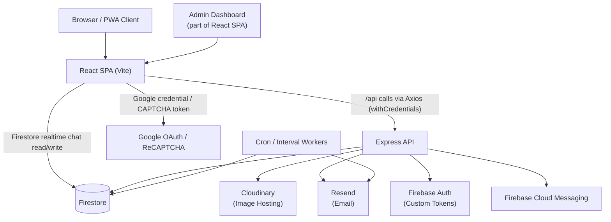

**Explanation:** The Browser/PWA client loads the React SPA, which talks to the Express API over `/api` using Axios with credentials enabled, and separately talks directly to Firestore (via the Firebase client SDK) for realtime chat. Google OAuth and ReCAPTCHA are called directly from the client during signup/login. The Express API is the integration hub — it is the only component that writes to Firestore on behalf of business logic, uploads to Cloudinary, sends email through Resend, mints Firebase custom tokens, and sends FCM push messages. Cron/interval workers (listing expiry, missed-chat-email processing) run inside the same server process and act on Firestore and Resend directly. The Admin Dashboard is not a separate application — it is a set of routes/pages inside the same React SPA, gated by `AdminRoute`.

---

## 2. Frontend Architecture

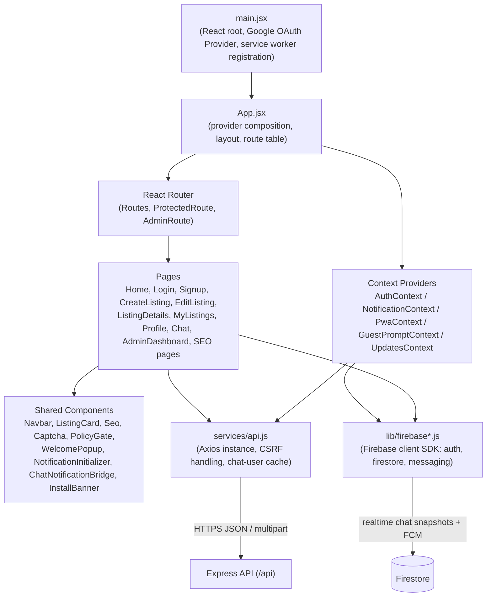

**Explanation:** `main.jsx` bootstraps the React root, wraps the app in the Google OAuth provider, and registers the Firebase messaging service worker. `App.jsx` composes all context providers and defines the route table using React Router, with `ProtectedRoute` and `AdminRoute` as guards. Pages consume shared components and call the backend through the single centralized Axios instance in `services/api.js`, which owns `withCredentials`, CSRF header attachment, CSRF-retry-once logic, and response unwrapping. Contexts and pages that need realtime chat or Firebase Cloud Messaging go through `lib/firebase*.js` directly to Firestore rather than through the Express API. State management is plain React Context plus local component state — no Redux or Zustand is used.

---

## 3. Backend Architecture

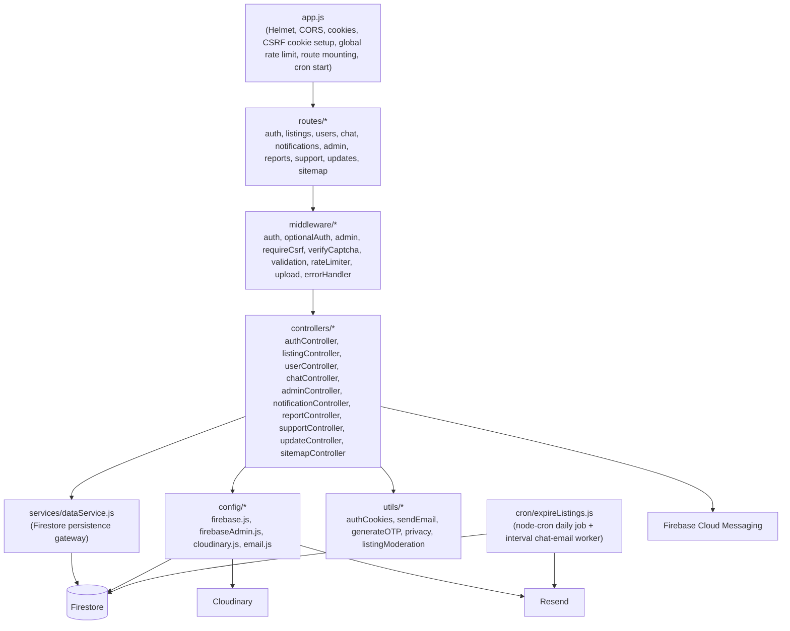

**Explanation:** `app.js` is the composition root: it applies security middleware, sets up the CSRF cookie, applies the global `/api` rate limiter, mounts every route module, registers health/404/error handlers, and starts cron jobs unless `ENABLE_CRON` disables them. Each route wires an ordered middleware chain before reaching its controller. Controllers hold business logic (ownership checks, edit limits, response shaping) and delegate persistence to `dataService.js`, which is the sole Firestore gateway — there is no separate model/schema layer, so document shapes are implicit across validators, controllers, and this service. `config/*` wraps the external SDKs (Firebase Admin, Cloudinary, Resend), and `utils/*` holds cross-cutting helpers (cookie signing, email templates, OTP generation, moderation word-list checks, privacy/masking). The cron layer runs in-process, not as a separate service.

---

## 4. Folder Architecture

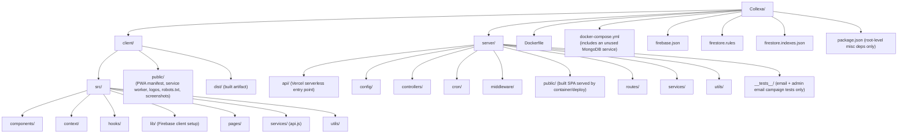

**Explanation:** The repository is a two-package monorepo (`client/`, `server/`) with shared deployment config at the root. `client/dist` and `server/public` are generated build artifacts, not source. `server/__tests__` only covers email and admin email campaign logic per the reverse-engineering report — no test runner script exists in `server/package.json`, so this test coverage is not currently executable via `npm test`. **Flagged gap:** `docker-compose.yml` defines a MongoDB service and a `MONGO_URI` variable that no application code actually uses (the app is Firestore-only) — this is confirmed stale/misleading config, not a hidden second datastore.

---

## 5. Database Relationships (Entity Overview)

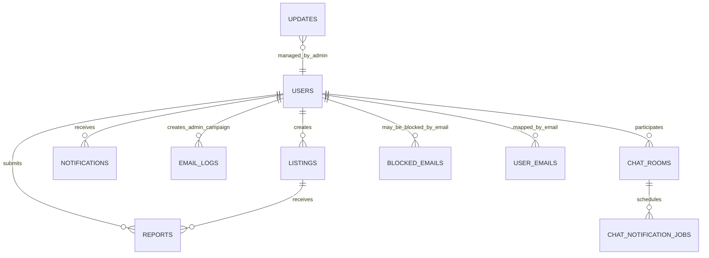

**Explanation:** This is an ER-style approximation only — Firestore is a document database with no enforced foreign keys, so all relationships shown here are by convention (ID fields), not database constraints. A user creates listings, submits reports, receives notifications, participates in chat rooms (always exactly two participants per room), may be blocked by normalized email, and is mapped 1:1 through `userEmails` for uniqueness enforcement. Listings can receive many reports. Chat rooms can schedule chat-notification (missed-message email) jobs. Updates are managed by admins but are not otherwise tied to a specific user record for display purposes.

---

## 6. Authentication Flow (Overview)

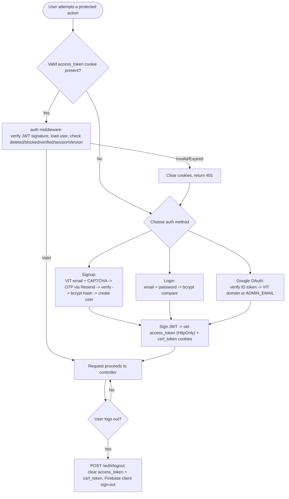

**Explanation:** This consolidates the three entry paths (email/OTP signup, password login, Google OAuth) into one decision flow; sections 7 and 8 below give the detailed sequence for login and signup individually. All three paths converge on the same session-issuing step: a JWT signed with `{userId, isAdmin, sessionVersion}` is placed in an HttpOnly `access_token` cookie alongside a readable `csrf_token` cookie. **Flagged gap:** the documentation explicitly states that `JWT_EXPIRE` is defined in environment examples but is **not** applied during signing — the cookie itself is set with a 10-year max age, so there is no real session expiry in the current implementation. Session invalidation instead relies on `sessionVersion`, which is bumped on password change/reset and checked on every request via a Firestore lookup in the auth middleware.

---

## 7. Login Sequence

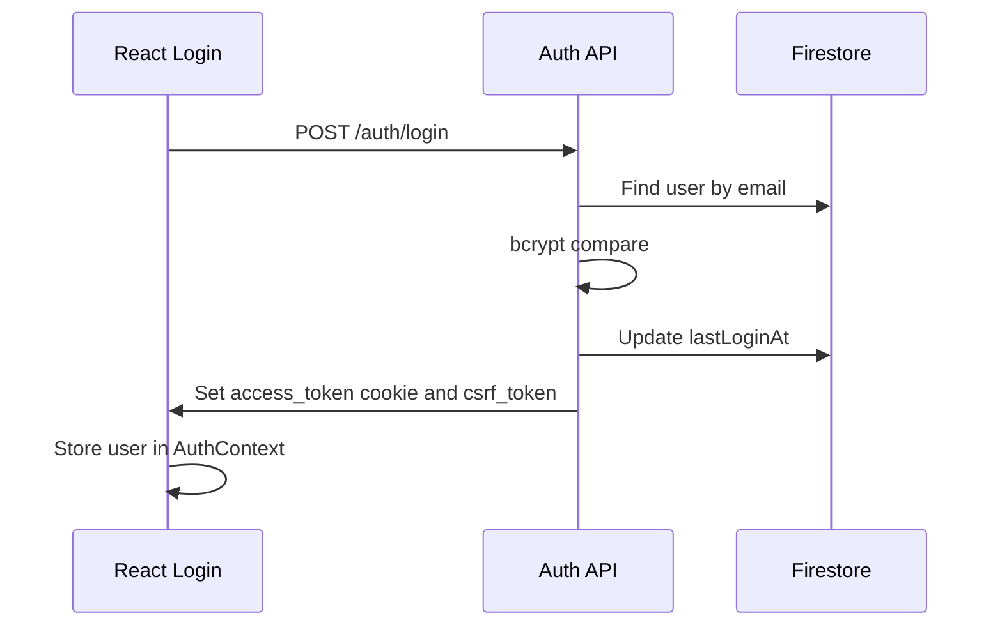

**Explanation:** Login is intentionally minimal compared to signup — there is no CAPTCHA step in the documented login flow (CAPTCHA is used for OTP-generating flows: signup, resend OTP, forgot password). The controller looks up the user by email, compares the submitted password against the stored bcrypt hash, updates `lastLoginAt`, and on success issues the same JWT/CSRF cookie pair used everywhere else. A wrong password returns 401 `Invalid credentials`; an unverified account returns 403.

---

## 8. Signup Sequence

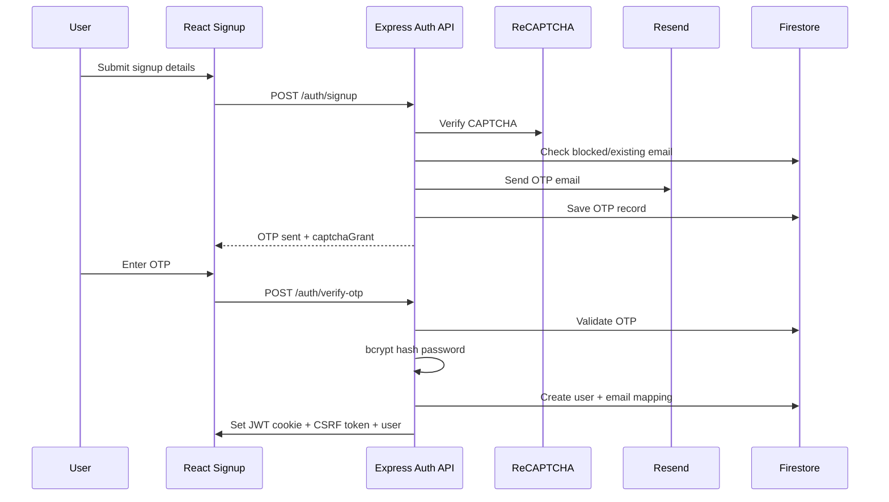

**Explanation:** Signup is a two-step OTP flow gated by CAPTCHA. `/auth/signup` validates the VIT email domain, checks the `blockedEmails`/existing-user state, sends a 15-minute-valid OTP through Resend, and returns a `captchaGrant` so the user is not forced to re-solve CAPTCHA for the follow-up OTP-resend or verify call. `/auth/verify-otp` validates the OTP, hashes the password with bcrypt (cost 12), creates the `users` document plus the corresponding `userEmails` uniqueness-mapping document inside a Firestore transaction, and only then issues the session cookies — meaning no session exists until the OTP step is actually completed.

---

## 9. JWT Flow

```mermaid
sequenceDiagram
  participant Client
  participant AuthController
  participant JWTLib as jsonwebtoken
  participant Cookie as access_token Cookie
  participant Middleware as auth middleware
  participant Firestore

  Client->>AuthController: Successful login / signup / google-auth
  AuthController->>JWTLib: sign({userId, isAdmin, sessionVersion})
  JWTLib-->>AuthController: token
  AuthController->>Cookie: Set-Cookie access_token (HttpOnly; 10yr maxAge; Secure+SameSite=None in prod, Lax in dev)
  Note over AuthController,Cookie: JWT_EXPIRE env var exists but is NOT applied during signing
  Client->>Middleware: Subsequent request (cookie sent automatically by browser)
  Middleware->>JWTLib: verify(token, JWT_SECRET)
  JWTLib-->>Middleware: decoded payload
  Middleware->>Firestore: Load user by userId
  Middleware->>Middleware: Check deleted / blocked / verified / sessionVersion match
  alt valid
    Middleware-->>Client: Attach req.userId / req.user / req.isAdmin, proceed
  else invalid or TokenExpiredError
    Middleware-->>Client: Clear cookies, return 401
  end
```

**Explanation:** The JWT payload is deliberately small: `userId`, `isAdmin`, and `sessionVersion`. There is no refresh-token mechanism — a single long-lived cookie is the entire session. `sessionVersion` is the substitute for a real revocation/blacklist mechanism: it is stored on the user document and bumped on password change/reset, so any previously issued JWT with a stale `sessionVersion` fails middleware validation even though the JWT signature itself is still valid. **Flagged gap (confirmed limitation, stated in all three source documents):** `JWT_EXPIRE` is documented in `.env.example` but never passed as `expiresIn` when signing, so tokens themselves do not expire — only the 10-year cookie and `sessionVersion` checks bound the session lifetime.

---

## 10. CSRF Flow

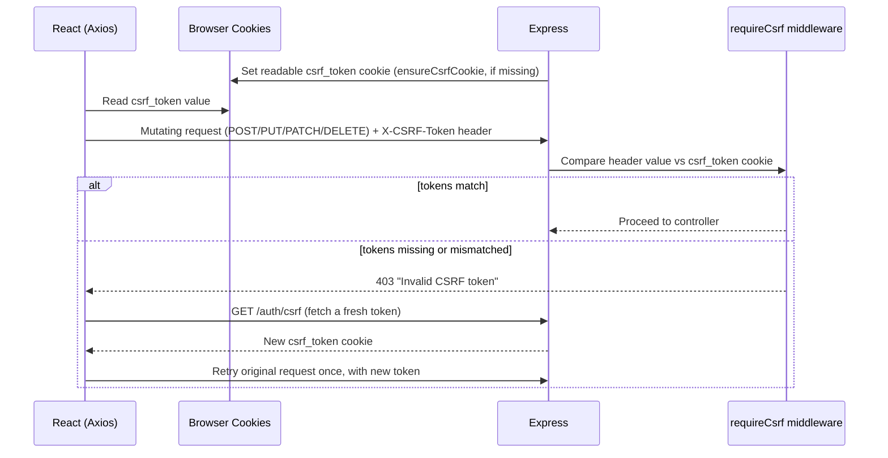

**Explanation:** This is the standard double-submit-cookie pattern: a readable `csrf_token` cookie is set by `ensureCsrfCookie`, and Axios attaches its value as the `X-CSRF-Token` header on every mutating request. `requireCsrf` skips safe methods (GET/HEAD/OPTIONS). The interviewer-facing debugging story in the source material describes a real failure mode this diagram captures: if a tab stays open long enough for the token to rotate or vanish, the very next mutating request gets a 403; the Axios response interceptor specifically detects that exact error string, re-fetches `/auth/csrf`, and retries the original request exactly once. **Flagged gap:** the source documents note that the admin "updates" create/edit/delete mutation routes are mounted behind `auth` + `admin` middleware but do **not** currently have `requireCsrf` applied — this is called out as a known security gap, not something this diagram should imply is protected.

---

## 11. API Request Lifecycle

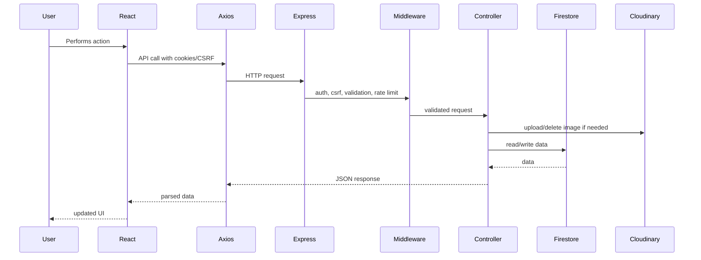

**Explanation:** This is the canonical end-to-end path for any authenticated, mutating request in Collexa. The `Cloudinary` step only applies to routes that handle images (listing create/edit, profile picture); most requests skip straight from `Middleware` to `Controller` to `Firestore`. This lifecycle applies identically regardless of which specific route is hit — the more detailed workflow diagrams below (creation, editing, deletion, chat, etc.) are all specializations of this same shape.

---

## 12. Listing Creation Workflow

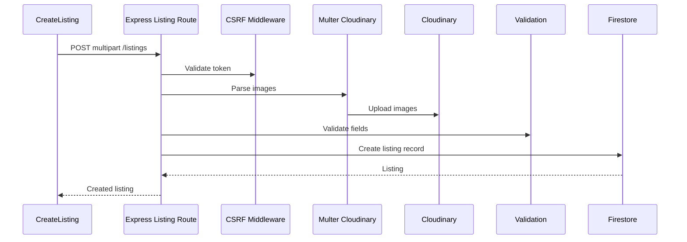

**Explanation:** Creation requires authentication and CSRF, then runs a create-listing-specific rate limiter (not shown at this granularity — see the Middleware Execution Flow diagram, #23, for full ordering), streams uploaded files to Cloudinary via Multer, validates listing fields with `express-validator` plus a shared moderation word-list check, and only then writes the Firestore document with `status: active`, an `expiresAt` 30 days out, counters (`editCount`, `viewCount`, `reportCount`) initialized, and the Cloudinary `{url, publicId}` image objects. At least one image is required to create a listing.

---

## 13. Listing Editing Workflow

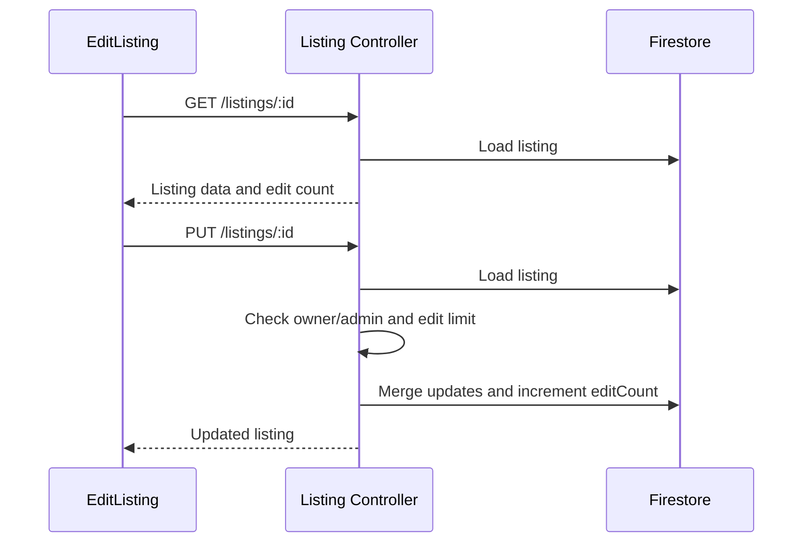

**Explanation:** Editing is a read-then-write pattern with two authorization gates: the requester must be the listing owner or an admin, and non-admin users are capped at 3 edits total (tracked via `editCount`). If new images are supplied during an update, the old Cloudinary images are deleted before the new ones are stored, though the source documentation notes the current `EditListing` page UI itself only exposes text-field editing, not image replacement, despite the backend route supporting it.

---

## 14. Listing Deletion Workflow

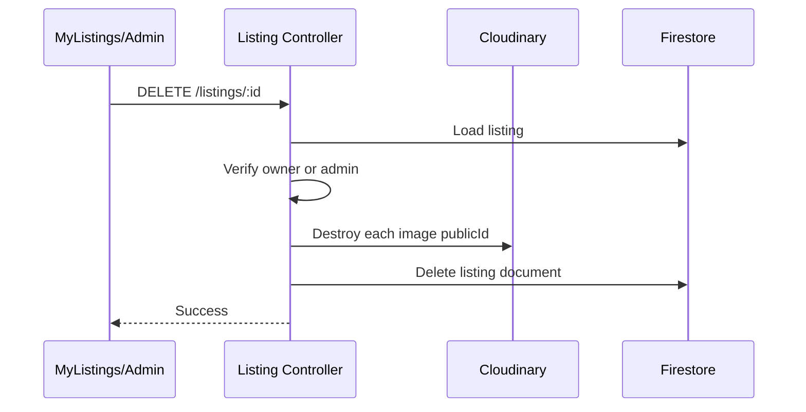

**Explanation:** Deletion is a hard delete of the Firestore document, preceded by destroying every associated Cloudinary image by its stored `publicId`. This differs from user account deletion, which is documented as a **soft** delete of the user record combined with a **hard** delete of that user's listings. **Flagged gap:** the source documents note there is no rollback handling if Cloudinary image deletion succeeds but the subsequent Firestore document deletion fails (or vice versa) — this is called out as an area for improvement, not a currently implemented safeguard.

---

## 15. Image Upload Workflow

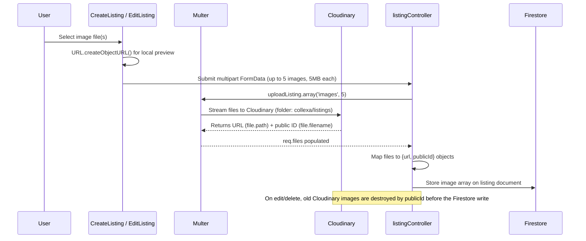

**Explanation:** This isolates the image-specific portion of the create/edit flows shown above. The critical design point is that Firestore never stores binary image data — only the Cloudinary-hosted URL and `publicId` per image, with transformations (max dimension 1200, auto quality/format) applied by Cloudinary itself. A parallel, separate path exists for profile pictures via the same Cloudinary configuration (folder `collexa/profiles`), documented in the Users/Profile update route.

---

## 16. Search Flow

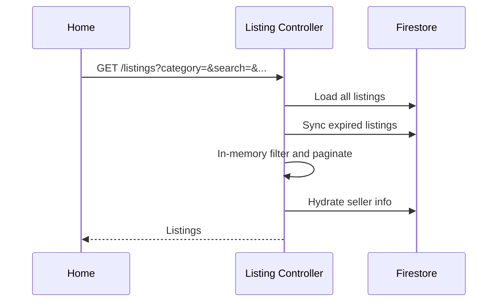

**Explanation:** This is explicitly documented as the current bottleneck across all three source documents. Every browse/search request loads listings from Firestore and then filters (`category`, `listingType`, `minPrice`, `maxPrice`, `search` over title/description, `sellerId`, `status`) and paginates **in memory on the server**, rather than issuing indexed Firestore queries. **Flagged gap:** there is no Algolia/Meilisearch/Elastic integration, no regex-based database query, and no listing-specific Firestore composite index — the only composite index that exists in `firestore.indexes.json` is for `chatRooms`. Pagination itself is array slicing after the in-memory filter, not cursor-based.

---

## 17. Chat Workflow

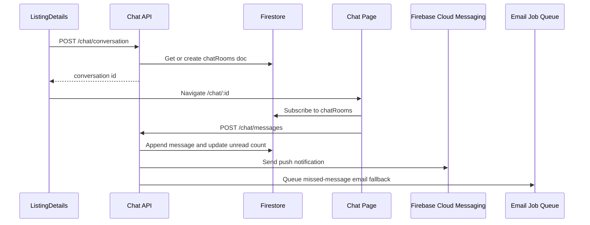

**Explanation:** Conversation IDs are deterministic: the two participant user IDs are sorted and joined, so any pair of users always maps to the same `chatRooms` document (self-chat is explicitly rejected by the backend). Once a conversation exists, the React client subscribes directly to that Firestore document via `onSnapshot` for realtime updates — messages are **not** streamed through the Express API on the read side, only on the send side (`POST /chat/messages`), which validates that both sender and recipient are actual participants and enforces a 500-character message limit. On send, the backend also fires an FCM push and conditionally queues a missed-message email job (see diagram #18) if the recipient is inactive/unavailable. **Flagged gap:** messages are stored as an array field inside the single `chatRooms` document, which the source documents flag as a Firestore document-size risk as conversations grow, with the recommended fix being a `chatRooms/{roomId}/messages/{messageId}` subcollection — not yet implemented.

---

## 18. Push Notification Flow

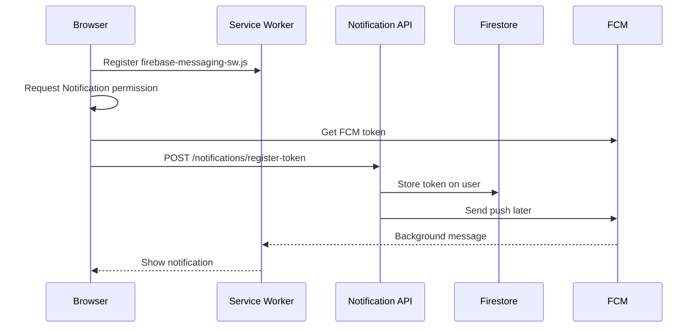

**Explanation:** Token registration is a one-time setup handled by `NotificationInitializer` and `usePushNotifications` on the client. Registered tokens are stored on the user document (`fcmToken` / `fcmTokens` array) and used later whenever the server needs to push a notification (chat messages being the primary trigger). Multicast sends prune invalid tokens automatically on failure. In-app notifications shown inside the app itself are a **separate** mechanism from push — `NotificationContext` polls `GET /notifications` every 60 seconds rather than using a realtime listener, which the source documents flag as a known limitation (not true realtime for the in-app badge/list, only for chat and for actual OS-level push via FCM).

---

## 19. Admin Dashboard Flow

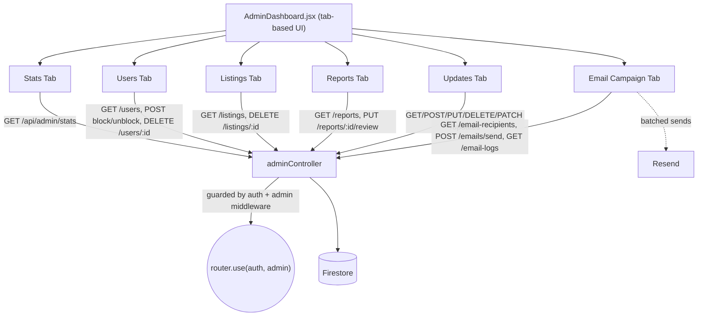

**Explanation:** Every admin tab maps to endpoints under `/api/admin/*`, all mounted behind `router.use(auth, admin)`. Admins cannot block or delete other admin accounts, and cannot delete their own admin account, per the documented controller-level checks. Admin stats are computed by loading and aggregating users/listings/reports in the controller — there are no precomputed counters. The Email Campaign tab is the most complex admin workflow: it computes an audience, personalizes templates, sends in batches through Resend **synchronously inside the HTTP request**, and logs the outcome to `emailLogs` — this synchronous-in-request design is explicitly documented as a trade-off that should move to a background queue at scale. **Flagged gap:** the "Updates" tab's individual create/edit/delete mutation routes are documented as **not** currently having `requireCsrf` applied, unlike most other mutating admin/user routes.

---

## 20. Deployment Architecture

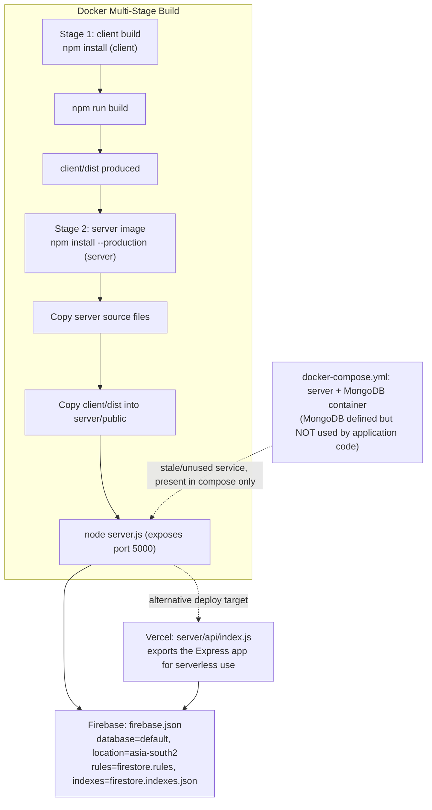

**Explanation:** Two deployment paths are documented: a container build (multi-stage Dockerfile that builds the client, then copies `client/dist` into `server/public` for the Express server to serve statically) and a Vercel serverless path (`server/api/index.js` exports the same Express app). Both paths connect to Firebase/Firestore using the config in `firebase.json`. **Flagged gap, stated directly in the source material:** "Exact production deployment topology cannot be fully determined from code alone" — this diagram represents the build/config artifacts that exist in the repo, not a confirmed live production topology. The MongoDB service in `docker-compose.yml` is confirmed present but confirmed unused by any application code (`MONGO_URI` appears unreferenced).

---

## 21. Scaling Architecture

```mermaid
flowchart TD
  subgraph Current["CURRENT — Implemented"]
    C1["In-memory listing filter/search\n(loads all listings, filters server-side)"]
    C2["node-cron + setInterval in-process scheduler"]
    C3["express-rate-limit with memory store"]
    C4["Chat messages stored as an array\ninside the chatRoom document"]
    C5["Admin email campaign sent\nsynchronously inside the HTTP request"]
  end

  subgraph Proposed["PROPOSED — Documented as future improvement, NOT implemented"]
    P1["Firestore composite indexes,\nor a search engine (Algolia / Meilisearch / Elastic)"]
    P2["Managed queue/scheduler\n(Cloud Tasks, Pub/Sub, or BullMQ + Redis)"]
    P3["Redis-backed distributed rate limiting"]
    P4["chatRooms/{id}/messages/{id} subcollections\nwith cursor pagination"]
    P5["Async queue-based email workers with retries"]
    P6["Load balancer across multiple API instances"]
    P7["CDN/edge caching for public listing reads"]
  end

  C1 -.->|"recommended replacement"| P1
  C2 -.->|"recommended replacement"| P2
  C3 -.->|"recommended replacement"| P3
  C4 -.->|"recommended replacement"| P4
  C5 -.->|"recommended replacement"| P5
```

**Explanation — flagged as roadmap, not architecture:** Everything in the "Proposed" half of this diagram is drawn from interview-prep answers and a "Future Improvements" section — it describes what the documentation says *should* be built at higher scale, and none of it is claimed to exist in the current codebase. The "Current" half is the only part representing implemented behavior. The source material frames this as a staged roadmap (100 → 1,000 → 10,000 → 100,000 → 1,000,000 users), with the first priority consistently identified as fixing listing search/filtering, followed by moving background jobs to queues, followed by refactoring chat message storage.

---

## 22. Component Dependency Diagram

```mermaid
flowchart TD
  Home --> ApiClient
  ListingDetails --> ApiClient
  ApiClient --> ExpressRoutes
  ExpressRoutes --> Middleware
  Middleware --> Controllers
  Controllers --> DataService
  DataService --> Firestore
  Controllers --> Cloudinary
  Controllers --> Resend
```

```mermaid
flowchart TD
  ListingDetails --> ChatConversationAPI
  ChatConversationAPI --> ChatController
  ChatController --> DataService
  DataService --> ChatRooms
  ChatPage --> FirestoreSnapshot
  ChatPage --> SendMessageAPI
  SendMessageAPI --> ChatController
  ChatController --> FCM
  ChatController --> ChatEmailJobs
```

```mermaid
flowchart TD
  LoginSignup --> AuthContext
  AuthContext --> AuthAPI
  AuthAPI --> AuthController
  AuthController --> BcryptJWT
  AuthController --> AuthCookies
  AuthController --> FirestoreUsers
  AuthContext --> FirebaseCustomToken
  FirebaseCustomToken --> FirestoreChatRules
```

**Explanation:** These three dependency graphs are reproduced as-is from the repository reverse-engineering report and cover the three dominant component chains in the app: (1) the general read/write path from a page through the Axios client, Express routing/middleware, controllers, and `dataService.js` out to Firestore/Cloudinary/Resend; (2) the chat-specific path, which splits into a REST call for conversation setup/sending and a direct Firestore subscription for realtime reads, with FCM and the chat-email-job queue as side effects of sending; and (3) the auth-specific path, which shows how login/signup both produce a server-owned JWT session (via bcrypt + `authCookies`) **and** a separate Firebase custom token used only so the client can authenticate against Firestore's own security rules for chat. This dual-auth-token design (server JWT for the API, Firebase custom token for Firestore rules) is a documented architectural trade-off, not a duplication error.

---

## 23. Middleware Execution Flow

```mermaid
flowchart TD
  Req["Incoming HTTP Request"] --> Helmet["Helmet (security headers / CSP)"]
  Helmet --> Cors["CORS (allowlist: FRONTEND_URL + localhost variants)"]
  Cors --> Cookies["cookie-parser"]
  Cookies --> BodyParse["JSON / urlencoded body parser (25kb limit)"]
  BodyParse --> CsrfCookie["ensureCsrfCookie (sets csrf_token cookie if missing)"]
  CsrfCookie --> GlobalLimiter["Global /api rate limiter"]
  GlobalLimiter --> RouteMatch["Route matched (e.g. listingRoutes)"]
  RouteMatch --> AuthMw["auth / optionalAuth middleware"]
  AuthMw --> CsrfMw{"requireCsrf\n(skipped for GET/HEAD/OPTIONS)"}
  CsrfMw --> RouteLimiter["Route-specific rate limiter\n(e.g. create-listing limiter)"]
  RouteLimiter --> UploadMw["upload middleware (Multer + Cloudinary), if the route handles files"]
  UploadMw --> ValidationMw["express-validator validation chain"]
  ValidationMw --> Controller["Controller (business logic)"]
  Controller --> ErrorCheck{"Error passed to next(error)?"}
  ErrorCheck -- Yes --> ErrorMw["errorHandler middleware -> JSON error response"]
  ErrorCheck -- No --> Response["JSON success response"]
```

**Explanation:** This combines two levels documented separately in the source material: the global middleware stack applied once in `app.js` (Helmet through the global rate limiter), and the per-route middleware chain applied at the route level (auth, CSRF, route-specific rate limiting, upload, validation, controller) — using listing creation as the representative example since it exercises every middleware type. Not every route hits every step: routes with no file upload skip `UploadMw`, and safe HTTP methods skip `CsrfMw` entirely. All controller errors flow through a single centralized `errorHandler`, which returns full error detail (message, error object, stack) in development and a generic `Request failed` message in production.

---

## 24. Firestore Collection Relationships

```mermaid
flowchart TD
  Users["users\n(profile, auth fields, isAdmin, sessionVersion, fcmToken/fcmTokens)"]
  UserEmails["userEmails\n(doc id = normalized email) --> userId"]
  Listings["listings\n(sellerId, images[], status, editCount, expiresAt, viewCount, reportCount)"]
  Reports["reports\n(doc id = listingId_reportedBy)"]
  Otps["otps\n(doc id = email, otpRecords[] with 15-min expiry)"]
  BlockedEmails["blockedEmails\n(doc id = email)"]
  Notifications["notifications\n(userId, type, message, read)"]
  Updates["updates\n(isPinned, isPublished; pruned to latest 4 on create)"]
  EmailLogs["emailLogs\n(campaign metadata, sent/failed counts, provider ids)"]
  ChatRooms["chatRooms\n(doc id = sorted participant ids, messages[] array, unreadCounts)"]
  ChatJobs["chatNotificationJobs\n(conversationId, recipientId, sendAfter, status)"]

  UserEmails -->|"maps to"| Users
  Users -->|"sellerId"| Listings
  Users -->|"reportedBy"| Reports
  Listings -->|"listingId"| Reports
  Users -->|"userId"| Notifications
  Users -->|"admin creates"| EmailLogs
  Users -->|"2x participants"| ChatRooms
  ChatRooms -->|"conversationId"| ChatJobs
  Users -.->|"email may be listed in"| BlockedEmails
  Users -->|"admin manages"| Updates
  Otps -.->|"keyed by email; consumed during"| Users
```

**Explanation:** This is a Firestore-specific companion to diagram #5, focused on document-ID keying strategy and cross-collection reference fields rather than abstract cardinality. Notable keying conventions: `userEmails` and `otps` and `blockedEmails` all use the normalized email address itself as the document ID (enabling uniqueness/lookup without a query); `reports` uses a deterministic composite ID (`${listingId}_${reportedBy}`) specifically to prevent duplicate reports from the same user on the same listing; `chatRooms` uses the two sorted participant user IDs joined together as the document ID, so a given pair of users always resolves to one room. **Flagged gap:** the only Firestore composite index defined anywhere in the repository is `chatRooms(participants array-contains, lastMessageAt desc)` — none of the other collections shown here, including `listings`, have a defined index, which is consistent with the in-memory-filtering limitation described in diagram #16.

---

*End of diagram set. All 24 diagrams and explanations are derived only from the three supplied source documents. Every "Flagged gap" note above corresponds to a limitation, missing feature, or undetermined detail stated explicitly in those documents — none are inferred beyond what the source material says.*
