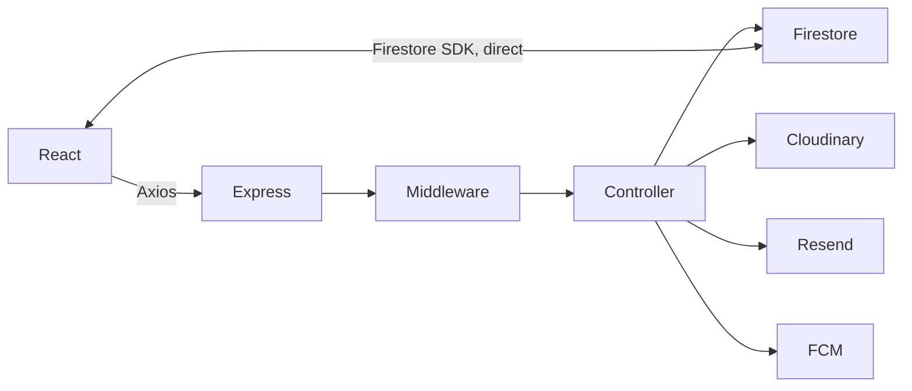

# Collexa — Interview Revision Handbook

*30-minute read. High-value recall only. No documentation-style explanations.*

---

## 1. Project Pitch (memorize this)

> "Collexa is a campus-only marketplace for VIT students — like OLX, but trust is built in because everyone's a verified VIT email. React + Vite frontend, Express backend, Firestore database, Cloudinary for images, Firebase for realtime chat + push, Resend for email. Full auth (OTP + Google), listing lifecycle, admin dashboard, moderation. Built solo, end to end."

**Why it exists:** generic marketplaces (OLX) = no trust signal, no campus relevance. WhatsApp groups = not searchable, not persistent.

**3 things to always mention:** (1) not just CRUD — OTP, chat, push, admin, moderation, (2) you know the exact weak points, (3) you know the fix for each weak point.

---

## 2. Architecture (one diagram, memorize the flow)

**Request path:** `React → Axios (/api, cookies, CSRF header) → Express → Middleware chain → Controller → dataService.js → Firestore / Cloudinary / Resend / FCM`



**Key fact:** Chat is the ONE place the client talks to Firestore directly (bypasses Express) — everything else goes through the API.

**No model layer** — Firestore schema is implicit (validators + controllers + `dataService.js`).

---

## 3. Tech Stack (say-it-fast table)

| Layer | Tech | One-line "why" |
|---|---|---|
| Frontend | React + Vite | Fast dev loop, component model for heavy UI state |
| Routing | React Router | `ProtectedRoute` / `AdminRoute` guards |
| Styling | Tailwind | Fast iteration, no custom CSS sprawl |
| API client | Axios (1 instance) | Credentials + CSRF header + auto-retry-once |
| Backend | Express | Lightweight, flexible middleware |
| Database | Firestore | Managed, realtime (chat), no server DB ops |
| Images | Cloudinary | CDN + transforms, no file storage on server |
| Auth token | JWT (HttpOnly cookie) | Stateless, but no revocation without `sessionVersion` |
| Chat/Push | Firebase (client SDK + Admin + FCM) | Realtime without building WebSocket infra |
| Email | Resend | OTP, support, admin campaigns, chat fallback |
| Passwords | bcrypt (cost 12) | Slow by design |
| CSRF | Double-submit cookie | Cookie auth needs it |
| Validation | express-validator | Backend is source of truth |
| Rate limiting | express-rate-limit (memory store) | Not distributed — known gap |
| CAPTCHA | Google ReCAPTCHA | Guards OTP-generating endpoints only |
| Scheduler | node-cron + setInterval | In-process, not serverless-safe |

---

## 4. Folder Structure (shape, not detail)

```
client/src/  → components, context, hooks, lib(firebase), pages, services(api.js), utils
server/      → routes → middleware → controllers → services(dataService.js) → config(firebase/cloudinary/email)
              + cron/, utils/, __tests__/ (email+admin only, no test script)
```

**One-liner:** "Route → middleware → controller → service. Controllers = business logic. `dataService.js` = only place that touches Firestore."

---

## 5. Authentication (the flow you must be able to draw)

**Signup:** CAPTCHA → check blocked/existing email → send OTP (Resend, 15-min expiry, stored in Firestore) → verify OTP → bcrypt hash → create user + `userEmails` mapping (transaction) → issue cookies.

**Login:** find by email → bcrypt compare → update `lastLoginAt` → issue `access_token` (JWT, HttpOnly) + `csrf_token` (readable).

**JWT payload:** `{ userId, isAdmin, sessionVersion }`

**Cookie:** HttpOnly, 10-year maxAge, `secure+sameSite=none` in prod, `lax` in dev.

**Session kill switch:** `sessionVersion` bump on password change → old JWTs fail middleware even though signature is valid.

**Google login:** verify ID token server-side → must be `@vitstudent.ac.in` unless `ADMIN_EMAIL`.

**Known gap:** `JWT_EXPIRE` env var exists, never applied to signing → tokens never truly expire.

---

## 6. Database (Firestore — say fast)

**11 collections:** `users`, `userEmails`, `listings`, `reports`, `otps`, `blockedEmails`, `notifications`, `updates`, `emailLogs`, `chatRooms`, `chatNotificationJobs`

| Trick | Fact |
|---|---|
| Unique email | `userEmails` doc ID = normalized email, written in a transaction |
| No duplicate reports | Report doc ID = `${listingId}_${reportedBy}` |
| Deterministic chat room | Doc ID = sorted, joined participant IDs |
| Only index that exists | `chatRooms(participants array-contains, lastMessageAt desc)` |
| Chat weak point | Messages stored as **array** in room doc → should be subcollection |
| No schema layer | Implicit — via validators/controllers/dataService only |

---

## 7. API Summary (groups, not full list)

`auth · listings · users · chat · notifications · admin · reports · support · updates · wishlist(501) · health · sitemap`

**Mutating request needs:** `access_token` cookie + `csrf_token` cookie + matching `X-CSRF-Token` header.

**Standout facts:**
- `GET /listings` → optional auth, in-memory filter/paginate
- `POST /listings` → CSRF + rate limit + Multer→Cloudinary + validation
- `/users/profile/verify-phone` → frontend calls it, **backend route doesn't exist**
- `/wishlist/*` → returns `501`
- Admin **update** routes (create/edit/delete) → missing `requireCsrf` (known gap)

---

## 8. Security (implemented vs gap — two-column memory aid)

| ✅ Implemented | ⚠️ Gap |
|---|---|
| bcrypt (cost 12) | JWT never expires (`JWT_EXPIRE` unused) |
| HttpOnly JWT cookie | Admin update routes missing CSRF |
| CSRF double-submit | Rate limiter is in-memory, not distributed |
| `sessionVersion` invalidation | No token blacklist / stolen-token defense |
| Rate limiting (auth/OTP/report/admin) | Chat message arrays = doc-size risk |
| Helmet + CORS allowlist | No centralized admin audit log |
| ReCAPTCHA on OTP flows | CSRF cookie is XSS-readable (doesn't stop XSS) |
| Firestore rules (users, chatRooms) | Most collections server-only, not rule-covered |

**One-liner for "biggest security weakness":** *"JWT expiry not applied, plus inconsistent CSRF coverage on admin update routes."*

---

## 9. Performance (bottleneck-first)

**#1 bottleneck, always lead with this:** listing search/filter loads ALL listings then filters **in memory** — no indexed Firestore queries.

Other bottlenecks: array-slicing pagination (not cursor-based) · chat message array growth · notification polling (60s, not realtime) · in-process cron risks duplicate work across instances · admin lists load broad datasets.

**What's already optimized:** Vite bundling, Cloudinary auto-transform, lazy-loaded SEO pages, chat-user client cache (TTL), sitemap XML cache, FCM invalid-token pruning.

---

## 10. Scaling (staged roadmap — memorize the order)

| Scale | Fix |
|---|---|
| 1K | tests, pagination, indexes, logging |
| 10K | Firestore query-based search, queue email jobs |
| 100K | search engine, Redis rate limiting, queues, chat subcollections |
| 1M | service separation, load balancing, CDN, analytics pipeline |

**Priority order (always answer in this order):** 1) fix listing search → 2) move background jobs to queues → 3) refactor chat storage.

**Would Firestore survive scale?** "Yes — it's not Firestore that's the problem, it's my in-memory filtering."

---

## 11. Challenges (debugging stories — pick 2 to tell well)

1. **CSRF staleness:** open tab → token rotates → next POST fails with "Invalid CSRF token" → fixed via Axios interceptor: catch error, refetch `/auth/csrf`, retry once.
2. **Image upload lifecycle:** multiple failure points (size/type/network/credentials) → no rollback yet if Cloudinary succeeds but Firestore write fails.
3. **Notification fallback layering:** push depends on secure context + SW + permission + VAPID key → if unavailable, queue a missed-message email instead.
4. **Stale Mongo config:** docker-compose still has MongoDB though app is Firestore-only — infra hygiene lesson.

---

## 12. Future Improvements (easy → hard, memorize 3 per tier)

- **Easy:** remove Mongo from Compose · add `npm test` script · CSRF on admin updates · fix sitemap bug · apply `JWT_EXPIRE`
- **Medium:** Zod schemas · indexed search · cursor pagination · admin audit logs
- **Hard:** chat → subcollections · queue-based workers · full-text search (Algolia/Meilisearch) · SSR for SEO
- **Enterprise:** IaC · secrets manager · Redis everywhere · audit logging · canary deploys

---

## 13. Top 100 Interview Questions — One-Line Answers

**Pitch/Story (1–10)**
1. What is Collexa? — Campus marketplace for VIT students, full-stack, solo-built.
2. Why build it? — WhatsApp/OLX are noisy and untrustworthy for campus trades.
3. Why not OLX? — No trust signal, not campus-relevant.
4. Users? — Guests browse, VIT students transact, admins moderate.
5. Hardest part? — Cookie auth + CSRF + a second Firebase auth for chat, together.
6. Biggest achievement? — It's a full product surface, not just CRUD.
7. Biggest mistake? — Left stale config (Mongo) and dead code (phone verify) in.
8. What'd you change? — Schemas, TypeScript, indexed search, real JWT expiry.
9. How'd you prioritize? — Core workflows first, then security/notifications/SEO.
10. One sentence architecture? — React SPA → Express API → Firestore, with Cloudinary/Firebase/Resend on the side.

**Architecture (11–20)**
11. Frontend → backend path? — Axios → `/api` → middleware → controller → dataService → Firestore.
12. Why no model layer? — Firestore access centralized in dataService; schema stays implicit.
13. Where does React talk to Firestore directly? — Chat only.
14. Controller vs service? — Controller = business logic, service = persistence.
15. Where's CSRF cookie set? — `ensureCsrfCookie` middleware in app.js.
16. Global middleware order? — Helmet → CORS → cookies → body parse → CSRF cookie → rate limit → routes.
17. What's `dataService.js`? — The only Firestore gateway.
18. Admin dashboard — separate app? — No, routes/pages inside the same SPA, gated by `AdminRoute`.
19. Why Express not NestJS? — Simpler/faster for this scope; no enforced structure though.
20. API versioning? — None currently — future `/api/v1` improvement.

**Tech Stack (21–30)**
21. Why Firestore? — Managed + realtime chat support.
22. Why not Mongo? — Docker has stale Mongo config; code is Firestore-only.
23. Why JWT? — Stateless sessions.
24. Why cookies not localStorage? — HttpOnly blocks JS/XSS token theft.
25. Why CSRF needed then? — Cookies auto-send, so CSRF risk appears.
26. Why bcrypt? — Slow, salted, cost 12.
27. Why Cloudinary? — CDN + transforms, no server file storage.
28. Why Firebase (again, besides Firestore)? — Custom auth for chat rules + FCM push.
29. Why Resend? — Simple transactional email API.
30. Why Tailwind? — Fast UI iteration, tradeoff = class-heavy JSX.

**Auth (31–45)**
31. Login flow? — Find user → bcrypt compare → issue JWT+CSRF cookies.
32. Signup flow? — CAPTCHA → OTP (Resend) → verify → bcrypt hash → create user.
33. JWT payload? — `userId`, `isAdmin`, `sessionVersion`.
34. Cookie config? — HttpOnly, 10yr maxAge, secure+sameSite=none in prod.
35. JWT_EXPIRE issue? — Configured, never applied when signing.
36. Session invalidation? — `sessionVersion` bump on password change.
37. Google login restriction? — Must be VIT email unless `ADMIN_EMAIL`.
38. OTP validity? — 15 minutes.
39. OTP abuse protection? — CAPTCHA + IP/email rate limits.
40. `captchaGrant`? — Short-lived grant so user doesn't re-CAPTCHA every OTP step.
41. Protected route (frontend)? — `AuthContext` calls `/auth/me`, `ProtectedRoute` redirects if unauthenticated.
42. Auth middleware checks? — JWT valid + not deleted/blocked + verified + sessionVersion match.
43. Logout does what? — Clears cookies + Firebase sign-out (no server-side blacklist).
44. Why Firebase custom token too? — So Firestore chat security rules can identify the user.
45. Biggest auth gap? — JWT never expires in practice.

**Database (46–55)**
46. Collections? — users, userEmails, listings, reports, otps, blockedEmails, notifications, updates, emailLogs, chatRooms, chatNotificationJobs.
47. Unique email trick? — `userEmails` transaction-mapped doc.
48. Report dedup trick? — Deterministic ID `listingId_reportedBy`.
49. Chat room ID trick? — Sorted+joined participant IDs.
50. Indexes? — Only `chatRooms(participants, lastMessageAt)`.
51. Schema files? — None — implicit only.
52. Chat storage issue? — Array in doc, not subcollection.
53. Listing expiry? — Cron job, 30-day window, batch update to `expired`.
54. Account deletion? — Soft-delete user, hard-delete their listings.
55. Would Firestore scale? — Yes, if query patterns fixed — not the bottleneck itself.

**Backend/API (56–65)**
56. Route structure? — route → middleware → controller → service.
57. Validation lib? — express-validator.
58. Error handling? — Centralized `errorHandler`, JSON responses.
59. Rate limiter weakness? — In-memory, not distributed.
60. Image upload path? — Multer → Cloudinary → store URL+publicId in Firestore.
61. Delete listing steps? — Destroy Cloudinary images by publicId → delete Firestore doc.
62. Edit cap? — 3 edits for non-admins.
63. Admin email campaign issue? — Synchronous in-request, should be queued.
64. Cron risk? — In-process, duplicates across multiple instances.
65. Wishlist status? — Route exists, returns 501.

**Frontend (66–72)**
66. State management? — React Context + local state, no Redux.
67. API layer? — One Axios instance, CSRF header, retry-once, 401 dispatch.
68. Chat realtime mechanism? — Firestore `onSnapshot`.
69. In-app notifications realtime? — No — 60s polling.
70. SEO approach? — react-helmet-async + lazy-loaded long-form pages; still client-rendered.
71. Dead code? — `verifyProfilePhone` (no backend route), empty `BottomNav.jsx`.
72. TypeScript/React Query used? — No — both flagged as future improvements.

**Security (73–80)**
73. Password storage? — bcrypt cost 12.
74. HttpOnly benefit? — Blocks JS-based token theft.
75. CSRF mechanism? — Double-submit cookie/header.
76. CSRF gap? — Admin update routes missing `requireCsrf`.
77. XSS + CSRF token? — CSRF cookie is readable, so XSS can still steal it.
78. Firestore rules cover what? — `users` own-doc, `chatRooms` participants only.
79. Stolen JWT risk? — Works until sessionVersion changes; no blacklist.
80. Pre-production checklist? — Secret audit, CSRF consistency, JWT expiry, rules tests.

**Performance/Scaling (81–90)**
81. #1 bottleneck? — In-memory listing search.
82. Pagination method? — Array slicing, not cursor-based.
83. Fix for search? — Firestore indexes or Algolia/Meilisearch/Elastic.
84. Fix for chat scale? — Message subcollections + pagination.
85. Fix for rate limiting at scale? — Redis-backed limiter.
86. First scaling priority? — Fix listing search.
87. Second? — Move jobs to queues.
88. Third? — Refactor chat storage.
89. Would you use microservices early? — No — not until real scale demands it.
90. Caching today? — Sitemap, PWA assets, chat-user TTL cache, localStorage for updates.

**Meta/Debt (91–100)**
91. Biggest technical debt? — Implicit schema + in-memory search + unapplied JWT expiry.
92. Stale config example? — MongoDB in docker-compose, unused.
93. Sitemap bug? — Undefined variable above 50,000 URLs.
94. Missing route example? — `/users/profile/verify-phone`.
95. Test coverage? — Only email/admin-campaign tests exist; no `npm test` script.
96. One-week fix priority? — Auth gaps (JWT expiry, CSRF) over scalability items.
97. One-month fix priority? — Add search indexing, schemas, tests.
98. What's NOT implemented at all? — Wishlist, phone verification, payments, recommendations.
99. Why is that OK for now? — Campus-scale MVP; these are documented, not hidden, gaps.
100. What did you learn overall? — A feature isn't done until validation, failure handling, abuse protection, and scale are considered — not just the happy path.

---

## 14. Cheat Sheets

**"Why X" → one-word trigger:**
`Firestore→realtime` · `Cookies→XSS-safe` · `CSRF→cookie-side-effect` · `bcrypt→slow-by-design` · `Cloudinary→no-server-storage` · `Firebase(2nd)→Firestore-rules-need-identity` · `Context→scope-was-small` · `node-cron→simple-single-process`

**"What's broken" → instant recall list (say these fast, in this order):**
1. JWT never expires
2. Search is in-memory
3. Chat messages are an array
4. Admin update routes lack CSRF
5. Mongo config is stale
6. Wishlist / phone verification unfinished
7. Sitemap bug above 50K URLs
8. Rate limiter isn't distributed

**"How do you scale it" → 3-word chain:**
Index search → Queue jobs → Subcollection chat.

---

## 15. Memory Tricks

- **"3 C's of security debt":** Cookie (no real JWT expiry), CSRF (missing on admin updates), Cron (in-process, not scalable).
- **Session kill switch mnemonic:** *"Version, not blacklist"* — `sessionVersion` is your only revocation tool.
- **Firestore doc-ID tricks = "UCR"**: **U**serEmails (email as ID), **C**hatRooms (sorted participant IDs), **R**eports (`listingId_reportedBy`).
- **The "two auths" trick:** JWT = talks to *my* API. Firebase custom token = talks to *Firestore rules* (chat only). Say it exactly like that if asked "why two auth systems."
- **Rapid gap-recall trigger:** if asked "any known issues?" — think **S.C.A.M.**: **S**earch (in-memory), **C**SRF (admin gap), **A**uth (JWT expiry), **M**ongo (stale config).

---

## 16. Quick Revision Tables

**Collections → Purpose**

| Collection | One word |
|---|---|
| users | identity |
| userEmails | uniqueness |
| listings | inventory |
| reports | moderation |
| otps | verification |
| blockedEmails | banlist |
| notifications | in-app alerts |
| updates | announcements |
| emailLogs | audit |
| chatRooms | conversations |
| chatNotificationJobs | fallback queue |

**Middleware order (create-listing example)**

`auth → CSRF → rate limit → Multer/Cloudinary → validation → controller`

**Status codes → meaning**

| Code | When |
|---|---|
| 400 | validation / upload error |
| 401 | missing/invalid JWT |
| 403 | blocked / unverified / not owner / bad CSRF |
| 404 | listing not found |
| 409 | duplicate report / duplicate signup |
| 501 | wishlist (not implemented) |
| 503 | email service unavailable |

**Scale → Fix (say in under 10 seconds)**

`1K→tests+pagination` · `10K→indexed search+queued email` · `100K→search engine+Redis+chat subcollections` · `1M→service split+CDN+analytics`

---

*End of handbook. If short on time, re-read only: Section 1 (pitch), Section 8 (security gaps), Section 10 (scaling order), and Section 15 (memory tricks) — that covers ~70% of what gets asked.*
